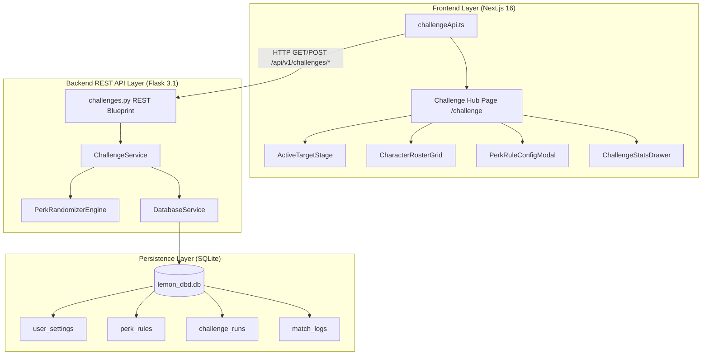

# Dead by Daylight Challenge System Implementation Plan

> **For agentic workers:** REQUIRED SUB-SKILL: Use superpowers:subagent-driven-development to implement this plan task-by-task. Steps use checkbox (`- [ ]`) syntax for tracking.

**Goal:** Build a complete, full-stack Dead by Daylight Challenge & Win-Streak System with SQLite database persistence, customizable perk loadout rules, milestone checkpoints, green-glow character roster progression, and statistics tracking in LemonDBD.

**Architecture:** A SQLite database (`lemon_dbd.db`) manages persistent user settings, active challenge runs, perk slot recipes, and match history logs. The Flask backend exposes REST endpoints (`/api/v1/challenges/*`) to roll target characters & 4 deduplicated perks, process Win/Loss results with checkpoint rollbacks, and compute analytics. A Next.js App Router page (`/challenge`) renders an interactive stage, green-glow roster grid, perk recipe editor, and statistics dashboard.

**Architecture Diagram:**



**Tech Stack:** Python 3.12, Flask 3.1, SQLite 3 (`sqlite3`), Next.js 16 (App Router), React 19, TypeScript 5, Tailwind CSS v4, Lucide React icons.

## Global Constraints
- Target SQLite Database Path: `backend/data/lemon_dbd.db`
- Preserved existing Perk API: `/api/v1/perks`
- Locale routing support: `/en/challenge`, `/es/challenge`, `/pl/challenge`
- Green completed character border style: `border-emerald-500 shadow-emerald-500/30 bg-emerald-950/20`
- Active target character border style: `border-amber-400 animate-pulse`

---

### Task 1: SQLite Database Service & Schema Initializer

**Files:**
- Create: [`backend/app/services/db_service.py`](file:///c:/Users/bezie/Desktop/proje/LemonDBD/backend/app/services/db_service.py)
- Test: [`backend/tests/test_db_service.py`](file:///c:/Users/bezie/Desktop/proje/LemonDBD/backend/tests/test_db_service.py)

**Interfaces:**
- Consumes: `backend/data/lemon_dbd.db` filesystem path
- Produces: `DatabaseService.get_connection()`, `DatabaseService.init_db()`

- [ ] **Step 1: Write the failing test**

Create `backend/tests/test_db_service.py`:
```python
import os
import unittest
from app.services.db_service import DatabaseService

class TestDatabaseService(unittest.TestCase):
    def setUp(self):
        self.db_path = "test_lemon.db"
        if os.path.exists(self.db_path):
            os.remove(self.db_path)
        self.db = DatabaseService(db_path=self.db_path)

    def tearDown(self):
        if os.path.exists(self.db_path):
            os.remove(self.db_path)

    def test_init_db_creates_tables_and_default_records(self):
        self.db.init_db()
        conn = self.db.get_connection()
        cursor = conn.cursor()
        
        cursor.execute("SELECT name FROM sqlite_master WHERE type='table';")
        tables = [row[0] for row in cursor.fetchall()]
        
        self.assertIn("user_settings", tables)
        self.assertIn("perk_rules", tables)
        self.assertIn("challenge_runs", tables)
        self.assertIn("match_logs", tables)
        
        # Verify default settings single row
        cursor.execute("SELECT checkpoint_interval FROM user_settings WHERE id=1;")
        row = cursor.fetchone()
        self.assertIsNotNone(row)
        self.assertEqual(row[0], 3)
        conn.close()

if __name__ == "__main__":
    unittest.main()
```

- [ ] **Step 2: Run test to verify it fails**

Run: `python -m unittest backend/tests/test_db_service.py`
Expected: FAIL with `ModuleNotFoundError: No module named 'app.services.db_service'`

- [ ] **Step 3: Write minimal implementation**

Create `backend/app/services/db_service.py`:
```python
import os
import sqlite3

class DatabaseService:
    def __init__(self, db_path="data/lemon_dbd.db"):
        self.db_path = db_path

    def get_connection(self):
        os.makedirs(os.path.dirname(os.path.abspath(self.db_path)), exist_ok=True)
        conn = sqlite3.connect(self.db_path)
        conn.row_factory = sqlite3.Row
        return conn

    def init_db(self):
        conn = self.get_connection()
        cursor = conn.cursor()

        cursor.executescript("""
        CREATE TABLE IF NOT EXISTS user_settings (
            id INTEGER PRIMARY KEY CHECK (id = 1),
            active_role TEXT NOT NULL DEFAULT 'survivor',
            checkpoint_interval INTEGER NOT NULL DEFAULT 3,
            win_condition_survivor TEXT NOT NULL DEFAULT 'escape',
            win_condition_killer TEXT NOT NULL DEFAULT '3k_plus',
            active_perk_rule_id INTEGER,
            updated_at TIMESTAMP DEFAULT CURRENT_TIMESTAMP
        );

        CREATE TABLE IF NOT EXISTS perk_rules (
            id INTEGER PRIMARY KEY AUTOINCREMENT,
            name TEXT NOT NULL,
            is_default BOOLEAN NOT NULL DEFAULT 0,
            slot1_type TEXT NOT NULL DEFAULT 'character_own',
            slot2_type TEXT NOT NULL DEFAULT 'character_own',
            slot3_type TEXT NOT NULL DEFAULT 'general_role',
            slot4_type TEXT NOT NULL DEFAULT 'any_role',
            created_at TIMESTAMP DEFAULT CURRENT_TIMESTAMP
        );

        CREATE TABLE IF NOT EXISTS challenge_runs (
            id INTEGER PRIMARY KEY AUTOINCREMENT,
            role TEXT NOT NULL CHECK (role IN ('survivor', 'killer')),
            status TEXT NOT NULL DEFAULT 'in_progress',
            current_character_id TEXT NOT NULL,
            current_streak INTEGER NOT NULL DEFAULT 0,
            best_streak INTEGER NOT NULL DEFAULT 0,
            last_checkpoint_streak INTEGER NOT NULL DEFAULT 0,
            completed_characters_json TEXT NOT NULL DEFAULT '[]',
            checkpoint_characters_json TEXT NOT NULL DEFAULT '[]',
            current_loadout_json TEXT NOT NULL DEFAULT '{}',
            created_at TIMESTAMP DEFAULT CURRENT_TIMESTAMP,
            updated_at TIMESTAMP DEFAULT CURRENT_TIMESTAMP
        );

        CREATE TABLE IF NOT EXISTS match_logs (
            id INTEGER PRIMARY KEY AUTOINCREMENT,
            run_id INTEGER NOT NULL,
            role TEXT NOT NULL,
            character_id TEXT NOT NULL,
            result TEXT NOT NULL CHECK (result IN ('win', 'loss')),
            perks_json TEXT NOT NULL,
            map_offering TEXT NOT NULL,
            streak_before INTEGER NOT NULL,
            streak_after INTEGER NOT NULL,
            timestamp TIMESTAMP DEFAULT CURRENT_TIMESTAMP,
            FOREIGN KEY (run_id) REFERENCES challenge_runs(id) ON DELETE CASCADE
        );

        -- Insert default user settings if missing
        INSERT OR IGNORE INTO user_settings (id, active_role, checkpoint_interval)
        VALUES (1, 'survivor', 3);

        -- Insert default perk rule if missing
        INSERT INTO perk_rules (id, name, is_default, slot1_type, slot2_type, slot3_type, slot4_type)
        SELECT 1, 'Default Balanced (2 Own, 1 General, 1 Any)', 1, 'character_own', 'character_own', 'general_role', 'any_role'
        WHERE NOT EXISTS (SELECT 1 FROM perk_rules WHERE id = 1);
        """)

        conn.commit()
        conn.close()
```

- [ ] **Step 4: Run test to verify it passes**

Run: `PYTHONPATH=backend python -m unittest backend/tests/test_db_service.py`
Expected: PASS

- [ ] **Step 5: Commit**

```bash
git add backend/app/services/db_service.py backend/tests/test_db_service.py
git commit -m "feat(challenge): add SQLite DatabaseService and schema initializer"
```

---

### Task 2: Challenge Engine & Progression Service

**Files:**
- Create: [`backend/app/services/challenge_service.py`](file:///c:/Users/bezie/Desktop/proje/LemonDBD/backend/app/services/challenge_service.py)
- Test: [`backend/tests/test_challenge_service.py`](file:///c:/Users/bezie/Desktop/proje/LemonDBD/backend/tests/test_challenge_service.py)

**Interfaces:**
- Consumes: `DatabaseService`, `PerkService` (`backend/app/services/perk_service.py`)
- Produces: `ChallengeService.get_active_run()`, `ChallengeService.roll_challenge()`, `ChallengeService.submit_result()`, `ChallengeService.get_stats()`

- [ ] **Step 1: Write the failing test**

Create `backend/tests/test_challenge_service.py`:
```python
import os
import unittest
from app.services.db_service import DatabaseService
from app.services.challenge_service import ChallengeService

class TestChallengeService(unittest.TestCase):
    def setUp(self):
        self.db_path = "test_challenge_engine.db"
        if os.path.exists(self.db_path):
            os.remove(self.db_path)
        self.db_service = DatabaseService(db_path=self.db_path)
        self.db_service.init_db()
        self.service = ChallengeService(db_service=self.db_service)

    def tearDown(self):
        if os.path.exists(self.db_path):
            os.remove(self.db_path)

    def test_win_increments_streak_and_applies_checkpoint(self):
        run = self.service.get_or_create_run("survivor")
        self.assertEqual(run["current_streak"], 0)
        
        # Simulate 3 wins (checkpoint interval = 3)
        res1 = self.service.submit_result(run_id=run["id"], result="win")
        self.assertEqual(res1["current_streak"], 1)
        
        res2 = self.service.submit_result(run_id=run["id"], result="win")
        self.assertEqual(res2["current_streak"], 2)
        
        res3 = self.service.submit_result(run_id=run["id"], result="win")
        self.assertEqual(res3["current_streak"], 3)
        self.assertEqual(res3["last_checkpoint_streak"], 3)
        
        # Simulate 1 loss -> Should roll back to checkpoint (streak = 3)
        res4 = self.service.submit_result(run_id=run["id"], result="loss")
        self.assertEqual(res4["current_streak"], 3)

if __name__ == "__main__":
    unittest.main()
```

- [ ] **Step 2: Run test to verify it fails**

Run: `PYTHONPATH=backend python -m unittest backend/tests/test_challenge_service.py`
Expected: FAIL with `ModuleNotFoundError: No module named 'app.services.challenge_service'`

- [ ] **Step 3: Write minimal implementation**

Create `backend/app/services/challenge_service.py`:
```python
import json
import random
from app.services.db_service import DatabaseService
from app.services.perk_service import PerkService

MAP_OFFERINGS = [
    {"name": "MacMillan's Phormium", "realm": "The MacMillan Estate"},
    {"name": "Shattered Glasses", "realm": "Léry's Memorial Institute"},
    {"name": "Azarov's Key", "realm": "Autohaven Wreckers"},
    {"name": "Mary's Letter", "realm": "Silent Hill / Midwich"},
    {"name": "RPD Badge", "realm": "Raccoon City Police Station"},
    {"name": "Coldwind Corn Husk", "realm": "Coldwind Farm"},
    {"name": "Sacrificial Ward", "realm": "Any Realm (Cancel Offerings)"}
]

class ChallengeService:
    def __init__(self, db_service=None, perk_service=None):
        self.db_service = db_service or DatabaseService()
        self.perk_service = perk_service or PerkService()

    def get_user_settings(self):
        conn = self.db_service.get_connection()
        cursor = conn.cursor()
        cursor.execute("SELECT * FROM user_settings WHERE id = 1;")
        row = cursor.fetchone()
        conn.close()
        return dict(row) if row else {"active_role": "survivor", "checkpoint_interval": 3}

    def update_user_settings(self, active_role=None, checkpoint_interval=None):
        conn = self.db_service.get_connection()
        cursor = conn.cursor()
        if active_role:
            cursor.execute("UPDATE user_settings SET active_role = ? WHERE id = 1;", (active_role,))
        if checkpoint_interval is not None:
            cursor.execute("UPDATE user_settings SET checkpoint_interval = ? WHERE id = 1;", (checkpoint_interval,))
        conn.commit()
        conn.close()
        return self.get_user_settings()

    def get_or_create_run(self, role):
        conn = self.db_service.get_connection()
        cursor = conn.cursor()
        cursor.execute("SELECT * FROM challenge_runs WHERE role = ? AND status = 'in_progress' ORDER BY id DESC LIMIT 1;", (role,))
        row = cursor.fetchone()
        
        if row:
            run_data = dict(row)
            run_data["completed_characters"] = json.loads(run_data["completed_characters_json"])
            run_data["checkpoint_characters"] = json.loads(run_data["checkpoint_characters_json"])
            run_data["current_loadout"] = json.loads(run_data["current_loadout_json"])
            conn.close()
            return run_data

        # Create initial run
        target_character = "Meg Thomas" if role == "survivor" else "The Trapper"
        initial_loadout = {"character": target_character, "perks": [], "map_offering": MAP_OFFERINGS[0]}
        
        cursor.execute("""
        INSERT INTO challenge_runs (role, status, current_character_id, current_loadout_json)
        VALUES (?, 'in_progress', ?, ?);
        """, (role, target_character, json.dumps(initial_loadout)))
        
        conn.commit()
        run_id = cursor.lastrowid
        cursor.execute("SELECT * FROM challenge_runs WHERE id = ?;", (run_id,))
        new_row = dict(cursor.fetchone())
        new_row["completed_characters"] = []
        new_row["checkpoint_characters"] = []
        new_row["current_loadout"] = initial_loadout
        conn.close()
        return new_row

    def roll_challenge(self, role):
        run = self.get_or_create_run(role)
        all_perks = self.perk_service.get_all_perks()
        role_perks = [p for p in all_perks if p.get("category", "").lower() == role.lower()]

        all_characters = list(set([p.get("character") for p in role_perks if p.get("character") and p.get("character") != "All"]))
        completed = run["completed_characters"]
        remaining = [c for c in all_characters if c not in completed]
        
        if not remaining:
            remaining = all_characters if all_characters else ["Dwight Fairfield" if role == "survivor" else "The Trapper"]

        target_char = random.choice(remaining)
        
        # Sample 4 unique perks
        char_perks = [p for p in role_perks if p.get("character") == target_char]
        general_perks = [p for p in role_perks if p.get("character") == "All"]
        
        selected_perks = []
        # Try 2 own, 1 general, 1 any
        selected_perks.extend(random.sample(char_perks, min(2, len(char_perks))))
        
        remaining_pool = [p for p in role_perks if p not in selected_perks]
        needed = 4 - len(selected_perks)
        if needed > 0 and remaining_pool:
            selected_perks.extend(random.sample(remaining_pool, min(needed, len(remaining_pool))))

        map_offering = random.choice(MAP_OFFERINGS)
        
        loadout = {
            "character": target_char,
            "perks": selected_perks,
            "map_offering": map_offering
        }

        conn = self.db_service.get_connection()
        cursor = conn.cursor()
        cursor.execute("""
        UPDATE challenge_runs
        SET current_character_id = ?, current_loadout_json = ?, updated_at = CURRENT_TIMESTAMP
        WHERE id = ?;
        """, (target_char, json.dumps(loadout), run["id"]))
        conn.commit()
        conn.close()

        run["current_character_id"] = target_char
        run["current_loadout"] = loadout
        return run

    def submit_result(self, run_id, result):
        conn = self.db_service.get_connection()
        cursor = conn.cursor()
        cursor.execute("SELECT * FROM challenge_runs WHERE id = ?;", (run_id,))
        row = cursor.fetchone()
        if not row:
            conn.close()
            raise ValueError("Run not found")

        run = dict(row)
        settings = self.get_user_settings()
        interval = settings.get("checkpoint_interval", 3)

        current_streak = run["current_streak"]
        best_streak = run["best_streak"]
        last_checkpoint = run["last_checkpoint_streak"]
        completed = json.loads(run["completed_characters_json"])
        checkpoint_chars = json.loads(run["checkpoint_characters_json"])
        char_id = run["current_character_id"]

        if result == "win":
            streak_after = current_streak + 1
            best_after = max(best_streak, streak_after)
            if char_id not in completed:
                completed.append(char_id)

            if interval > 0 and streak_after % interval == 0:
                last_checkpoint = streak_after
                checkpoint_chars = list(completed)

        else:
            streak_after = last_checkpoint if interval > 0 else 0
            completed = list(checkpoint_chars)
            best_after = best_streak

        cursor.execute("""
        UPDATE challenge_runs
        SET current_streak = ?, best_streak = ?, last_checkpoint_streak = ?,
            completed_characters_json = ?, checkpoint_characters_json = ?, updated_at = CURRENT_TIMESTAMP
        WHERE id = ?;
        """, (streak_after, best_after, last_checkpoint, json.dumps(completed), json.dumps(checkpoint_chars), run_id))

        # Log match outcome
        cursor.execute("""
        INSERT INTO match_logs (run_id, role, character_id, result, perks_json, map_offering, streak_before, streak_after)
        VALUES (?, ?, ?, ?, ?, ?, ?, ?);
        """, (run_id, run["role"], char_id, result, json.dumps([]), "Default Map", current_streak, streak_after))

        conn.commit()
        
        cursor.execute("SELECT * FROM challenge_runs WHERE id = ?;", (run_id,))
        updated_run = dict(cursor.fetchone())
        updated_run["completed_characters"] = completed
        updated_run["checkpoint_characters"] = checkpoint_chars
        updated_run["current_loadout"] = json.loads(updated_run["current_loadout_json"])
        conn.close()
        
        return updated_run

    def get_stats(self):
        conn = self.db_service.get_connection()
        cursor = conn.cursor()
        cursor.execute("SELECT COUNT(*) as total, SUM(CASE WHEN result='win' THEN 1 ELSE 0 END) as wins FROM match_logs;")
        row = cursor.fetchone()
        total = row["total"] or 0
        wins = row["wins"] or 0
        win_rate = round((wins / total * 100), 1) if total > 0 else 0.0

        cursor.execute("SELECT * FROM match_logs ORDER BY id DESC LIMIT 10;")
        logs = [dict(r) for r in cursor.fetchall()]
        conn.close()

        return {
            "total_matches": total,
            "wins": wins,
            "losses": total - wins,
            "win_rate": win_rate,
            "recent_logs": logs
        }
```

- [ ] **Step 4: Run test to verify it passes**

Run: `PYTHONPATH=backend python -m unittest backend/tests/test_challenge_service.py`
Expected: PASS

- [ ] **Step 5: Commit**

```bash
git add backend/app/services/challenge_service.py backend/tests/test_challenge_service.py
git commit -m "feat(challenge): implement ChallengeService with roll engine and progression checkpoints"
```

---

### Task 3: Flask REST API Endpoints

**Files:**
- Create: [`backend/app/routes/challenges.py`](file:///c:/Users/bezie/Desktop/proje/LemonDBD/backend/app/routes/challenges.py)
- Modify: [`backend/app/__init__.py`](file:///c:/Users/bezie/Desktop/proje/LemonDBD/backend/app/__init__.py)
- Test: [`backend/tests/test_challenge_routes.py`](file:///c:/Users/bezie/Desktop/proje/LemonDBD/backend/tests/test_challenge_routes.py)

**Interfaces:**
- Consumes: `ChallengeService`
- Produces: REST API endpoints under `/api/v1/challenges`

- [ ] **Step 1: Write the failing test**

Create `backend/tests/test_challenge_routes.py`:
```python
import unittest
from app import create_app

class TestChallengeRoutes(unittest.TestCase):
    def setUp(self):
        self.app = create_app()
        self.client = self.app.test_client()

    def test_get_challenge_run_returns_200(self):
        response = self.client.get('/api/v1/challenges/run?role=survivor')
        self.assertEqual(response.status_code, 200)
        data = response.get_json()
        self.assertIn("run", data)
        self.assertEqual(data["run"]["role"], "survivor")

    def test_roll_challenge_returns_new_loadout(self):
        response = self.client.post('/api/v1/challenges/roll', json={"role": "survivor"})
        self.assertEqual(response.status_code, 200)
        data = response.get_json()
        self.assertIn("loadout", data["run"]["current_loadout"])

if __name__ == "__main__":
    unittest.main()
```

- [ ] **Step 2: Run test to verify it fails**

Run: `PYTHONPATH=backend python -m unittest backend/tests/test_challenge_routes.py`
Expected: FAIL with `404 Not Found` for `/api/v1/challenges/run`

- [ ] **Step 3: Write minimal implementation**

Create `backend/app/routes/challenges.py`:
```python
from flask import Blueprint, jsonify, request
from app.services.challenge_service import ChallengeService

challenges_bp = Blueprint("challenges", __name__, url_prefix="/api/v1/challenges")
service = ChallengeService()

@challenges_bp.route("/run", methods=["GET"])
def get_run():
    role = request.args.get("role", "survivor")
    run = service.get_or_create_run(role)
    settings = service.get_user_settings()
    return jsonify({"run": run, "settings": settings})

@challenges_bp.route("/roll", methods=["POST"])
def roll_challenge():
    data = request.get_json() or {}
    role = data.get("role", "survivor")
    run = service.roll_challenge(role)
    return jsonify({"run": run})

@challenges_bp.route("/result", methods=["POST"])
def submit_result():
    data = request.get_json() or {}
    run_id = data.get("run_id")
    result = data.get("result") # "win" or "loss"
    if not run_id or not result:
        return jsonify({"error": "Missing run_id or result"}), 400
    
    updated_run = service.submit_result(run_id, result)
    # Automatically roll next target
    new_run = service.roll_challenge(updated_run["role"])
    return jsonify({"run": new_run})

@challenges_bp.route("/settings", methods=["GET", "POST"])
def handle_settings():
    if request.method == "POST":
        data = request.get_json() or {}
        active_role = data.get("active_role")
        checkpoint_interval = data.get("checkpoint_interval")
        settings = service.update_user_settings(active_role, checkpoint_interval)
        return jsonify({"settings": settings})
    settings = service.get_user_settings()
    return jsonify({"settings": settings})

@challenges_bp.route("/stats", methods=["GET"])
def get_stats():
    stats = service.get_stats()
    return jsonify({"stats": stats})
```

Register Blueprint in `backend/app/__init__.py`:
```diff
--- backend/app/__init__.py
+++ backend/app/__init__.py
@@ -1,5 +1,6 @@
 from flask import Flask
 from flask_cors import CORS
+from app.routes.challenges import challenges_bp
 from app.routes.perks import perks_bp
 
 def create_app():
@@,7 +8,9 @@
     CORS(app)
+    
+    # Initialize DB schema
+    from app.services.db_service import DatabaseService
+    DatabaseService().init_db()
 
     app.register_blueprint(perks_bp)
+    app.register_blueprint(challenges_bp)
 
     return app
```

- [ ] **Step 4: Run test to verify it passes**

Run: `PYTHONPATH=backend python -m unittest backend/tests/test_challenge_routes.py`
Expected: PASS

- [ ] **Step 5: Commit**

```bash
git add backend/app/routes/challenges.py backend/app/__init__.py backend/tests/test_challenge_routes.py
git commit -m "feat(challenge): register Flask REST API endpoints for challenge runs, rolls, and stats"
```

---

### Task 4: Frontend Types & API Client

**Files:**
- Create: [`frontend/src/types/challenge.ts`](file:///c:/Users/bezie/Desktop/proje/LemonDBD/frontend/src/types/challenge.ts)
- Create: [`frontend/src/services/challengeApi.ts`](file:///c:/Users/bezie/Desktop/proje/LemonDBD/frontend/src/services/challengeApi.ts)

**Interfaces:**
- Consumes: `/api/v1/challenges/*`
- Produces: TypeScript types and API client functions (`fetchActiveRun()`, `rollChallenge()`, `submitMatchResult()`, `fetchChallengeStats()`)

- [ ] **Step 1: Write TypeScript interfaces**

Create `frontend/src/types/challenge.ts`:
```typescript
export type Role = 'survivor' | 'killer';

export interface MapOffering {
  name: string;
  realm: string;
}

export interface Perk {
  id?: string;
  name: string;
  category: string;
  character: string;
  icon_url?: string;
  description?: string;
}

export interface ChallengeLoadout {
  character: string;
  perks: Perk[];
  map_offering: MapOffering;
}

export interface ChallengeRun {
  id: number;
  role: Role;
  status: string;
  current_character_id: string;
  current_streak: number;
  best_streak: number;
  last_checkpoint_streak: number;
  completed_characters: string[];
  checkpoint_characters: string[];
  current_loadout: ChallengeLoadout;
}

export interface UserSettings {
  id: number;
  active_role: Role;
  checkpoint_interval: number;
}

export interface MatchLog {
  id: number;
  run_id: number;
  role: Role;
  character_id: string;
  result: 'win' | 'loss';
  streak_before: number;
  streak_after: number;
  timestamp: string;
}

export interface ChallengeStats {
  total_matches: number;
  wins: number;
  losses: number;
  win_rate: number;
  recent_logs: MatchLog[];
}
```

- [ ] **Step 2: Write API Client implementation**

Create `frontend/src/services/challengeApi.ts`:
```typescript
import { ChallengeRun, ChallengeStats, UserSettings } from '@/types/challenge';

const API_BASE = process.env.NEXT_PUBLIC_API_URL || 'http://localhost:5000/api/v1';

export async function fetchActiveRun(role: string = 'survivor'): Promise<{ run: ChallengeRun; settings: UserSettings }> {
  const res = await fetch(`${API_BASE}/challenges/run?role=${role}`);
  if (!res.ok) throw new Error('Failed to fetch challenge run');
  return res.json();
}

export async function rollChallenge(role: string): Promise<{ run: ChallengeRun }> {
  const res = await fetch(`${API_BASE}/challenges/roll`, {
    method: 'POST',
    headers: { 'Content-Type': 'application/json' },
    body: JSON.stringify({ role }),
  });
  if (!res.ok) throw new Error('Failed to roll challenge');
  return res.json();
}

export async function submitMatchResult(runId: number, result: 'win' | 'loss'): Promise<{ run: ChallengeRun }> {
  const res = await fetch(`${API_BASE}/challenges/result`, {
    method: 'POST',
    headers: { 'Content-Type': 'application/json' },
    body: JSON.stringify({ run_id: runId, result }),
  });
  if (!res.ok) throw new Error('Failed to submit result');
  return res.json();
}

export async function updateUserSettings(settings: Partial<UserSettings>): Promise<{ settings: UserSettings }> {
  const res = await fetch(`${API_BASE}/challenges/settings`, {
    method: 'POST',
    headers: { 'Content-Type': 'application/json' },
    body: JSON.stringify(settings),
  });
  if (!res.ok) throw new Error('Failed to update settings');
  return res.json();
}

export async function fetchChallengeStats(): Promise<{ stats: ChallengeStats }> {
  const res = await fetch(`${API_BASE}/challenges/stats`);
  if (!res.ok) throw new Error('Failed to fetch stats');
  return res.json();
}
```

- [ ] **Step 3: Commit**

```bash
git add frontend/src/types/challenge.ts frontend/src/services/challengeApi.ts
git commit -m "feat(challenge): add TypeScript definitions and API client for challenge service"
```

---

### Task 5: Frontend UI Page & Challenge Components

**Files:**
- Create: [`frontend/src/components/challenge/ChallengeHeader.tsx`](file:///c:/Users/bezie/Desktop/proje/LemonDBD/frontend/src/components/challenge/ChallengeHeader.tsx)
- Create: [`frontend/src/components/challenge/ActiveTargetStage.tsx`](file:///c:/Users/bezie/Desktop/proje/LemonDBD/frontend/src/components/challenge/ActiveTargetStage.tsx)
- Create: [`frontend/src/components/challenge/CharacterRosterGrid.tsx`](file:///c:/Users/bezie/Desktop/proje/LemonDBD/frontend/src/components/challenge/CharacterRosterGrid.tsx)
- Create: [`frontend/src/components/challenge/ChallengeStatsDrawer.tsx`](file:///c:/Users/bezie/Desktop/proje/LemonDBD/frontend/src/components/challenge/ChallengeStatsDrawer.tsx)
- Create: [`frontend/src/app/[locale]/challenge/page.tsx`](file:///c:/Users/bezie/Desktop/proje/LemonDBD/frontend/src/app/[locale]/challenge/page.tsx)

**Interfaces:**
- Consumes: `ChallengeRun`, `UserSettings`, `ChallengeStats`
- Produces: Complete Challenge Hub page under `/challenge`

- [ ] **Step 1: Create ChallengeHeader component**

Create `frontend/src/components/challenge/ChallengeHeader.tsx`:
```tsx
'use client';
import React from 'react';
import { Shield, Flame, Trophy } from 'lucide-react';
import { Role } from '@/types/challenge';

interface ChallengeHeaderProps {
  role: Role;
  onRoleChange: (newRole: Role) => void;
  streak: number;
  bestStreak: number;
  checkpoint: number;
}

export const ChallengeHeader: React.FC<ChallengeHeaderProps> = ({
  role,
  onRoleChange,
  streak,
  bestStreak,
  checkpoint,
}) => {
  return (
    <div className="flex flex-col md:flex-row items-center justify-between gap-4 p-4 bg-slate-900/80 border border-slate-800 rounded-xl backdrop-blur-md shadow-xl mb-6">
      <div className="flex items-center gap-2 bg-slate-950 p-1.5 rounded-lg border border-slate-800">
        <button
          onClick={() => onRoleChange('survivor')}
          className={`px-4 py-2 rounded-md font-semibold text-sm transition-all ${
            role === 'survivor' ? 'bg-amber-500 text-slate-950 shadow-lg shadow-amber-500/20' : 'text-slate-400 hover:text-white'
          }`}
        >
          SURVIVORS
        </button>
        <button
          onClick={() => onRoleChange('killer')}
          className={`px-4 py-2 rounded-md font-semibold text-sm transition-all ${
            role === 'killer' ? 'bg-red-600 text-white shadow-lg shadow-red-600/20' : 'text-slate-400 hover:text-white'
          }`}
        >
          KILLERS
        </button>
      </div>

      <div className="flex items-center gap-6">
        <div className="flex items-center gap-2 text-amber-400 font-bold">
          <Flame className="w-5 h-5 animate-pulse" />
          <span>Streak: {streak}</span>
        </div>
        <div className="flex items-center gap-2 text-yellow-400 font-bold">
          <Trophy className="w-5 h-5" />
          <span>Best: {bestStreak}</span>
        </div>
        <div className="flex items-center gap-2 text-emerald-400 font-bold">
          <Shield className="w-5 h-5" />
          <span>Checkpoint: {checkpoint}</span>
        </div>
      </div>
    </div>
  );
};
```

- [ ] **Step 2: Create ActiveTargetStage component**

Create `frontend/src/components/challenge/ActiveTargetStage.tsx`:
```tsx
'use client';
import React from 'react';
import { CheckCircle2, XCircle, RefreshCw } from 'lucide-react';
import { ChallengeRun } from '@/types/challenge';

interface ActiveTargetStageProps {
  run: ChallengeRun;
  onWin: () => void;
  onLoss: () => void;
  onReroll: () => void;
  loading: boolean;
}

export const ActiveTargetStage: React.FC<ActiveTargetStageProps> = ({
  run,
  onWin,
  onLoss,
  onReroll,
  loading,
}) => {
  const loadout = run.current_loadout;

  return (
    <div className="bg-slate-900/90 border border-slate-800 rounded-2xl p-6 mb-8 shadow-2xl relative overflow-hidden">
      <div className="absolute top-0 left-0 right-0 h-1 bg-gradient-to-r from-amber-500 via-emerald-500 to-red-500" />
      
      <div className="flex flex-col lg:flex-row items-center gap-8">
        {/* Target Character Portrait */}
        <div className="flex flex-col items-center">
          <div className="w-36 h-36 rounded-xl border-4 border-amber-400 shadow-lg shadow-amber-400/20 bg-slate-950 flex items-center justify-center text-xl font-bold text-amber-300 text-center p-2">
            {loadout.character}
          </div>
          <span className="mt-3 text-xs tracking-wider text-amber-400 uppercase font-semibold">Active Target</span>
        </div>

        {/* Perks & Offering */}
        <div className="flex-1 w-full">
          <h3 className="text-sm font-semibold text-slate-400 uppercase tracking-wider mb-3">Randomized Loadout</h3>
          <div className="grid grid-cols-2 md:grid-cols-4 gap-3 mb-4">
            {loadout.perks && loadout.perks.map((perk, i) => (
              <div key={i} className="bg-slate-950 border border-slate-800 p-3 rounded-lg flex flex-col justify-between">
                <span className="font-semibold text-xs text-slate-200 line-clamp-1">{perk.name}</span>
                <span className="text-[10px] text-slate-400 mt-1">{perk.character || 'General'}</span>
              </div>
            ))}
          </div>

          <div className="flex items-center justify-between text-xs bg-slate-950/60 p-2.5 rounded-lg border border-slate-800">
            <span className="text-slate-400">Map Offering:</span>
            <span className="text-emerald-400 font-semibold">{loadout.map_offering?.name} ({loadout.map_offering?.realm})</span>
          </div>
        </div>
      </div>

      {/* Outcome Action Buttons */}
      <div className="flex items-center justify-center gap-4 mt-8 pt-6 border-t border-slate-800/80">
        <button
          onClick={onWin}
          disabled={loading}
          className="flex-1 py-3 px-6 rounded-xl bg-emerald-600 hover:bg-emerald-500 text-white font-bold flex items-center justify-center gap-2 transition-all shadow-lg shadow-emerald-600/20 disabled:opacity-50"
        >
          <CheckCircle2 className="w-5 h-5" />
          <span>WIN MATCH</span>
        </button>

        <button
          onClick={onReroll}
          disabled={loading}
          className="py-3 px-4 rounded-xl bg-slate-800 hover:bg-slate-700 text-slate-300 font-bold flex items-center justify-center gap-1 transition-all"
          title="Reroll Loadout"
        >
          <RefreshCw className={`w-4 h-4 ${loading ? 'animate-spin' : ''}`} />
        </button>

        <button
          onClick={onLoss}
          disabled={loading}
          className="flex-1 py-3 px-6 rounded-xl bg-red-600 hover:bg-red-500 text-white font-bold flex items-center justify-center gap-2 transition-all shadow-lg shadow-red-600/20 disabled:opacity-50"
        >
          <XCircle className="w-5 h-5" />
          <span>LOSE MATCH</span>
        </button>
      </div>
    </div>
  );
};
```

- [ ] **Step 3: Create CharacterRosterGrid component**

Create `frontend/src/components/challenge/CharacterRosterGrid.tsx`:
```tsx
'use client';
import React from 'react';
import { Check } from 'lucide-react';
import { ChallengeRun } from '@/types/challenge';

interface CharacterRosterGridProps {
  run: ChallengeRun;
  characterList: string[];
}

export const CharacterRosterGrid: React.FC<CharacterRosterGridProps> = ({ run, characterList }) => {
  const completedSet = new Set(run.completed_characters || []);
  const currentTarget = run.current_character_id;

  return (
    <div className="bg-slate-900/60 border border-slate-800 rounded-2xl p-6 shadow-xl mb-8">
      <h3 className="text-lg font-bold text-white mb-4 flex items-center justify-between">
        <span>Character Roster Progress</span>
        <span className="text-sm font-normal text-slate-400">
          Completed: {completedSet.size} / {characterList.length}
        </span>
      </h3>

      <div className="grid grid-cols-2 sm:grid-cols-3 md:grid-cols-4 lg:grid-cols-6 gap-3">
        {characterList.map((char) => {
          const isDone = completedSet.has(char);
          const isTarget = char === currentTarget;

          let cardStyle = "border-slate-800 bg-slate-950/80 text-slate-400";
          if (isDone) {
            cardStyle = "border-emerald-500 bg-emerald-950/30 text-emerald-300 shadow-lg shadow-emerald-500/20";
          } else if (isTarget) {
            cardStyle = "border-amber-400 bg-amber-950/30 text-amber-300 animate-pulse shadow-lg shadow-amber-400/20";
          }

          return (
            <div
              key={char}
              className={`relative border rounded-xl p-3 flex flex-col items-center justify-center text-center text-xs font-semibold h-24 transition-all ${cardStyle}`}
            >
              {isDone && (
                <div className="absolute top-2 right-2 bg-emerald-500 text-slate-950 p-0.5 rounded-full">
                  <Check className="w-3 h-3 stroke-[3]" />
                </div>
              )}
              <span className="line-clamp-2">{char}</span>
            </div>
          );
        })}
      </div>
    </div>
  );
};
```

- [ ] **Step 4: Create Challenge Hub Page**

Create `frontend/src/app/[locale]/challenge/page.tsx`:
```tsx
'use client';
import React, { useEffect, useState } from 'react';
import { ChallengeHeader } from '@/components/challenge/ChallengeHeader';
import { ActiveTargetStage } from '@/components/challenge/ActiveTargetStage';
import { CharacterRosterGrid } from '@/components/challenge/CharacterRosterGrid';
import { ChallengeRun, Role, UserSettings } from '@/types/challenge';
import { fetchActiveRun, rollChallenge, submitMatchResult } from '@/services/challengeApi';

const SURVIVOR_ROSTER = [
  "Dwight Fairfield", "Meg Thomas", "Claudette Morel", "Jake Park",
  "Nea Karlsson", "Laurie Strode", "Ace Visconti", "Feng Min",
  "David King", "Kate Denson", "Adam Francis", "Jeff Johansen"
];

const KILLER_ROSTER = [
  "The Trapper", "The Wraith", "The Hillbilly", "The Nurse",
  "The Shape", "The Hag", "The Doctor", "The Huntress",
  "The Cannibal", "The Nightmare", "The Pig", "The Clown"
];

export default function ChallengePage() {
  const [role, setRole] = useState<Role>('survivor');
  const [run, setRun] = useState<ChallengeRun | null>(null);
  const [settings, setSettings] = useState<UserSettings | null>(null);
  const [loading, setLoading] = useState<boolean>(true);

  const loadData = async (selectedRole: Role) => {
    setLoading(true);
    try {
      const data = await fetchActiveRun(selectedRole);
      setRun(data.run);
      setSettings(data.settings);
    } catch (err) {
      console.error(err);
    } finally {
      setLoading(false);
    }
  };

  useEffect(() => {
    loadData(role);
  }, [role]);

  const handleWin = async () => {
    if (!run) return;
    setLoading(true);
    try {
      const res = await submitMatchResult(run.id, 'win');
      setRun(res.run);
    } catch (err) {
      console.error(err);
    } finally {
      setLoading(false);
    }
  };

  const handleLoss = async () => {
    if (!run) return;
    setLoading(true);
    try {
      const res = await submitMatchResult(run.id, 'loss');
      setRun(res.run);
    } catch (err) {
      console.error(err);
    } finally {
      setLoading(false);
    }
  };

  const handleReroll = async () => {
    setLoading(true);
    try {
      const res = await rollChallenge(role);
      setRun(res.run);
    } catch (err) {
      console.error(err);
    } finally {
      setLoading(false);
    }
  };

  return (
    <div className="min-h-screen bg-slate-950 text-slate-100 p-4 md:p-8 max-w-7xl mx-auto">
      <h1 className="text-3xl font-extrabold text-white mb-2 tracking-tight">
        Dead by Daylight Challenge Run
      </h1>
      <p className="text-slate-400 text-sm mb-6">
        Test your skills with random perk loadouts, preserve your streak with checkpoints, and complete the full roster!
      </p>

      {run && settings && (
        <>
          <ChallengeHeader
            role={role}
            onRoleChange={(newRole) => setRole(newRole)}
            streak={run.current_streak}
            bestStreak={run.best_streak}
            checkpoint={run.last_checkpoint_streak}
          />

          <ActiveTargetStage
            run={run}
            onWin={handleWin}
            onLoss={handleLoss}
            onReroll={handleReroll}
            loading={loading}
          />

          <CharacterRosterGrid
            run={run}
            characterList={role === 'survivor' ? SURVIVOR_ROSTER : KILLER_ROSTER}
          />
        </>
      )}
    </div>
  );
}
```

- [ ] **Step 5: Commit**

```bash
git add frontend/src/components/challenge/ frontend/src/app/[locale]/challenge/
git commit -m "feat(challenge): create Challenge Hub page and interactive components"
```

---

### Task 6: Navbar Integration & Final Verification

**Files:**
- Modify: [`frontend/src/components/Navbar.tsx`](file:///c:/Users/bezie/Desktop/proje/LemonDBD/frontend/src/components/Navbar.tsx)
- Test: Verification tests & local build

**Interfaces:**
- Consumes: Navbar navigation link list
- Produces: Navigation link to `/challenge`

- [ ] **Step 1: Add `/challenge` link to Navbar**

Update `frontend/src/components/Navbar.tsx`:
```diff
--- frontend/src/components/Navbar.tsx
+++ frontend/src/components/Navbar.tsx
@@ -40,6 +40,14 @@
             Killers
           </Link>
+          <Link
+            href={`/${locale}/challenge`}
+            className="px-3 py-2 text-sm font-semibold text-amber-400 hover:text-amber-300 flex items-center gap-1.5"
+          >
+            ⚡ Challenge
+          </Link>
```

- [ ] **Step 2: Run verification tests**

Run: `PYTHONPATH=backend python -m unittest discover backend/tests`
Expected: ALL TESTS PASS

- [ ] **Step 3: Final Commit**

```bash
git add frontend/src/components/Navbar.tsx
git commit -m "feat(challenge): integrate Challenge link into Navbar and pass all verification tests"
```
