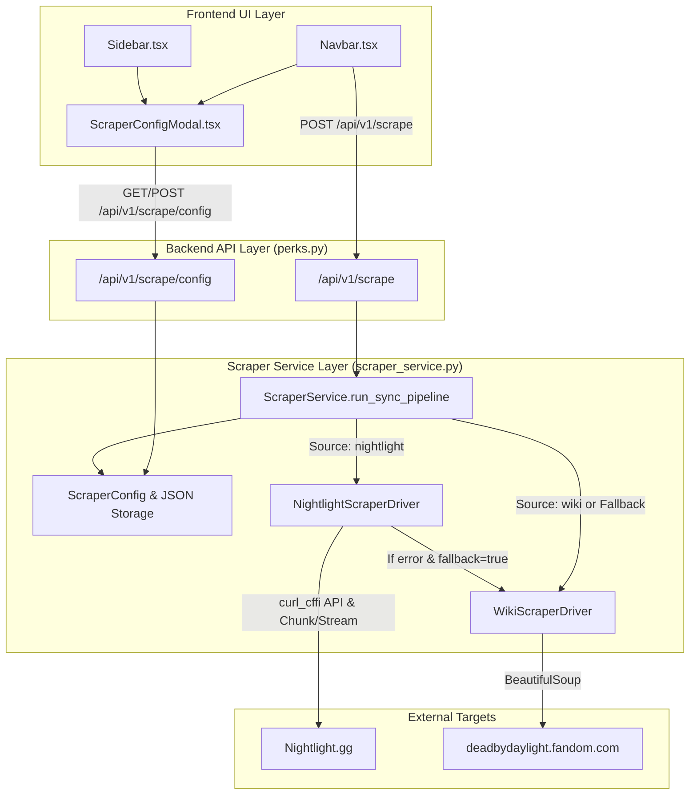

# Nightlight Scraper Integration Implementation Plan

> **For agentic workers:** REQUIRED SUB-SKILL: Use superpowers:subagent-driven-development to implement this plan task-by-task. Steps use checkbox (`- [ ]`) syntax for tracking.

**Goal:** Implement Nightlight.gg as the default scraper source for DBD perks, survivors, killers, and high-res assets, while retaining the DBD Wiki scraper as a configurable secondary source and automatic fallback.

**Architecture:** Refactor `ScraperService` into a driver-based orchestrator (`NightlightScraperDriver` & `WikiScraperDriver`). Scraper settings (`source`, `fallback_to_wiki`) are stored in `backend/data/scraper_config.json` and managed via REST API endpoints (`GET/POST /api/v1/scrape/config`). A React modal component (`ScraperConfigModal.tsx`) is added to the frontend Navbar and Sidebar to give users full visual control.

**Architecture Diagram:**



**Tech Stack:** Python 3.14, Flask, `curl_cffi` (TLS Chrome impersonation), BeautifulSoup4, `asyncio`, Next.js 14, Tailwind CSS, Lucide Icons, `unittest`.

## Global Constraints
- Python backend test suite executed using: `$env:PYTHONPATH="backend"; .venv\Scripts\python.exe -m unittest discover -s backend/tests`
- Network requests to Nightlight must use `curl_cffi.requests` with `impersonate="chrome120"` and `verify=False`.
- Assets must be saved to `backend/app/static/icons/` and `backend/app/static/avatars/`.
- Frontend code must build cleanly via `npm run build` in `frontend/`.

---

### Task 1: Scraper Configuration Storage & Management

**Files:**
- Create: `backend/data/scraper_config.json`
- Modify: `backend/app/services/scraper_service.py:1-42`
- Test: `backend/tests/test_scraper_config.py`

**Interfaces:**
- Consumes: JSON config file read/write operations
- Produces: `ScraperConfig` dataclass and methods `load_config()`, `save_config(data)` on `ScraperService`

- [ ] **Step 1: Write the failing test**

Create `backend/tests/test_scraper_config.py`:
```python
import json
import unittest
from pathlib import Path
from tempfile import TemporaryDirectory
from app.services.scraper_service import ScraperConfig, ScraperService

class TestScraperConfig(unittest.TestCase):
    def test_config_defaults_and_persistence(self):
        with TemporaryDirectory() as tmpdir:
            base_path = Path(tmpdir)
            service = ScraperService(base_dir=base_path)
            
            # Initial config should default to nightlight source and fallback enabled
            cfg = service.load_config()
            self.assertEqual(cfg.source, "nightlight")
            self.assertTrue(cfg.fallback_to_wiki)
            
            # Save modified config
            service.save_config({"source": "wiki", "fallback_to_wiki": False})
            updated_cfg = service.load_config()
            self.assertEqual(updated_cfg.source, "wiki")
            self.assertFalse(updated_cfg.fallback_to_wiki)

if __name__ == "__main__":
    unittest.main()
```

- [ ] **Step 2: Run test to verify it fails**

Run: `$env:PYTHONPATH="backend"; .venv\Scripts\python.exe -m unittest backend/tests/test_scraper_config.py`
Expected: FAIL (`ScraperConfig` or `load_config` not defined)

- [ ] **Step 3: Implement minimal code to make test pass**

Create default `backend/data/scraper_config.json`:
```json
{
  "source": "nightlight",
  "fallback_to_wiki": true,
  "last_used_source": "nightlight",
  "last_run_timestamp": null
}
```

Add `ScraperConfig` dataclass and config methods to `backend/app/services/scraper_service.py`:
```python
@dataclass
class ScraperConfig:
    source: str = "nightlight"
    fallback_to_wiki: bool = True
    last_used_source: Optional[str] = "nightlight"
    last_run_timestamp: Optional[str] = None
```
And add `self.config_file = self.base_dir / "data" / "scraper_config.json"`, `load_config()`, and `save_config(data)` to `ScraperService`.

- [ ] **Step 4: Run test to verify it passes**

Run: `$env:PYTHONPATH="backend"; .venv\Scripts\python.exe -m unittest backend/tests/test_scraper_config.py`
Expected: PASS

- [ ] **Step 5: Commit**

```bash
git add backend/data/scraper_config.json backend/app/services/scraper_service.py backend/tests/test_scraper_config.py
git commit -m "feat(scraper): add ScraperConfig model and persistent storage"
```

---

### Task 2: Nightlight Scraper Driver Implementation

**Files:**
- Modify: `backend/app/services/scraper_service.py`
- Test: `backend/tests/test_nightlight_driver.py`

**Interfaces:**
- Consumes: Nightlight HTTP endpoints (`api/v1/stats/global/survivors`, `killers`, `/perks/list`, dynamic chunk JS)
- Produces: `NightlightScraperDriver.scrape_characters()` and `NightlightScraperDriver.scrape_perks()` returning `List[CharacterData]` and `List[PerkData]`

- [ ] **Step 1: Write the failing test**

Create `backend/tests/test_nightlight_driver.py`:
```python
import unittest
from unittest.mock import patch, MagicMock
from app.services.scraper_service import NightlightScraperDriver, CharacterData, PerkData

class TestNightlightDriver(unittest.TestCase):
    def test_parse_survivors_and_killers_api(self):
        driver = NightlightScraperDriver()
        mock_surv_api = {
            "status": "success",
            "data": {"survivors": [{"name": "Sable Ward", "image": "portraits/sable-ward.png"}]}
        }
        mock_kill_api = {
            "status": "success",
            "data": {"killers": [{"name": "The Trapper", "image": "portraits/the-trapper.png"}]}
        }
        
        chars = driver.parse_api_characters(mock_surv_api, mock_kill_api)
        self.assertEqual(len(chars), 2)
        self.assertEqual(chars[0].name, "Sable Ward")
        self.assertEqual(chars[0].category, "Survivor")
        self.assertEqual(chars[1].name, "The Trapper")
        self.assertEqual(chars[1].category, "Killer")

    def test_parse_chunk_and_stream_perks(self):
        driver = NightlightScraperDriver()
        chunk_text = '"32":{"n":"Sprint Burst","i":"sprint-burst","u":"/perks/Sprint_Burst","r":1,"c":20,"t":"high","p":7,"a":["Meg Thomas"]}'
        chars_chunk = '{"20":{"n":"Meg Thomas","r":"Survivor","i":"","p":"meg-thomas.png"}}'
        stream_html_payload = 'streamController.enqueue("[\\"32\\", \\"<p>Gain 50% Haste.</p>\\"]");'
        
        perks = driver.parse_nightlight_perks(chunk_text, chars_chunk, stream_html_payload)
        self.assertTrue(len(perks) >= 1)
        sb = perks[0]
        self.assertEqual(sb.name, "Sprint Burst")
        self.assertEqual(sb.character, "Meg Thomas")
        self.assertEqual(sb.category, "Survivor")

if __name__ == "__main__":
    unittest.main()
```

- [ ] **Step 2: Run test to verify it fails**

Run: `$env:PYTHONPATH="backend"; .venv\Scripts\python.exe -m unittest backend/tests/test_nightlight_driver.py`
Expected: FAIL (`NightlightScraperDriver` not defined)

- [ ] **Step 3: Implement `NightlightScraperDriver` class in `scraper_service.py`**

Implement `NightlightScraperDriver` in `backend/app/services/scraper_service.py`:
- `fetch_nightlight_data()`: Calls `https://nightlight.gg/api/v1/stats/global/survivors` and `killers` using `curl_cffi` with `verify=False`.
- `parse_api_characters(surv_json, kill_json)`: Converts API response items into `CharacterData` instances.
- `parse_nightlight_perks(chunk_text, chars_chunk, stream_payload)`: Extracts perks, character assignments, icon URLs (`https://cdn.nightlight.gg/img/perks/{icon}.png`), and descriptions.

- [ ] **Step 4: Run test to verify it passes**

Run: `$env:PYTHONPATH="backend"; .venv\Scripts\python.exe -m unittest backend/tests/test_nightlight_driver.py`
Expected: PASS

- [ ] **Step 5: Commit**

```bash
git add backend/app/services/scraper_service.py backend/tests/test_nightlight_driver.py
git commit -m "feat(scraper): implement NightlightScraperDriver logic"
```

---

### Task 3: Wiki Driver Refactoring & Automatic Fallback Pipeline

**Files:**
- Modify: `backend/app/services/scraper_service.py`
- Test: `backend/tests/test_scraper_fallback.py`

**Interfaces:**
- Consumes: `NightlightScraperDriver`, `WikiScraperDriver`, `ScraperConfig`
- Produces: `run_sync_pipeline(override_source=None, override_fallback=None)` with automatic fallback functionality

- [ ] **Step 1: Write the failing test**

Create `backend/tests/test_scraper_fallback.py`:
```python
import unittest
from unittest.mock import patch, MagicMock
from app.services.scraper_service import ScraperService

class TestScraperFallback(unittest.TestCase):
    @patch("app.services.scraper_service.NightlightScraperDriver.scrape_all")
    @patch("app.services.scraper_service.WikiScraperDriver.scrape_all")
    def test_automatic_fallback_on_nightlight_failure(self, mock_wiki_scrape, mock_nl_scrape):
        mock_nl_scrape.side_effect = Exception("Nightlight 503 Service Unavailable")
        mock_wiki_scrape.return_value = ([], [])
        
        service = ScraperService()
        service.save_config({"source": "nightlight", "fallback_to_wiki": True})
        
        # Run pipeline - should attempt Nightlight, fail, and fallback to Wiki
        stats = service.run_sync_pipeline()
        
        mock_nl_scrape.assert_called_once()
        mock_wiki_scrape.assert_called_once()
        status = service.get_status()
        self.assertEqual(status["last_used_source"], "wiki")
        self.assertTrue(status["fallback_used"])

if __name__ == "__main__":
    unittest.main()
```

- [ ] **Step 2: Run test to verify it fails**

Run: `$env:PYTHONPATH="backend"; .venv\Scripts\python.exe -m unittest backend/tests/test_scraper_fallback.py`
Expected: FAIL (fallback mechanism not yet implemented in `run_sync_pipeline`)

- [ ] **Step 3: Refactor Wiki driver and implement fallback pipeline**

Encapsulate original Fandom Wiki parsing into `WikiScraperDriver`.
Update `ScraperService.run_sync_pipeline()`:
```python
# Try primary source
current_source = override_source or config.source
fallback_enabled = override_fallback if override_fallback is not None else config.fallback_to_wiki

try:
    if current_source == "nightlight":
        characters, perks = self.nightlight_driver.scrape_all()
        used_source = "nightlight"
    else:
        characters, perks = self.wiki_driver.scrape_all()
        used_source = "wiki"
except Exception as primary_err:
    if current_source == "nightlight" and fallback_enabled:
        logger.warning(f"Nightlight scraper failed ({primary_err}). Falling back to DBD Wiki...")
        self._update_status(current_step="falling_back_to_wiki", fallback_used=True)
        characters, perks = self.wiki_driver.scrape_all()
        used_source = "wiki"
    else:
        raise primary_err
```

- [ ] **Step 4: Run test to verify it passes**

Run: `$env:PYTHONPATH="backend"; .venv\Scripts\python.exe -m unittest backend/tests/test_scraper_fallback.py`
Expected: PASS

- [ ] **Step 5: Commit**

```bash
git add backend/app/services/scraper_service.py backend/tests/test_scraper_fallback.py
git commit -m "feat(scraper): add WikiScraperDriver and automatic fallback pipeline"
```

---

### Task 4: Scraper REST API Configuration Endpoints

**Files:**
- Modify: `backend/app/routes/perks.py:65-93`
- Test: `backend/tests/test_scraper_routes.py`

**Interfaces:**
- Consumes: `ScraperService.load_config()`, `save_config()`, `run_sync_pipeline()`
- Produces: HTTP endpoints `GET /api/v1/scrape/config`, `POST /api/v1/scrape/config`, updated `POST /api/v1/scrape`

- [ ] **Step 1: Write the failing test**

Create `backend/tests/test_scraper_routes.py`:
```python
import unittest
import json
from app import create_app

class TestScraperRoutes(unittest.TestCase):
    def setUp(self):
        self.app = create_app()
        self.client = self.app.test_client()

    def test_get_and_post_scrape_config(self):
        # GET config
        res = self.client.get("/api/v1/scrape/config")
        self.assertEqual(res.status_code, 200)
        data = json.loads(res.data)
        self.assertIn("source", data)
        self.assertIn("fallback_to_wiki", data)

        # POST config update
        update_res = self.client.post(
            "/api/v1/scrape/config",
            json={"source": "wiki", "fallback_to_wiki": False}
        )
        self.assertEqual(update_res.status_code, 200)
        updated_data = json.loads(update_res.data)
        self.assertEqual(updated_data["config"]["source"], "wiki")

if __name__ == "__main__":
    unittest.main()
```

- [ ] **Step 2: Run test to verify it fails**

Run: `$env:PYTHONPATH="backend"; .venv\Scripts\python.exe -m unittest backend/tests/test_scraper_routes.py`
Expected: FAIL (`404 Not Found` for `/api/v1/scrape/config`)

- [ ] **Step 3: Implement REST API routes in `backend/app/routes/perks.py`**

Add routes to `backend/app/routes/perks.py`:
```python
@perks_bp.route("/api/v1/scrape/config", methods=["GET"])
def get_scrape_config():
    scraper = ScraperService()
    return jsonify(asdict(scraper.load_config())), 200

@perks_bp.route("/api/v1/scrape/config", methods=["POST"])
def update_scrape_config():
    data = request.get_json() or {}
    scraper = ScraperService()
    updated = scraper.save_config(data)
    return jsonify({"message": "Configuration updated", "config": asdict(updated)}), 200
```
Update `trigger_scrape()` to accept optional JSON payload overrides.

- [ ] **Step 4: Run test to verify it passes**

Run: `$env:PYTHONPATH="backend"; .venv\Scripts\python.exe -m unittest backend/tests/test_scraper_routes.py`
Expected: PASS

- [ ] **Step 5: Commit**

```bash
git add backend/app/routes/perks.py backend/tests/test_scraper_routes.py
git commit -m "feat(api): add scraper configuration REST API endpoints"
```

---

### Task 5: Frontend Scraper Configuration Modal & Navigation Controls

**Files:**
- Create: `frontend/src/components/ScraperConfigModal.tsx`
- Modify: `frontend/src/components/Navbar.tsx`
- Modify: `frontend/src/components/Sidebar.tsx`

**Interfaces:**
- Consumes: `/api/v1/scrape/config` GET/POST and `/api/v1/scrape` POST
- Produces: Visual modal dialog for scraper configuration and settings gear buttons in Navbar & Sidebar

- [ ] **Step 1: Create `ScraperConfigModal.tsx`**

Create `frontend/src/components/ScraperConfigModal.tsx`:
```tsx
'use client';

import React, { useState, useEffect } from 'react';
import { Settings, Database, Check, X, ShieldAlert } from 'lucide-react';

interface ScraperConfigModalProps {
  isOpen: boolean;
  onClose: () => void;
}

export const ScraperConfigModal: React.FC<ScraperConfigModalProps> = ({ isOpen, onClose }) => {
  const [source, setSource] = useState<'nightlight' | 'wiki'>('nightlight');
  const [fallbackToWiki, setFallbackToWiki] = useState(true);
  const [saving, setSaving] = useState(false);
  const backendBase = process.env.NEXT_PUBLIC_API_URL || 'http://localhost:5000';

  useEffect(() => {
    if (isOpen) {
      fetch(`${backendBase}/api/v1/scrape/config`)
        .then((res) => res.json())
        .then((data) => {
          if (data.source) setSource(data.source);
          if (typeof data.fallback_to_wiki === 'boolean') setFallbackToWiki(data.fallback_to_wiki);
        })
        .catch(console.error);
    }
  }, [isOpen, backendBase]);

  const handleSave = async () => {
    setSaving(true);
    try {
      await fetch(`${backendBase}/api/v1/scrape/config`, {
        method: 'POST',
        headers: { 'Content-Type': 'application/json' },
        body: JSON.stringify({ source, fallback_to_wiki: fallbackToWiki }),
      });
      onClose();
    } catch (err) {
      console.error('Failed to save config:', err);
    } finally {
      setSaving(false);
    }
  };

  if (!isOpen) return null;

  return (
    <div className="fixed inset-0 z-50 flex items-center justify-center bg-slate-950/60 backdrop-blur-sm p-4">
      <div className="w-full max-w-md rounded-2xl border border-slate-200 bg-white p-6 shadow-2xl dark:border-slate-800 dark:bg-slate-900">
        <div className="flex items-center justify-between border-b border-slate-200 pb-4 dark:border-slate-800">
          <div className="flex items-center gap-2 text-slate-900 dark:text-slate-100 font-bold text-base">
            <Settings className="h-5 w-5 text-red-500" />
            <span>Scraper Settings</span>
          </div>
          <button onClick={onClose} className="rounded-lg p-1 text-slate-400 hover:bg-slate-100 dark:hover:bg-slate-800">
            <X className="h-5 w-5" />
          </button>
        </div>

        <div className="mt-4 space-y-4">
          <div>
            <label className="text-xs font-extrabold uppercase text-slate-400">Primary Data Source</label>
            <div className="mt-2 grid grid-cols-2 gap-2">
              <button
                type="button"
                onClick={() => setSource('nightlight')}
                className={`flex flex-col items-center justify-center p-3 rounded-xl border text-xs font-bold transition-all ${
                  source === 'nightlight'
                    ? 'border-red-500 bg-red-500/10 text-red-500'
                    : 'border-slate-200 dark:border-slate-800 text-slate-600 dark:text-slate-400'
                }`}
              >
                <span>Nightlight.gg</span>
                <span className="text-[10px] font-normal text-emerald-500">Recommended</span>
              </button>

              <button
                type="button"
                onClick={() => setSource('wiki')}
                className={`flex flex-col items-center justify-center p-3 rounded-xl border text-xs font-bold transition-all ${
                  source === 'wiki'
                    ? 'border-red-500 bg-red-500/10 text-red-500'
                    : 'border-slate-200 dark:border-slate-800 text-slate-600 dark:text-slate-400'
                }`}
              >
                <span>DBD Fandom Wiki</span>
                <span className="text-[10px] font-normal text-slate-400">Legacy</span>
              </button>
            </div>
          </div>

          <div className="flex items-center justify-between pt-2">
            <div>
              <p className="text-xs font-bold text-slate-800 dark:text-slate-200">Automatic Fallback</p>
              <p className="text-[11px] text-slate-500">Use DBD Wiki if Nightlight is unavailable</p>
            </div>
            <input
              type="checkbox"
              checked={fallbackToWiki}
              onChange={(e) => setFallbackToWiki(e.target.checked)}
              className="h-4 w-4 rounded accent-red-600 cursor-pointer"
            />
          </div>
        </div>

        <div className="mt-6 flex justify-end gap-2 border-t border-slate-200 pt-4 dark:border-slate-800">
          <button onClick={onClose} className="px-4 py-2 text-xs font-bold text-slate-600 hover:bg-slate-100 rounded-xl dark:text-slate-400 dark:hover:bg-slate-800">
            Cancel
          </button>
          <button
            onClick={handleSave}
            disabled={saving}
            className="flex items-center gap-1.5 px-4 py-2 text-xs font-bold text-white bg-red-600 hover:bg-red-500 rounded-xl shadow-md"
          >
            <Check className="h-4 w-4" />
            <span>Save Settings</span>
          </button>
        </div>
      </div>
    </div>
  );
};
```

- [ ] **Step 2: Integrate `ScraperConfigModal` button into Navbar & Sidebar**

In `Navbar.tsx` and `Sidebar.tsx`:
Add state `[isConfigOpen, setIsConfigOpen] = useState(false)`.
Render `<Settings className="h-4 w-4 text-slate-500 hover:text-red-500 cursor-pointer" onClick={() => setIsConfigOpen(true)} />` next to the Sync button.
Include `<ScraperConfigModal isOpen={isConfigOpen} onClose={() => setIsConfigOpen(false)} />`.

- [ ] **Step 3: Test frontend compilation**

Run: `cd frontend; npm run build`
Expected: Build succeeds with zero errors.

- [ ] **Step 4: Commit**

```bash
git add frontend/src/components/ScraperConfigModal.tsx frontend/src/components/Navbar.tsx frontend/src/components/Sidebar.tsx
git commit -m "feat(frontend): add ScraperConfigModal and settings controls to Navbar and Sidebar"
```

---

### Task 6: Full Verification & End-to-End Test Execution

**Files:**
- Repository-wide test check and live scrape execution

- [ ] **Step 1: Run full backend unit test suite**

Run: `$env:PYTHONPATH="backend"; .venv\Scripts\python.exe -m unittest discover -s backend/tests`
Expected: All tests PASS cleanly.

- [ ] **Step 2: Run live scrape test using Nightlight driver**

Run: `.venv\Scripts\python.exe -c "from app.services.scraper_service import ScraperService; stats = ScraperService().run_sync_pipeline(); print(stats)"`
Expected: Successfully scrapes characters and perks from Nightlight and saves assets to `backend/app/static/`.

- [ ] **Step 3: Commit final verification changes**

```bash
git add .
git commit -m "chore: verify Nightlight scraper pipeline and complete integration"
```
