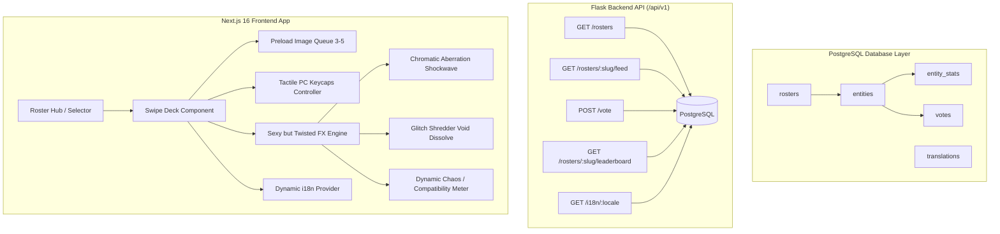

# Smash or Pass Overhaul: Complete Implementation Plan

> **For agentic workers:** REQUIRED SUB-SKILL: Use superpowers:subagent-driven-development to implement this plan task-by-task. Steps use checkbox (`- [ ]`) syntax for tracking.

**Goal:** Overhaul the entire Smash or Pass application into a 100% database-driven system with PostgreSQL, high-concurrency Flask APIs, Next.js 16+ App Router with Framer Motion, dynamic multi-locale i18n, and a "Sexy but Twisted" dark-neon aesthetic.

**Architecture:** A decoupled full-stack architecture where dynamic rosters, entities, stats, votes, and translations are stored in PostgreSQL with SQLAlchemy 2.0. The Flask backend exposes rate-limited batch feed and voting endpoints with session tracking. The Next.js 16 frontend provides a fluid gesture/keyboard-driven card deck with 3-5 item image preloading, chromatic aberration shockwaves, glitch disintegrations, dynamic chaos compatibility meters, and zero hardcoded UI strings.

**Architecture Diagram:**


**Tech Stack:**
- **Backend:** Python 3.11+, Flask 3.x, SQLAlchemy 2.0, PostgreSQL (psycopg2-binary / SQLite fallback in dev/test)
- **Frontend:** Next.js 16+, React 19 / React Server Components, TypeScript, Tailwind CSS, Framer Motion, Lucide React
- **Aesthetic:** "Sexy but Twisted" (Void black `#09090b`, Neon Crimson `#ff0055`, Cyber Mint `#00f5d4`, Velvet Purple `#2e0854`)

## Global Constraints
- **Zero Hardcoded Strings:** Every UI element, button, modal, error message, toast, and roster text must derive from the i18n translation system.
- **Database-Driven Content:** All roster catalogs, character entities, metadata traits, stats, and translations must reside in PostgreSQL.
- **Performance:** Preload 3-5 upcoming images in the swipe queue for zero-lag card transitions.
- **Responsive Controls:** Fluid mobile touch swipe gestures + PC tactile keyboard controls (`← Pass`, `→ Smash`, `↑ Stats`, `↓ Chaos`, `R Reset`) with illuminated on-screen keycaps.

---

### Task 1: PostgreSQL Schema & SQLAlchemy Models

**Files:**
- Create/Modify: `backend/app/models/smash_or_pass.py`
- Modify: `backend/app/models/__init__.py`
- Modify: `backend/app/services/db/raw_schema.py`
- Test: `backend/tests/test_smash_models.py`

**Interfaces:**
- Produces: `Roster`, `Entity`, `EntityStat`, `Vote`, `Translation` SQLAlchemy models with `.to_dict()` methods, relationship definitions, and atomic stat calculations.

- [ ] **Step 1: Write the failing test for new models**

```python
# backend/tests/test_smash_models.py
import pytest
import uuid
from app.models.smash_or_pass import Roster, Entity, EntityStat, Vote, Translation

def test_create_roster_and_entity(db_session):
    roster = Roster(
        slug="test_cyberpunk",
        name_i18n_key="smashOrPass.rosters.cyberpunk.name",
        description_i18n_key="smashOrPass.rosters.cyberpunk.desc",
        theme_color="#00f5d4",
        category="Cyberpunk",
    )
    db_session.add(roster)
    db_session.commit()

    entity = Entity(
        roster_id=roster.id,
        slug="cyber_trickster",
        name="Trickster 2077",
        role="Killer",
        gender="male",
        media_url="/images/roster/trickster.png",
        metadata_json={"chaos_score": 92, "danger_level": "Lethal", "archetype": "Neon Idol"}
    )
    db_session.add(entity)
    db_session.commit()

    assert entity.id is not None
    assert entity.roster.slug == "test_cyberpunk"
    assert entity.metadata_json["chaos_score"] == 92
```

- [ ] **Step 2: Run test to verify it fails**

Run: `pytest backend/tests/test_smash_models.py -v`
Expected: FAIL with missing classes or attributes.

- [ ] **Step 3: Implement `smash_or_pass.py` models & raw schema**

Define `Roster`, `Entity`, `EntityStat`, `Vote`, and `Translation` in `backend/app/models/smash_or_pass.py` with UUID PKs, JSONB metadata, foreign keys, and `.to_dict()` serialization. Update `backend/app/models/__init__.py` and `backend/app/services/db/raw_schema.py`.

- [ ] **Step 4: Run test to verify it passes**

Run: `pytest backend/tests/test_smash_models.py -v`
Expected: PASS.

- [ ] **Step 5: Commit**

```bash
git add backend/app/models/smash_or_pass.py backend/app/models/__init__.py backend/app/services/db/raw_schema.py backend/tests/test_smash_models.py
git commit -m "feat(backend): implement postgresql models for smash or pass overhaul"
```

---

### Task 2: Database Seeder & Dynamic Content Service

**Files:**
- Create: `backend/app/seeds/smash_roster_seeder.py`
- Modify: `backend/app/services/others/smash_or_pass_service.py`
- Test: `backend/tests/test_smash_seeder_service.py`

**Interfaces:**
- Consumes: `Roster`, `Entity`, `EntityStat`, `Vote`, `Translation`
- Produces: `SmashOrPassService.get_rosters()`, `SmashOrPassService.get_feed()`, `SmashOrPassService.cast_vote()`, `SmashOrPassService.get_leaderboard()`, `SmashOrPassService.get_translations()`

- [ ] **Step 1: Write failing test for Seeder & Service**

```python
# backend/tests/test_smash_seeder_service.py
import pytest
from app.services.others.smash_or_pass_service import SmashOrPassService

def test_seeder_and_feed_generation(app, db_session):
    with app.app_context():
        service = SmashOrPassService()
        service.ensure_seeded()
        
        rosters = service.get_rosters()
        assert len(rosters) >= 5
        
        feed = service.get_feed(roster_slug="canon", session_id="test_session_123")
        assert len(feed["entities"]) > 0
        first_entity = feed["entities"][0]
        assert "stats" in first_entity
        assert "metadata" in first_entity
```

- [ ] **Step 2: Run test to verify it fails**

Run: `pytest backend/tests/test_smash_seeder_service.py -v`
Expected: FAIL.

- [ ] **Step 3: Implement `smash_roster_seeder.py` and upgrade `SmashOrPassService`**

Implement comprehensive seeding for:
1. DBD Fog Canon (98 characters with rich traits and chaos scores)
2. Hooked on You (Island Romance)
3. Legendary & Cosplay Skins
4. Cyberpunk Fog 2077 Edition
5. Fog Anime / Manga Aesthetic
6. Gothic & Victorian Eldritch
7. Multi-locale translation keys for `en`, `es`, `de`, `ja`, `pl`.

Update `SmashOrPassService` to query entities from PostgreSQL, perform unvoted feed filtering with session ID exclusion, and execute atomic voting calculations.

- [ ] **Step 4: Run test to verify it passes**

Run: `pytest backend/tests/test_smash_seeder_service.py -v`
Expected: PASS.

- [ ] **Step 5: Commit**

```bash
git add backend/app/seeds/smash_roster_seeder.py backend/app/services/others/smash_or_pass_service.py backend/tests/test_smash_seeder_service.py
git commit -m "feat(backend): implement multi-roster seeder and db-driven smash service"
```

---

### Task 3: Flask API Endpoints, Rate Limiting & Dynamic i18n Route

**Files:**
- Modify: `backend/app/routes/others/smash_or_pass.py`
- Modify: `backend/app/__init__.py`
- Test: `backend/tests/test_smash_api.py`

**Interfaces:**
- Endpoints:
  - `GET /api/v1/smash-or-pass/rosters`
  - `GET /api/v1/smash-or-pass/rosters/<slug>/feed`
  - `POST /api/v1/smash-or-pass/vote`
  - `GET /api/v1/smash-or-pass/rosters/<slug>/leaderboard`
  - `GET /api/v1/i18n/<locale>`
  - `POST /api/v1/smash-or-pass/session/reset`

- [ ] **Step 1: Write failing API test**

```python
# backend/tests/test_smash_api.py
def test_smash_or_pass_api_flow(client):
    # 1. Get rosters
    res = client.get('/api/v1/smash-or-pass/rosters')
    assert res.status_code == 200
    rosters = res.json['data']
    assert len(rosters) >= 5

    # 2. Get feed
    res_feed = client.get('/api/v1/smash-or-pass/rosters/canon/feed?session_id=sess_abc')
    assert res_feed.status_code == 200
    entities = res_feed.json['data']['entities']
    assert len(entities) > 0
    entity_id = entities[0]['id']

    # 3. Cast vote
    res_vote = client.post('/api/v1/smash-or-pass/vote', json={
        'entity_id': entity_id,
        'vote_type': 'smash',
        'session_id': 'sess_abc'
    })
    assert res_vote.status_code == 200
    assert res_vote.json['data']['smash_count'] >= 1
```

- [ ] **Step 2: Run test to verify it fails**

Run: `pytest backend/tests/test_smash_api.py -v`
Expected: FAIL.

- [ ] **Step 3: Implement Flask routes and register dynamic i18n route**

Write modular Flask routes with error handling, session cookies, input validation, and rate limiting in `backend/app/routes/others/smash_or_pass.py`. Add `/api/v1/i18n/<locale>` endpoint.

- [ ] **Step 4: Run test to verify it passes**

Run: `pytest backend/tests/test_smash_api.py -v`
Expected: PASS.

- [ ] **Step 5: Commit**

```bash
git add backend/app/routes/others/smash_or_pass.py backend/app/__init__.py backend/tests/test_smash_api.py
git commit -m "feat(backend): implement rest api blueprint and dynamic i18n endpoint"
```

---

### Task 4: Frontend API Layer, Types & Dynamic i18n Hydration

**Files:**
- Create: `frontend/src/types/smashOrPass.ts`
- Create: `frontend/src/services/smashApi.ts`
- Modify: `frontend/src/locales/en.json`, `es.json`, `de.json`, `ja.json`, `pl.json`

**Interfaces:**
- Produces: TypeScript types `RosterItem`, `EntityItem`, `EntityStatItem`, `FeedResponse`, `VotePayload`, and typed API service functions `fetchRosters()`, `fetchRosterFeed()`, `castVote()`, `fetchLeaderboard()`, `fetchDynamicTranslations()`.

- [ ] **Step 1: Define full TypeScript interfaces in `frontend/src/types/smashOrPass.ts`**
- [ ] **Step 2: Implement robust API client in `frontend/src/services/smashApi.ts` with session persistence**
- [ ] **Step 3: Update locale JSON files (`en.json`, `es.json`, `de.json`, `ja.json`, `pl.json`) with all new "Sexy but Twisted" keys and zero hardcoded text**
- [ ] **Step 4: Verify frontend builds with new types**

Run: `npm --prefix frontend run build` (or typecheck)
Expected: PASS.

- [ ] **Step 5: Commit**

```bash
git add frontend/src/types/smashOrPass.ts frontend/src/services/smashApi.ts frontend/src/locales/
git commit -m "feat(frontend): create api service layer, typescript definitions, and i18n keys"
```

---

### Task 5: "Sexy but Twisted" Visual FX, Tactile Keycaps & Chaos Metrics

**Files:**
- Create/Modify: `frontend/src/components/smash-or-pass/SmashAnimations.tsx`
- Create/Modify: `frontend/src/components/smash-or-pass/CardDisintegrationOverlay.tsx`
- Create: `frontend/src/components/smash-or-pass/TactileKeycaps.tsx`
- Create: `frontend/src/components/smash-or-pass/ChaosMetricsDisplay.tsx`

**Interfaces:**
- Produces:
  - `SmashAnimations`: Neon chromatic shockwave particle burst canvas/SVG emitter.
  - `CardDisintegrationOverlay`: Glitch CRT scanlines and digital shredder void dissolve for passes.
  - `TactileKeycaps`: Interactive HUD showing `[← Pass]`, `[↑ Stats]`, `[→ Smash]`, `[↓ Chaos]`, `[R Reset]` lighting up on physical keystrokes.
  - `ChaosMetricsDisplay`: Real-time compatibility & chaos score gauge with surreal AI persona commentary.

- [ ] **Step 1: Implement `TactileKeycaps.tsx` with active keypress listeners and neon glow states**
- [ ] **Step 2: Implement `ChaosMetricsDisplay.tsx` with eerie animated gauge and personality analysis**
- [ ] **Step 3: Upgrade `SmashAnimations.tsx` with crimson particle bursts and chromatic aberration shockwave**
- [ ] **Step 4: Upgrade `CardDisintegrationOverlay.tsx` with void glitch shredder shader effects**
- [ ] **Step 5: Verify build & component rendering**
- [ ] **Step 6: Commit**

```bash
git add frontend/src/components/smash-or-pass/TactileKeycaps.tsx frontend/src/components/smash-or-pass/ChaosMetricsDisplay.tsx frontend/src/components/smash-or-pass/SmashAnimations.tsx frontend/src/components/smash-or-pass/CardDisintegrationOverlay.tsx
git commit -m "feat(frontend): implement sexy-twisted fx, tactile keycaps HUD, and chaos metrics"
```

---

### Task 6: Interactive Card Stack & Image Preloader Queue

**Files:**
- Modify: `frontend/src/components/smash-or-pass/CharacterCard.tsx`
- Modify: `frontend/src/components/smash-or-pass/CharacterStatsModal.tsx`
- Modify: `frontend/src/components/smash-or-pass/SmashLeaderboardModal.tsx`

**Interfaces:**
- Produces: High-performance gesture-drag Card Stack (Framer Motion) with dynamic color shifts (Right = Crimson, Left = Void Cyan), 3-5 image preloader, rich threat/chaos trait badges, and surreal lore modals.

- [ ] **Step 1: Implement `CharacterCard.tsx` with Framer Motion spring physics, gesture thresholds, and trait badges**
- [ ] **Step 2: Upgrade `CharacterStatsModal.tsx` with dark dossier aesthetics, chaos score, danger rating, and community ratios**
- [ ] **Step 3: Upgrade `SmashLeaderboardModal.tsx` with tier categories (*God Tier*, *Fatal Attraction*, *Friendzone*, *Eldritch Void*) and search filters**
- [ ] **Step 4: Verify component styles and type safety**
- [ ] **Step 5: Commit**

```bash
git add frontend/src/components/smash-or-pass/CharacterCard.tsx frontend/src/components/smash-or-pass/CharacterStatsModal.tsx frontend/src/components/smash-or-pass/SmashLeaderboardModal.tsx
git commit -m "feat(frontend): upgrade interactive card stack, trait badges, and leaderboards"
```

---

### Task 7: Roster Hub & Full SmashOrPassHub Integration

**Files:**
- Create: `frontend/src/components/smash-or-pass/RosterSelector.tsx`
- Modify: `frontend/src/components/smash-or-pass/SmashOrPassHub.tsx`
- Modify: `frontend/src/app/[locale]/smash-or-pass/page.tsx`

**Interfaces:**
- Produces: Complete browsable Roster Hub (Fog Canon, Hooked on You, Cyberpunk 2077, Anime/Manga, Gothic/Eldritch, Legendary Cosplay), connected to backend feed queue, image preloading, keyboard controller, sound effects, and zero-hardcoded dynamic i18n.

- [ ] **Step 1: Implement `RosterSelector.tsx` with category badges, cover art, and total vote counters**
- [ ] **Step 2: Refactor `SmashOrPassHub.tsx` to use database-driven feeds, 3-5 image preloader queue, tactile keycaps HUD, and chaos metrics**
- [ ] **Step 3: Update `page.tsx` to handle dynamic locale hydration and error states gracefully**
- [ ] **Step 4: Verify build and compile passes without errors**
- [ ] **Step 5: Commit**

```bash
git add frontend/src/components/smash-or-pass/RosterSelector.tsx frontend/src/components/smash-or-pass/SmashOrPassHub.tsx frontend/src/app/[locale]/smash-or-pass/page.tsx
git commit -m "feat(frontend): integrate database-driven roster hub and swipe deck"
```

---

### Task 8: Full-Stack Verification & Automated Test Suite

**Files:**
- Test: `backend/tests/`
- Test: Frontend build & typecheck

- [ ] **Step 1: Run complete backend pytest suite**

Run: `pytest backend/tests/ -v`
Expected: All backend tests pass.

- [ ] **Step 2: Run frontend build and lint check**

Run: `powershell -Command "cd frontend; npm run build"`
Expected: Build passes with 0 errors.

- [ ] **Step 3: Verify all features end-to-end (Rosters, Feed, Voting, Keycaps, FX, Leaderboards, i18n)**
- [ ] **Step 4: Final commit & walkthrough artifact creation**

```bash
git add .
git commit -m "feat(smash-or-pass): complete database-driven sexy-twisted overhaul"
```
