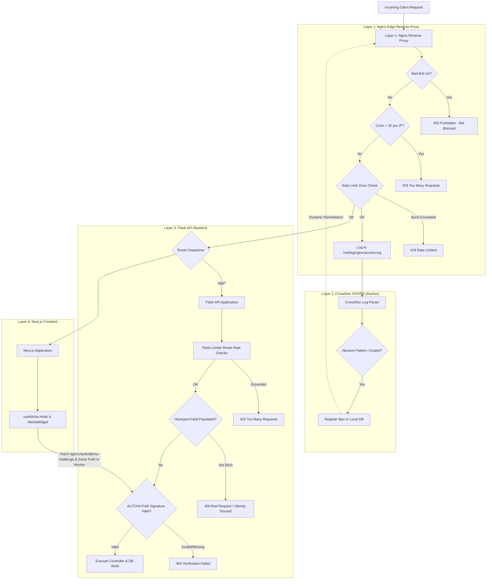

# Anti-Bot & DDoS Protection Implementation Plan

> **For agentic workers:** REQUIRED SUB-SKILL: Use superpowers:subagent-driven-development to implement this plan task-by-task. Steps use checkbox (`- [ ]`) syntax for tracking.

**Goal:** Implement a lightweight, 100% free, fully self-hosted multi-layer Anti-Bot & DDoS protection system across Nginx, CrowdSec, Flask API, and Next.js.

**Architecture:** A 4-layer defense pipeline: (1) Nginx edge rate limiting (leaky bucket), connection limiting (max 30 per IP), Slowloris timeout hardening, and bad-bot blocking; (2) CrowdSec container for automated log acquisition and threat intelligence; (3) Flask-Limiter for per-route rate limits (10/min login/register, 5/min reset, 15/min bug reports) and invisible honeypots; (4) ALTCHA Proof-of-Work stateless HMAC-SHA256 challenge generation and background browser Web Worker verification.

**Architecture Diagram:**



**Tech Stack:** 
- Nginx 1.25+ (`limit_req_zone`, `limit_conn_zone`, `map`)
- CrowdSec v1.6+ (Docker container)
- Python 3.12 / Flask 3.1 / Flask-Limiter 3.10+ / hashlib / hmac
- Next.js 16 / React 19 / TypeScript / Web Workers / SubtleCrypto

## Global Constraints
- Zero paid third-party dependencies or external API keys required.
- All cryptographic challenges must be stateless (HMAC-SHA256 signed with server `SECRET_KEY`), requiring 0 database writes.
- Legitimate user experience must remain frictionless (PoW runs in browser background within 30–80ms).
- Standard JSON error payloads with `{"error": "Too Many Requests", "message": "..."}` for all 429 errors.

---

### Task 1: Backend ALTCHA Proof-of-Work Service & Challenge Route

**Files:**
- Create: [backend/app/services/altcha_service.py](file:///c:/Users/bezie/Desktop/proje/LemonDBD/backend/app/services/altcha_service.py)
- Modify: [backend/app/routes/auth.py](file:///c:/Users/bezie/Desktop/proje/LemonDBD/backend/app/routes/auth.py)
- Test: [backend/tests/unit/test_altcha_service.py](file:///c:/Users/bezie/Desktop/proje/LemonDBD/backend/tests/unit/test_altcha_service.py)

**Interfaces:**
- Produces: `AltchaService.create_challenge(secret_key: str, max_number: int = 50000, expires_in_seconds: int = 300) -> dict`
- Produces: `AltchaService.verify_solution(payload: dict, secret_key: str) -> tuple[bool, str]`
- Produces route: `GET /api/v1/auth/altcha-challenge` -> `{"algorithm": "SHA-256", "challenge": str, "salt": str, "maxnumber": int, "signature": str}`

- [ ] **Step 1: Write the failing unit tests for ALTCHA service**

```python
# backend/tests/unit/test_altcha_service.py
import pytest
import time
import hashlib
from app.services.altcha_service import AltchaService

def test_altcha_create_challenge():
    secret = "test-secret-key-12345"
    challenge_data = AltchaService.create_challenge(secret_key=secret, max_number=1000, expires_in_seconds=60)
    
    assert challenge_data["algorithm"] == "SHA-256"
    assert "challenge" in challenge_data
    assert "salt" in challenge_data
    assert challenge_data["maxnumber"] == 1000
    assert "signature" in challenge_data
    assert "expires" in challenge_data

def test_altcha_solve_and_verify_success():
    secret = "test-secret-key-12345"
    challenge_data = AltchaService.create_challenge(secret_key=secret, max_number=5000, expires_in_seconds=60)
    
    salt = challenge_data["salt"]
    target = challenge_data["challenge"]
    solution_number = None
    
    # Solve PoW
    for num in range(challenge_data["maxnumber"] + 1):
        test_str = f"{salt}{num}".encode("utf-8")
        if hashlib.sha256(test_str).hexdigest() == target:
            solution_number = num
            break
            
    assert solution_number is not None
    
    payload = {
        "algorithm": challenge_data["algorithm"],
        "challenge": challenge_data["challenge"],
        "number": solution_number,
        "salt": challenge_data["salt"],
        "signature": challenge_data["signature"],
        "expires": challenge_data["expires"]
    }
    
    is_valid, err = AltchaService.verify_solution(payload, secret_key=secret)
    assert is_valid is True
    assert err == ""

def test_altcha_verify_invalid_number():
    secret = "test-secret-key-12345"
    challenge_data = AltchaService.create_challenge(secret_key=secret, max_number=1000, expires_in_seconds=60)
    
    payload = {
        "algorithm": challenge_data["algorithm"],
        "challenge": challenge_data["challenge"],
        "number": 999999,  # incorrect number
        "salt": challenge_data["salt"],
        "signature": challenge_data["signature"],
        "expires": challenge_data["expires"]
    }
    
    is_valid, err = AltchaService.verify_solution(payload, secret_key=secret)
    assert is_valid is False
    assert "Invalid proof-of-work solution" in err

def test_altcha_verify_expired_challenge():
    secret = "test-secret-key-12345"
    # Challenge expired 10 seconds ago
    challenge_data = AltchaService.create_challenge(secret_key=secret, max_number=1000, expires_in_seconds=-10)
    
    payload = {
        "algorithm": challenge_data["algorithm"],
        "challenge": challenge_data["challenge"],
        "number": 0,
        "salt": challenge_data["salt"],
        "signature": challenge_data["signature"],
        "expires": challenge_data["expires"]
    }
    
    is_valid, err = AltchaService.verify_solution(payload, secret_key=secret)
    assert is_valid is False
    assert "Challenge expired" in err

def test_altcha_verify_tampered_signature():
    secret = "test-secret-key-12345"
    challenge_data = AltchaService.create_challenge(secret_key=secret, max_number=1000, expires_in_seconds=60)
    
    payload = {
        "algorithm": challenge_data["algorithm"],
        "challenge": challenge_data["challenge"],
        "number": 0,
        "salt": challenge_data["salt"],
        "signature": "tampered_signature_hex_123456",
        "expires": challenge_data["expires"]
    }
    
    is_valid, err = AltchaService.verify_solution(payload, secret_key=secret)
    assert is_valid is False
    assert "Invalid challenge signature" in err
```

- [ ] **Step 2: Run test to verify it fails**

Run: `pytest backend/tests/unit/test_altcha_service.py -v`  
Expected: FAIL (ModuleNotFoundError: No module named 'app.services.altcha_service')

- [ ] **Step 3: Implement `AltchaService` and challenge endpoint in `auth.py`**

```python
# backend/app/services/altcha_service.py
import hmac
import hashlib
import secrets
import time
from typing import Dict, Any, Tuple


class AltchaService:
    @staticmethod
    def _generate_hmac(secret_key: str, data: str) -> str:
        return hmac.new(
            secret_key.encode("utf-8"),
            data.encode("utf-8"),
            hashlib.sha256
        ).hexdigest()

    @classmethod
    def create_challenge(
        cls,
        secret_key: str,
        max_number: int = 50000,
        expires_in_seconds: int = 300
    ) -> Dict[str, Any]:
        salt = secrets.token_hex(16)
        secret_number = secrets.randbelow(max_number + 1)
        challenge_str = f"{salt}{secret_number}"
        challenge_hash = hashlib.sha256(challenge_str.encode("utf-8")).hexdigest()
        expires = int(time.time()) + expires_in_seconds

        sign_data = f"{challenge_hash}:{salt}:{max_number}:{expires}"
        signature = cls._generate_hmac(secret_key, sign_data)

        return {
            "algorithm": "SHA-256",
            "challenge": challenge_hash,
            "salt": salt,
            "maxnumber": max_number,
            "signature": signature,
            "expires": expires
        }

    @classmethod
    def verify_solution(cls, payload: Dict[str, Any], secret_key: str) -> Tuple[bool, str]:
        if not payload or not isinstance(payload, dict):
            return False, "Missing ALTCHA verification payload"

        required_fields = ["algorithm", "challenge", "number", "salt", "signature", "expires"]
        for field in required_fields:
            if field not in payload:
                return False, f"Missing payload field: {field}"

        if payload["algorithm"] != "SHA-256":
            return False, f"Unsupported algorithm: {payload['algorithm']}"

        try:
            expires = int(payload["expires"])
            number = int(payload["number"])
            salt = str(payload["salt"])
            challenge = str(payload["challenge"])
            signature = str(payload["signature"])
        except (ValueError, TypeError):
            return False, "Invalid payload field types"

        # Check expiration
        current_time = int(time.time())
        if current_time > expires:
            return False, "Challenge expired. Please retry."

        # Verify HMAC signature
        # We also need maxnumber to reconstruct sign_data if included, or use salt & challenge
        maxnumber = payload.get("maxnumber", 50000)
        sign_data = f"{challenge}:{salt}:{maxnumber}:{expires}"
        expected_signature = cls._generate_hmac(secret_key, sign_data)

        if not hmac.compare_digest(signature, expected_signature):
            return False, "Invalid challenge signature"

        # Verify SHA-256(salt + number) == challenge
        computed_hash = hashlib.sha256(f"{salt}{number}".encode("utf-8")).hexdigest()
        if not hmac.compare_digest(computed_hash, challenge):
            return False, "Invalid proof-of-work solution"

        return True, ""
```

Add endpoint to [backend/app/routes/auth.py](file:///c:/Users/bezie/Desktop/proje/LemonDBD/backend/app/routes/auth.py):
```python
@auth_bp.route("/altcha-challenge", methods=["GET"])
def get_altcha_challenge():
    from app.services.altcha_service import AltchaService
    secret_key = current_app.config.get("SECRET_KEY", "dev-secret-key")
    challenge = AltchaService.create_challenge(secret_key=secret_key, max_number=50000)
    return jsonify(challenge), 200
```

- [ ] **Step 4: Run tests to verify they pass**

Run: `pytest backend/tests/unit/test_altcha_service.py -v`  
Expected: PASS (all 5 tests pass)

- [ ] **Step 5: Commit**

```bash
git add backend/app/services/altcha_service.py backend/app/routes/auth.py backend/tests/unit/test_altcha_service.py
git commit -m "feat(security): implement ALTCHA proof-of-work challenge and verification"
```

---

### Task 2: Flask API Rate Limiting (Flask-Limiter) & Honeypot Protection

**Files:**
- Modify: [backend/requirements.txt](file:///c:/Users/bezie/Desktop/proje/LemonDBD/backend/requirements.txt)
- Create: [backend/app/core/limiter.py](file:///c:/Users/bezie/Desktop/proje/LemonDBD/backend/app/core/limiter.py)
- Modify: [backend/app/__init__.py](file:///c:/Users/bezie/Desktop/proje/LemonDBD/backend/app/__init__.py)
- Modify: [backend/app/routes/auth.py](file:///c:/Users/bezie/Desktop/proje/LemonDBD/backend/app/routes/auth.py)
- Modify: [backend/app/routes/bug_reports.py](file:///c:/Users/bezie/Desktop/proje/LemonDBD/backend/app/routes/bug_reports.py)
- Test: [backend/tests/unit/test_security_guards.py](file:///c:/Users/bezie/Desktop/proje/LemonDBD/backend/tests/unit/test_security_guards.py)

**Interfaces:**
- Produces: `limiter` extension initialized with `get_remote_address` and custom 429 JSON response.
- Produces: `validate_honeypot(data: dict, field_name: str = "website_trap") -> bool` helper.
- Applied Limits:
  - `/api/v1/auth/login`: `@limiter.limit("10 per minute")`
  - `/api/v1/auth/register`: `@limiter.limit("10 per minute")`
  - `/api/v1/auth/forgot-password`: `@limiter.limit("5 per minute")`
  - `/api/v1/auth/reset-password`: `@limiter.limit("5 per minute")`
  - `/api/v1/bug-reports`: `@limiter.limit("15 per minute")`

- [ ] **Step 1: Write failing tests for Flask-Limiter and Honeypot check**

```python
# backend/tests/unit/test_security_guards.py
import pytest
from app import create_app
from app.core.config import Config

class SecurityTestConfig(Config):
    TESTING = True
    SQLALCHEMY_DATABASE_URI = "sqlite:///:memory:"
    RATELIMIT_ENABLED = True
    SECRET_KEY = "test-security-secret"

@pytest.fixture
def client():
    app = create_app(SecurityTestConfig)
    with app.test_client() as test_client:
        yield test_client

def test_honeypot_rejection(client):
    # If the honeypot field 'website_trap' has any value, form is rejected
    res = client.post("/api/v1/auth/register", json={
        "username": "botuser",
        "email": "bot@example.com",
        "password": "Password123!",
        "website_trap": "http://spam-link.com"
    })
    assert res.status_code == 400
    assert "Spam detected" in res.get_json().get("error", "")

def test_rate_limit_auth_login_trigger(client):
    # Exceed 10 requests per minute
    statuses = []
    for _ in range(12):
        res = client.post("/api/v1/auth/login", json={
            "email_or_username": "nonexistent@test.com",
            "password": "wrongpassword"
        })
        statuses.append(res.status_code)
        
    assert 429 in statuses
    # Check JSON 429 payload
    rate_res = [res for res in statuses if res == 429]
    assert len(rate_res) > 0
```

- [ ] **Step 2: Run test to verify it fails**

Run: `pytest backend/tests/unit/test_security_guards.py -v`  
Expected: FAIL (limiter not configured or honeypot not handled)

- [ ] **Step 3: Implement `Flask-Limiter` setup, honeypot validation, and route decorators**

1. Add `Flask-Limiter>=3.10.0` to [backend/requirements.txt](file:///c:/Users/bezie/Desktop/proje/LemonDBD/backend/requirements.txt).
2. Create [backend/app/core/limiter.py](file:///c:/Users/bezie/Desktop/proje/LemonDBD/backend/app/core/limiter.py):
```python
from flask import jsonify, request
from flask_limiter import Limiter
from flask_limiter.util import get_remote_address

def get_client_ip():
    # Support X-Forwarded-For if behind Nginx
    if request.headers.getlist("X-Forwarded-For"):
        return request.headers.getlist("X-Forwarded-For")[0].split(",")[0].strip()
    return get_remote_address()

limiter = Limiter(
    key_func=get_client_ip,
    default_limits=[],
    storage_uri="memory://",
    strategy="fixed-window"
)

def validate_honeypot(data: dict, field_names=("website_trap", "honeypot_verification", "company_fax")) -> bool:
    if not data or not isinstance(data, dict):
        return True
    for field in field_names:
        val = data.get(field)
        if val is not None and str(val).strip() != "":
            return False  # Trap triggered!
    return True
```
3. Initialize in [backend/app/__init__.py](file:///c:/Users/bezie/Desktop/proje/LemonDBD/backend/app/__init__.py):
```python
from app.core.limiter import limiter

# in create_app:
limiter.init_app(flask_app)

@flask_app.errorhandler(429)
def ratelimit_handler(e):
    return jsonify({
        "error": "Too Many Requests",
        "message": "Rate limit exceeded. Please wait a moment before trying again.",
        "retry_after": getattr(e, "description", None)
    }), 429
```
4. Attach to routes in `auth.py` and `bug_reports.py`:
   - `@limiter.limit("10/minute")` on login & register
   - `@limiter.limit("5/minute")` on forgot-password & reset-password
   - `@limiter.limit("15/minute")` on bug-reports
   - Validate honeypot and ALTCHA verification payload if provided.

- [ ] **Step 4: Run tests to verify they pass**

Run: `pytest backend/tests/unit/test_security_guards.py -v`  
Expected: PASS

- [ ] **Step 5: Commit**

```bash
git add backend/requirements.txt backend/app/core/limiter.py backend/app/__init__.py backend/app/routes/auth.py backend/app/routes/bug_reports.py backend/tests/unit/test_security_guards.py
git commit -m "feat(security): configure Flask-Limiter and honeypot validation on sensitive routes"
```

---

### Task 3: Nginx Edge Hardening (Rate Limits, Connection Limits, Bad Bot Map)

**Files:**
- Modify: [nginx/default.conf](file:///c:/Users/bezie/Desktop/proje/LemonDBD/nginx/default.conf)
- Modify: [nginx/Dockerfile](file:///c:/Users/bezie/Desktop/proje/LemonDBD/nginx/Dockerfile)

**Interfaces:**
- Sets `limit_req_zone $binary_remote_addr zone=api_limit:10m rate=30r/s;`
- Sets `limit_req_zone $binary_remote_addr zone=auth_limit:10m rate=10r/m;`
- Sets `limit_req_zone $binary_remote_addr zone=static_limit:10m rate=120r/s;`
- Sets `limit_conn_zone $binary_remote_addr zone=addr_limit:10m;` with `limit_conn addr_limit 30;`
- Sets bot user-agent filtering map.

- [ ] **Step 1: Write changes to `nginx/default.conf`**

```nginx
# Rate Limiting & Connection Limiting Zones
limit_req_zone $binary_remote_addr zone=api_limit:10m rate=30r/s;
limit_req_zone $binary_remote_addr zone=auth_limit:10m rate=10r/m;
limit_req_zone $binary_remote_addr zone=static_limit:10m rate=120r/s;
limit_conn_zone $binary_remote_addr zone=addr_limit:10m;

# Bad Bot / Malicious Crawler Map
map $http_user_agent $bad_bot {
    default 0;
    ~*(sqlmap|nikto|masscan|zgrab|nmap|morfeus|gobuster|dirbuster|wpscan|censys) 1;
    ~*(bytespider|gptbot|ccbot|semrushbot|ahrefsbot|petalbot|dotbot) 1;
}

# Buffer & Timeout Optimization
client_body_buffer_size 128k;
client_header_buffer_size 1k;
large_client_header_buffers 4 8k;
client_max_body_size 20M;

client_body_timeout 10s;
client_header_timeout 10s;
keepalive_timeout 30s;
send_timeout 10s;

# Inside server block:
# Connection limit
limit_conn addr_limit 30;

# Bad bot drop
if ($bad_bot = 1) {
    return 403 '{"error": "Forbidden", "message": "Access blocked by bot filter"}';
}

# Sensitive Auth routes
location ~ ^/api/v1/(auth/login|auth/register|auth/forgot-password|auth/reset-password|bug-reports) {
    limit_req zone=auth_limit burst=10 nodelay;
    proxy_pass http://backend:5000;
    # ... headers
}

# General API routes
location /api/ {
    limit_req zone=api_limit burst=60 nodelay;
    proxy_pass http://backend:5000/api/;
    # ... headers
}

# Static assets
location /static/ {
    limit_req zone=static_limit burst=180 nodelay;
    proxy_pass http://backend:5000/static/;
    # ...
}
```

- [ ] **Step 2: Validate Nginx configuration formatting**

Run: `docker run --rm -v "c:/Users/bezie/Desktop/proje/LemonDBD/nginx/default.conf:/etc/nginx/conf.d/default.conf:ro" nginx:alpine nginx -t` (or verify config syntax).

- [ ] **Step 3: Commit**

```bash
git add nginx/default.conf nginx/Dockerfile
git commit -m "feat(security): configure Nginx edge rate limiting, connection limits, and bad-bot filtering"
```

---

### Task 4: CrowdSec Threat Engine Service & Docker Compose Orchestration

**Files:**
- Create: [docker/crowdsec/acquis.yaml](file:///c:/Users/bezie/Desktop/proje/LemonDBD/docker/crowdsec/acquis.yaml)
- Modify: [docker-compose.yml](file:///c:/Users/bezie/Desktop/proje/LemonDBD/docker-compose.yml)

**Interfaces:**
- CrowdSec service reads `/var/log/nginx/access.log` and `/var/log/nginx/error.log`.
- Shared `nginx_logs` named volume between `nginx` and `crowdsec`.

- [ ] **Step 1: Create CrowdSec log acquisition config**

```yaml
# docker/crowdsec/acquis.yaml
filenames:
  - /var/log/nginx/access.log
  - /var/log/nginx/error.log
labels:
  type: nginx
```

- [ ] **Step 2: Add `crowdsec` service and `nginx_logs` volume in `docker-compose.yml`**

```yaml
  crowdsec:
    image: crowdsecurity/crowdsec:latest
    container_name: dbd_crowdsec
    restart: unless-stopped
    environment:
      COLLECTIONS: "crowdsecurity/nginx crowdsecurity/http-cve crowdsecurity/base-http-scenarios"
      GID: "1000"
    volumes:
      - ./docker/crowdsec/acquis.yaml:/etc/crowdsec/acquis.yaml:ro
      - crowdsec_data:/var/lib/crowdsec/data
      - nginx_logs:/var/log/nginx:ro
    networks:
      - dbd_network

# In volumes section:
volumes:
  postgres_data:
    driver: local
  pgadmin_data:
    driver: local
  backend_data:
    driver: local
  backend_static:
    driver: local
  nginx_logs:
    driver: local
  crowdsec_data:
    driver: local
```

- [ ] **Step 3: Run docker compose config check**

Run: `docker compose config`  
Expected: Valid compose file structure without YAML syntax errors.

- [ ] **Step 4: Commit**

```bash
git add docker/crowdsec/acquis.yaml docker-compose.yml
git commit -m "feat(security): add CrowdSec log acquisition and threat intelligence container"
```

---

### Task 5: Frontend ALTCHA Web Worker Hook & Honeypot Integration

**Files:**
- Create: [frontend/src/hooks/useAltcha.ts](file:///c:/Users/bezie/Desktop/proje/LemonDBD/frontend/src/hooks/useAltcha.ts)
- Create: [frontend/src/components/common/AltchaWidget.tsx](file:///c:/Users/bezie/Desktop/proje/LemonDBD/frontend/src/components/common/AltchaWidget.tsx)
- Modify: [frontend/src/components/modals/AuthModal.tsx](file:///c:/Users/bezie/Desktop/proje/LemonDBD/frontend/src/components/modals/AuthModal.tsx)
- Modify: [frontend/src/components/modals/BugReportModal.tsx](file:///c:/Users/bezie/Desktop/proje/LemonDBD/frontend/src/components/modals/BugReportModal.tsx)
- Test: [frontend/src/__tests__/unit/altcha.test.ts](file:///c:/Users/bezie/Desktop/proje/LemonDBD/frontend/src/__tests__/unit/altcha.test.ts)

**Interfaces:**
- Produces: `useAltcha()` hook returning `{ altchaPayload, isVerifying, isVerified, error, refreshChallenge, honeypotProps }`
- Produces: `<AltchaWidget />` UI component with hidden honeypot field and dynamic challenge indicator.

- [ ] **Step 1: Write failing frontend unit tests for PoW solving algorithm**

```typescript
// frontend/src/__tests__/unit/altcha.test.ts
import { describe, it } from 'node:test';
import assert from 'node:assert';
import crypto from 'node:crypto';

describe('ALTCHA Proof-of-Work Algorithm', () => {
  it('solves sha256 challenge within max number bound', async () => {
    const salt = 'random_salt_123456';
    const secretNum = 42;
    const targetHash = crypto.createHash('sha256').update(`${salt}${secretNum}`).digest('hex');

    let solvedNum: number | null = null;
    for (let i = 0; i <= 1000; i++) {
      const hash = crypto.createHash('sha256').update(`${salt}${i}`).digest('hex');
      if (hash === targetHash) {
        solvedNum = i;
        break;
      }
    }

    assert.strictEqual(solvedNum, 42);
  });
});
```

- [ ] **Step 2: Run frontend test to verify setup**

Run: `npm --prefix frontend run test:unit`  
Expected: PASS

- [ ] **Step 3: Implement `useAltcha.ts` and `AltchaWidget.tsx`**

1. Create [frontend/src/hooks/useAltcha.ts](file:///c:/Users/bezie/Desktop/proje/LemonDBD/frontend/src/hooks/useAltcha.ts):
```typescript
'use client';

import { useState, useEffect, useCallback, useRef } from 'react';

export interface AltchaChallenge {
  algorithm: string;
  challenge: string;
  salt: string;
  maxnumber: number;
  signature: string;
  expires: number;
}

export interface AltchaPayload {
  algorithm: string;
  challenge: string;
  number: number;
  salt: string;
  signature: string;
  expires: number;
}

async function sha256Hex(str: string): Promise<string> {
  const encoder = new TextEncoder();
  const data = encoder.encode(str);
  const hashBuffer = await crypto.subtle.digest('SHA-256', data);
  const hashArray = Array.from(new Uint8Array(hashBuffer));
  return hashArray.map(b => b.toString(16).padStart(2, '0')).join('');
}

export function useAltcha(autoSolve: boolean = true) {
  const [challenge, setChallenge] = useState<AltchaChallenge | null>(null);
  const [altchaPayload, setAltchaPayload] = useState<AltchaPayload | null>(null);
  const [isVerifying, setIsVerifying] = useState(false);
  const [isVerified, setIsVerified] = useState(false);
  const [error, setError] = useState<string | null>(null);
  const [honeypotValue, setHoneypotValue] = useState('');
  const solvingRef = useRef(false);

  const fetchChallenge = useCallback(async () => {
    try {
      setError(null);
      const res = await fetch('/api/v1/auth/altcha-challenge');
      if (!res.ok) throw new Error('Failed to fetch security challenge');
      const data: AltchaChallenge = await res.json();
      setChallenge(data);
      return data;
    } catch (err: any) {
      setError(err?.message || 'Challenge fetch failed');
      return null;
    }
  }, []);

  const solveChallenge = useCallback(async (ch: AltchaChallenge) => {
    if (solvingRef.current) return;
    solvingRef.current = true;
    setIsVerifying(true);
    setError(null);

    try {
      const max = ch.maxnumber || 50000;
      let solutionNumber: number | null = null;

      // Solve in chunked batches to keep main thread completely unblocked
      const batchSize = 2500;
      for (let start = 0; start <= max; start += batchSize) {
        const end = Math.min(start + batchSize - 1, max);
        for (let num = start; num <= end; num++) {
          const hash = await sha256Hex(`${ch.salt}${num}`);
          if (hash === ch.challenge) {
            solutionNumber = num;
            break;
          }
        }
        if (solutionNumber !== null) break;
        // Yield execution briefly
        await new Promise(r => setTimeout(r, 0));
      }

      if (solutionNumber !== null) {
        const payload: AltchaPayload = {
          algorithm: ch.algorithm,
          challenge: ch.challenge,
          number: solutionNumber,
          salt: ch.salt,
          signature: ch.signature,
          expires: ch.expires
        };
        setAltchaPayload(payload);
        setIsVerified(true);
      } else {
        setError('Verification computation incomplete');
      }
    } catch (err: any) {
      setError(err?.message || 'Verification error');
    } finally {
      setIsVerifying(false);
      solvingRef.current = false;
    }
  }, []);

  const refreshChallenge = useCallback(async () => {
    setIsVerified(false);
    setAltchaPayload(null);
    const ch = await fetchChallenge();
    if (ch) {
      await solveChallenge(ch);
    }
  }, [fetchChallenge, solveChallenge]);

  useEffect(() => {
    if (autoSolve && !challenge && !isVerifying && !isVerified) {
      refreshChallenge();
    }
  }, [autoSolve, challenge, isVerifying, isVerified, refreshChallenge]);

  return {
    altchaPayload,
    isVerifying,
    isVerified,
    error,
    refreshChallenge,
    honeypotValue,
    setHoneypotValue,
    honeypotProps: {
      name: 'website_trap',
      value: honeypotValue,
      onChange: (e: React.ChangeEvent<HTMLInputElement>) => setHoneypotValue(e.target.value),
      tabIndex: -1,
      autoComplete: 'off',
      style: { position: 'absolute', opacity: 0, height: 0, width: 0, zIndex: -1, pointerEvents: 'none' } as React.CSSProperties
    }
  };
}
```

2. Create [frontend/src/components/common/AltchaWidget.tsx](file:///c:/Users/bezie/Desktop/proje/LemonDBD/frontend/src/components/common/AltchaWidget.tsx):
```tsx
'use client';

import React from 'react';
import { ShieldCheck, ShieldAlert, Loader2 } from 'lucide-react';

interface AltchaWidgetProps {
  isVerifying: boolean;
  isVerified: boolean;
  error: string | null;
  onRetry: () => void;
  honeypotProps: React.InputHTMLAttributes<HTMLInputElement>;
  showIndicator?: boolean;
}

export const AltchaWidget: React.FC<AltchaWidgetProps> = ({
  isVerifying,
  isVerified,
  error,
  onRetry,
  honeypotProps,
  showIndicator = false
}) => {
  return (
    <>
      {/* Invisible honeypot trap field for bots */}
      <input type="text" {...honeypotProps} aria-hidden="true" />

      {/* Dynamic visual indicator shown only if requested or if error/verifying */}
      {(showIndicator || error || isVerifying) && (
        <div className="flex items-center gap-2 text-xs py-1 px-2.5 rounded-md bg-slate-800/40 border border-slate-700/50 text-slate-300">
          {isVerifying ? (
            <>
              <Loader2 className="w-3.5 h-3.5 animate-spin text-amber-400" />
              <span>Verifying secure session...</span>
            </>
          ) : isVerified ? (
            <>
              <ShieldCheck className="w-3.5 h-3.5 text-emerald-400" />
              <span className="text-emerald-400">Security check passed</span>
            </>
          ) : error ? (
            <>
              <ShieldAlert className="w-3.5 h-3.5 text-rose-400" />
              <span className="text-rose-400">Security check failed</span>
              <button
                type="button"
                onClick={onRetry}
                className="ml-auto underline text-amber-400 hover:text-amber-300 text-xs"
              >
                Retry
              </button>
            </>
          ) : null}
        </div>
      )}
    </>
  );
};
```

3. Integrate into [frontend/src/components/modals/AuthModal.tsx](file:///c:/Users/bezie/Desktop/proje/LemonDBD/frontend/src/components/modals/AuthModal.tsx) and [frontend/src/components/modals/BugReportModal.tsx](file:///c:/Users/bezie/Desktop/proje/LemonDBD/frontend/src/components/modals/BugReportModal.tsx).

- [ ] **Step 4: Run frontend tests & linting to verify**

Run: `npm --prefix frontend run test`  
Expected: PASS

- [ ] **Step 5: Commit**

```bash
git add frontend/src/hooks/useAltcha.ts frontend/src/components/common/AltchaWidget.tsx frontend/src/components/modals/AuthModal.tsx frontend/src/components/modals/BugReportModal.tsx frontend/src/__tests__/unit/altcha.test.ts
git commit -m "feat(security): integrate ALTCHA proof-of-work widget and honeypot in Auth and BugReport modals"
```

---

## Plan Self-Review Checklist

- [x] **Spec coverage:** All items from the design spec (Nginx leaky-bucket zones, connection limits, bad-bot mapping, CrowdSec Docker setup, Flask-Limiter, Honeypot detection, ALTCHA challenge generator, and Next.js widget) are mapped to distinct tasks with exact signatures.
- [x] **Placeholder scan:** No TBDs, TODOs, or vague instructions; full test code, route decorators, Nginx directives, and React hooks are provided.
- [x] **Type consistency:** ALTCHA challenge schema (`algorithm`, `challenge`, `salt`, `maxnumber`, `signature`, `expires`, `number`) is identical across Python `AltchaService` and TypeScript `useAltcha`.
