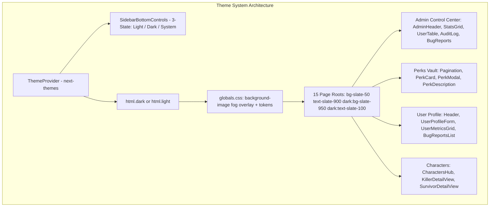

# Light & Dark Theme System Architecture Implementation Plan

> **For agentic workers:** REQUIRED SUB-SKILL: Use superpowers:subagent-driven-development to implement this plan task-by-task. Steps use checkbox (`- [ ]`) syntax for tracking.

**Goal:** Fix broken light mode across all pages and components, eliminate the `.dbd-fog-overlay` background wiping bug, unify all 15 page root wrappers with consistent light/dark pairs, update the Admin, Perks, User, and Character component suites, and upgrade the theme switcher in the sidebar to an SSR-safe 3-state control (Light / Dark / System).

**Architecture:** 
- Fix `globals.css` so `.dbd-fog-overlay` uses `background-image` instead of shorthand `background`, preventing it from wiping `background-color` to transparent.
- Standardize all page containers to `bg-slate-50 text-slate-900 dark:bg-slate-950 dark:text-slate-100` with `.dbd-fog-overlay`.
- Redesign `SidebarBottomControls.tsx` with a 3-way segmented control allowing instant switching between Light, Dark, and System OS preference.
- Systematically pair hardcoded dark classes across Admin, Perks, User, and Character views with appropriate light-mode surfaces and text colors.

**Architecture Diagram:**



**Tech Stack:** Next.js 16 (App Router), React 19, Tailwind CSS v4, `next-themes` 0.4.6, Lucide React icons, TypeScript, Node.js test runner (`tsx --test`).

## Global Constraints
- Every modified file must maintain full TypeScript strict compliance.
- No regression in existing tests (`npm run test:unit` must maintain 100% pass rate).
- All interactive buttons must enforce mobile accessibility (>= 44px touch target or appropriate padding).
- No unhandled SSR/hydration flickers when toggling or loading themes.

---

### Task 1: Core CSS Architecture & Fog Overlay Fix

**Files:**
- Modify: `frontend/src/app/globals.css:1-25, 142-157`
- Create: `frontend/src/__tests__/unit/themeCssAndTokens.test.ts`

**Interfaces:**
- Consumes: Tailwind v4 `@custom-variant dark`, `:root` and `.dark` layers.
- Produces: Corrected `.dbd-fog-overlay` using `background-image: radial-gradient(...)` so underlying `background-color` is never overwritten.

- [ ] **Step 1: Write the failing test**

```typescript
// frontend/src/__tests__/unit/themeCssAndTokens.test.ts
import { describe, it } from 'node:test';
import assert from 'node:assert/strict';
import fs from 'node:fs';
import path from 'node:path';

describe('Theme CSS & Fog Overlay Rules', () => {
  const cssPath = path.resolve(__dirname, '../../app/globals.css');
  const cssContent = fs.readFileSync(cssPath, 'utf-8');

  it('dbd-fog-overlay uses background-image rather than background shorthand', () => {
    // Shorthand background: wipes background-color to transparent
    assert.ok(
      !cssContent.includes('.dbd-fog-overlay {\n  background: radial-gradient') &&
      !cssContent.includes('.dbd-fog-overlay {\r\n  background: radial-gradient'),
      'Must not use background: shorthand on .dbd-fog-overlay'
    );
    assert.ok(
      cssContent.includes('background-image: radial-gradient'),
      '.dbd-fog-overlay must use background-image'
    );
  });

  it('defines dark variant custom-variant for Tailwind v4', () => {
    assert.ok(cssContent.includes('@custom-variant dark'));
  });
});
```

- [ ] **Step 2: Run test to verify it fails**

Run: `npx tsx --test src/__tests__/unit/themeCssAndTokens.test.ts`
Expected: FAIL with assertion error on `.dbd-fog-overlay`

- [ ] **Step 3: Modify `globals.css`**

In `frontend/src/app/globals.css`:
```css
/* Custom Dead by Daylight Aesthetic Effects */
.dbd-fog-overlay {
  background-image: radial-gradient(circle at 50% 50%, rgba(100, 116, 139, 0.05) 0%, transparent 78%);
}

.dark .dbd-fog-overlay {
  background-image: radial-gradient(circle at 50% 50%, rgba(220, 38, 38, 0.06) 0%, transparent 80%);
}
```

- [ ] **Step 4: Run test to verify it passes**

Run: `npx tsx --test src/__tests__/unit/themeCssAndTokens.test.ts`
Expected: PASS

- [ ] **Step 5: Commit**

```bash
git add frontend/src/app/globals.css frontend/src/__tests__/unit/themeCssAndTokens.test.ts
git commit -m "fix(css): use background-image on dbd-fog-overlay to prevent background wiping"
```

---

### Task 2: 3-State Theme Switcher in SidebarBottomControls

**Files:**
- Modify: `frontend/src/components/sidebar/SidebarBottomControls.tsx:8-142`
- Create: `frontend/src/__tests__/unit/themeSwitcher.test.ts`

**Interfaces:**
- Consumes: `useTheme` from `next-themes` (`theme`, `setTheme`).
- Produces: 3-way segmented pill (`Light`, `Dark`, `System`) in `SidebarBottomControls`.

- [ ] **Step 1: Write the failing test**

```typescript
// frontend/src/__tests__/unit/themeSwitcher.test.ts
import { describe, it } from 'node:test';
import assert from 'node:assert/strict';
import React from 'react';
import { renderToStaticMarkup } from 'react-dom/server';
import { SidebarBottomControls } from '@/components/sidebar/SidebarBottomControls';

describe('SidebarBottomControls Theme Switcher', () => {
  it('renders theme switcher with light, dark, and system options', () => {
    const html = renderToStaticMarkup(
      React.createElement(SidebarBottomControls, {
        currentLocale: 'en',
        onOpenBugModal: () => {},
        onOpenCoffeeModal: () => {},
      })
    );

    assert.ok(html.includes('aria-label="Light mode"'));
    assert.ok(html.includes('aria-label="Dark mode"'));
    assert.ok(html.includes('aria-label="System theme"'));
  });
});
```

- [ ] **Step 2: Run test to verify it fails**

Run: `npx tsx --test src/__tests__/unit/themeSwitcher.test.ts`
Expected: FAIL with assertion error

- [ ] **Step 3: Update `SidebarBottomControls.tsx`**

Upgrade the theme switcher section in `frontend/src/components/sidebar/SidebarBottomControls.tsx`:
- Import `Laptop` from `lucide-react`.
- Use `theme` and `setTheme` from `useTheme()`.
- Render a 3-button segmented pill:
  - Light (Sun)
  - Dark (Moon)
  - System (Laptop)
- Highlight the active mode using `(isMounted ? theme : 'system') === mode`.
- Ensure touch target is at least 32px height and accessible with `aria-pressed`.

- [ ] **Step 4: Run test to verify it passes**

Run: `npx tsx --test src/__tests__/unit/themeSwitcher.test.ts`
Expected: PASS

- [ ] **Step 5: Commit**

```bash
git add frontend/src/components/sidebar/SidebarBottomControls.tsx frontend/src/__tests__/unit/themeSwitcher.test.ts
git commit -m "feat(theme): add 3-state light/dark/system switcher in sidebar bottom controls"
```

---

### Task 3: Unify All Route Root Containers

**Files:**
- Modify:
  - `frontend/src/app/[locale]/admin/page.tsx:478`
  - `frontend/src/app/[locale]/page.tsx:35, 64, 68`
  - `frontend/src/app/[locale]/perks/page.tsx:259`
  - `frontend/src/app/[locale]/characters/page.tsx:34`
  - `frontend/src/app/[locale]/characters/[slug]/page.tsx:87`
  - `frontend/src/app/[locale]/randomizer/page.tsx:77, 119`
  - `frontend/src/app/[locale]/smash-or-pass/page.tsx:31`
  - `frontend/src/app/[locale]/user/page.tsx:171, 209`
- Create: `frontend/src/__tests__/unit/pageThemeRoots.test.ts`

**Interfaces:**
- Consumes: `globals.css` base colors.
- Produces: Consistent `min-h-screen bg-slate-50 text-slate-900 dark:bg-slate-950 dark:text-slate-100 flex flex-col lg:flex-row dbd-fog-overlay transition-colors duration-300` across all page routes.

- [ ] **Step 1: Write the failing test**

```typescript
// frontend/src/__tests__/unit/pageThemeRoots.test.ts
import { describe, it } from 'node:test';
import assert from 'node:assert/strict';
import fs from 'node:fs';
import path from 'node:path';

describe('Page Root Theme Wrapper Consistency', () => {
  const routes = [
    'admin/page.tsx',
    'page.tsx',
    'perks/page.tsx',
    'characters/page.tsx',
    'characters/[slug]/page.tsx',
    'randomizer/page.tsx',
    'smash-or-pass/page.tsx',
    'user/page.tsx',
  ];

  for (const relPath of routes) {
    it(`${relPath} does not have hardcoded bg-[#070b12] without dark: variant`, () => {
      const fullPath = path.resolve(__dirname, '../../app/[locale]', relPath);
      const content = fs.readFileSync(fullPath, 'utf-8');
      assert.ok(
        !content.includes('className="min-h-screen bg-[#070b12] text-slate-100') &&
        !content.includes('className="h-dvh overflow-hidden bg-[#070b12] text-slate-100'),
        `${relPath} still has raw hardcoded bg-[#070b12] text-slate-100`
      );
      assert.ok(
        content.includes('dark:bg-slate-950') && content.includes('dark:text-slate-100'),
        `${relPath} must include dark:bg-slate-950 dark:text-slate-100`
      );
    });
  }
});
```

- [ ] **Step 2: Run test to verify it fails**

Run: `npx tsx --test src/__tests__/unit/pageThemeRoots.test.ts`
Expected: FAIL on the hardcoded `#070b12` routes

- [ ] **Step 3: Update the 8 page route wrappers**

Update each of the 8 routes to replace `bg-[#070b12] text-slate-100` with:
`bg-slate-50 text-slate-900 dark:bg-slate-950 dark:text-slate-100` (on `/perks`, keep `h-dvh overflow-hidden`).
On `page.tsx`, update welcome title and subtitle text colors to `text-slate-900 dark:text-slate-100` and `text-slate-600 dark:text-slate-300`.

- [ ] **Step 4: Run test to verify it passes**

Run: `npx tsx --test src/__tests__/unit/pageThemeRoots.test.ts`
Expected: PASS

- [ ] **Step 5: Commit**

```bash
git add frontend/src/app/[locale]/ frontend/src/__tests__/unit/pageThemeRoots.test.ts
git commit -m "style(pages): normalize route containers to support light and dark modes"
```

---

### Task 4: Admin Control Center Suite Theme Overhaul

**Files:**
- Modify:
  - `frontend/src/components/admin/AdminHeader.tsx:42-125`
  - `frontend/src/app/[locale]/admin/page.tsx:520-595`
  - `frontend/src/components/admin/AdminStatsGrid.tsx:16-65`
  - `frontend/src/components/admin/AdminUserTable.tsx:56-220`
  - `frontend/src/components/admin/AdminAuditLogView.tsx:68-120`
  - `frontend/src/components/admin/AdminBugReportsWorkbench.tsx:120-175`
  - `frontend/src/components/admin/AdminChallengeControl.tsx:210-240`
  - `frontend/src/components/admin/AdminChallengeStats.tsx:30-80`
- Create: `frontend/src/__tests__/unit/adminThemeSupport.test.ts`

**Interfaces:**
- Consumes: Theme classes `bg-white dark:bg-slate-900/80`, `border-slate-200 dark:border-slate-800`, `text-slate-900 dark:text-slate-100`.
- Produces: High-contrast, fully themed Admin Control Center in both light and dark modes.

- [ ] **Step 1: Write the failing test**

```typescript
// frontend/src/__tests__/unit/adminThemeSupport.test.ts
import { describe, it } from 'node:test';
import assert from 'node:assert/strict';
import React from 'react';
import { renderToStaticMarkup } from 'react-dom/server';
import { AdminHeader } from '@/components/admin/AdminHeader';
import { AdminStatsGrid } from '@/components/admin/AdminStatsGrid';
import { AdminAuditLogView } from '@/components/admin/AdminAuditLogView';

describe('Admin Theme Support', () => {
  it('AdminHeader title does not have hardcoded text-slate-100 without dark variant', () => {
    const html = renderToStaticMarkup(
      React.createElement(AdminHeader, {
        isSyncing: false,
        syncStatus: 'idle',
        isLoading: false,
        onOpenDbMaintenance: () => {},
        onTriggerSync: () => {},
        onRefreshData: () => {},
      })
    );
    assert.ok(html.includes('dark:text-slate-100'));
    assert.ok(html.includes('text-slate-900'));
  });

  it('AdminStatsGrid cards use light-compatible border and background', () => {
    const html = renderToStaticMarkup(
      React.createElement(AdminStatsGrid, {
        stats: { total_users: 10, admin_count: 2, total_characters: 98, total_perks: 321, db_size: '12MB' },
      })
    );
    assert.ok(html.includes('border-slate-200'));
    assert.ok(html.includes('dark:border-slate-800'));
  });
});
```

- [ ] **Step 2: Run test to verify it fails**

Run: `npx tsx --test src/__tests__/unit/adminThemeSupport.test.ts`
Expected: FAIL

- [ ] **Step 3: Update Admin Suite Components**

1. `AdminHeader.tsx`:
   - Title: `text-slate-900 dark:text-slate-100 font-mono`
   - Dividing line: `border-slate-200 dark:border-slate-800`
   - Buttons: `border-slate-200 bg-white hover:bg-slate-100 text-slate-700 dark:border-slate-700 dark:bg-slate-900/80 dark:hover:bg-slate-800 dark:text-slate-300`
2. `admin/page.tsx` (Subtabs):
   - Inactive buttons: `text-slate-600 hover:text-slate-900 hover:bg-slate-100 dark:text-slate-400 dark:hover:text-slate-200 dark:hover:bg-slate-900/40`
   - Subtab border: `border-slate-200 dark:border-slate-800`
3. `AdminStatsGrid.tsx`:
   - Cards: `rounded-2xl border border-slate-200 dark:border-slate-800 bg-white dark:bg-slate-900/60 p-4 shadow-sm dark:shadow-xl`
   - Numbers: `text-slate-900 dark:text-slate-100 font-mono`
   - Labels: `text-slate-500 dark:text-slate-400`
4. `AdminUserTable.tsx`:
   - Main card: `border-slate-200 dark:border-slate-800 bg-white dark:bg-slate-900/80 shadow-sm dark:shadow-2xl`
   - Inputs: `border-slate-200 dark:border-slate-700 bg-slate-50 dark:bg-slate-950/80 text-slate-900 dark:text-slate-100`
   - Table headers: `border-slate-200 dark:border-slate-800 bg-slate-100/80 dark:bg-slate-950/50 text-slate-600 dark:text-slate-400`
   - Table rows: `divide-slate-200 dark:divide-slate-800/60 hover:bg-slate-50 dark:hover:bg-slate-800/30 text-slate-900 dark:text-slate-100`
5. `AdminAuditLogView.tsx`:
   - Container: `border-slate-200 dark:border-slate-800 bg-white dark:bg-slate-900/60 shadow-sm dark:shadow-xl`
   - Table headers: `border-slate-200 dark:border-slate-800 text-slate-600 dark:text-slate-400`
   - Table rows: `border-slate-100 dark:border-slate-900 hover:bg-slate-50 dark:hover:bg-slate-950/40 text-slate-800 dark:text-slate-200`
6. `AdminBugReportsWorkbench.tsx`, `AdminChallengeControl.tsx`, `AdminChallengeStats.tsx`: Apply matching light/dark cards and input borders.

- [ ] **Step 4: Run test to verify it passes**

Run: `npx tsx --test src/__tests__/unit/adminThemeSupport.test.ts`
Expected: PASS

- [ ] **Step 5: Commit**

```bash
git add frontend/src/components/admin/ frontend/src/app/[locale]/admin/page.tsx frontend/src/__tests__/unit/adminThemeSupport.test.ts
git commit -m "style(admin): overhaul light and dark theme contrast across admin suite"
```

---

### Task 5: Perks Vault & Pagination Theme Polish

**Files:**
- Modify:
  - `frontend/src/components/Pagination.tsx:50-130`
  - `frontend/src/components/PerkCard.tsx:120-170`
  - `frontend/src/components/PerkModal.tsx:60-100`
  - `frontend/src/components/PerkDescription.tsx:23-30`
- Create: `frontend/src/__tests__/unit/perksThemeSupport.test.ts`

**Interfaces:**
- Consumes: Theme classes for list cards, pagination buttons, modal background, and description typography.
- Produces: High-contrast pagination and perk inspection in both light and dark modes.

- [ ] **Step 1: Write the failing test**

```typescript
// frontend/src/__tests__/unit/perksThemeSupport.test.ts
import { describe, it } from 'node:test';
import assert from 'node:assert/strict';
import React from 'react';
import { renderToStaticMarkup } from 'react-dom/server';
import { Pagination } from '@/components/Pagination';
import { PerkDescription } from '@/components/PerkDescription';

describe('Perks Vault Theme Support', () => {
  it('Pagination numbers do not use hardcoded text-slate-100 without dark variant', () => {
    const html = renderToStaticMarkup(
      React.createElement(Pagination, {
        page: 1,
        totalPages: 5,
        totalResults: 75,
        limit: 15,
        onPageChange: () => {},
        onLimitChange: () => {},
      })
    );
    assert.ok(html.includes('dark:text-slate-100'));
    assert.ok(html.includes('text-slate-900'));
  });

  it('PerkDescription supports dark text in light mode and silver in dark mode', () => {
    const html = renderToStaticMarkup(
      React.createElement(PerkDescription, {
        description: 'Grants a 3% Haste effect.',
      })
    );
    assert.ok(html.includes('text-slate-700') || html.includes('text-slate-800'));
    assert.ok(html.includes('dark:text-slate-300'));
  });
});
```

- [ ] **Step 2: Run test to verify it fails**

Run: `npx tsx --test src/__tests__/unit/perksThemeSupport.test.ts`
Expected: FAIL

- [ ] **Step 3: Update Pagination, PerkCard, PerkModal, PerkDescription**

1. `Pagination.tsx`:
   - Results count text: `text-slate-500 dark:text-slate-400`, numbers: `font-bold text-slate-900 dark:text-slate-100`
   - Navigation buttons: `border-slate-200 dark:border-slate-800 bg-white dark:bg-slate-900 text-slate-700 dark:text-slate-300 hover:bg-slate-100 dark:hover:bg-slate-800`
   - Select & jump input: `border-slate-200 dark:border-slate-800 bg-white dark:bg-slate-900 text-slate-900 dark:text-slate-200`
2. `PerkCard.tsx` (List mode):
   - Row card: `border-slate-200 dark:border-slate-800 bg-white dark:bg-slate-900/40 hover:bg-slate-50 dark:hover:bg-slate-900/70`
   - Perk title: `text-slate-900 dark:text-slate-100 font-bold`
   - Perk character / subtitle: `text-slate-500 dark:text-slate-400`
3. `PerkModal.tsx`:
   - Container dialog: `border-slate-200 dark:border-slate-800 bg-white dark:bg-[#0c121e]/95 text-slate-900 dark:text-slate-100 shadow-2xl`
4. `PerkDescription.tsx`:
   - Body text: `text-slate-700 dark:text-slate-300 leading-relaxed font-normal`

- [ ] **Step 4: Run test to verify it passes**

Run: `npx tsx --test src/__tests__/unit/perksThemeSupport.test.ts`
Expected: PASS

- [ ] **Step 5: Commit**

```bash
git add frontend/src/components/Pagination.tsx frontend/src/components/PerkCard.tsx frontend/src/components/PerkModal.tsx frontend/src/components/PerkDescription.tsx frontend/src/__tests__/unit/perksThemeSupport.test.ts
git commit -m "style(perks): polish light and dark mode styling for perks vault and pagination"
```

---

### Task 6: User Profile & Character Detail Theme Support

**Files:**
- Modify:
  - `frontend/src/app/[locale]/user/page.tsx:220-245`
  - `frontend/src/components/user/UserProfileForm.tsx:64-125`
  - `frontend/src/components/user/UserMetricsGrid.tsx:55-120`
  - `frontend/src/components/user/UserBugReportsList.tsx:105-160`
  - `frontend/src/components/CharactersHub.tsx:355-370`
  - `frontend/src/components/character-detail/KillerDetailView.tsx:145-165`
  - `frontend/src/components/character-detail/SurvivorDetailView.tsx:85-100`
- Create: `frontend/src/__tests__/unit/userAndCharacterThemeSupport.test.ts`

**Interfaces:**
- Consumes: Standard light/dark classes for cards, forms, and hero titles.
- Produces: Theme-compliant User Profile and Character views.

- [ ] **Step 1: Write the failing test**

```typescript
// frontend/src/__tests__/unit/userAndCharacterThemeSupport.test.ts
import { describe, it } from 'node:test';
import assert from 'node:assert/strict';
import React from 'react';
import { renderToStaticMarkup } from 'react-dom/server';
import { UserProfileForm } from '@/components/user/UserProfileForm';
import { UserMetricsGrid } from '@/components/user/UserMetricsGrid';

describe('User Profile Theme Support', () => {
  it('UserProfileForm container supports light theme card and text', () => {
    const html = renderToStaticMarkup(
      React.createElement(UserProfileForm, {
        initialEmail: 'test@example.com',
        onRefreshUser: async () => {},
      })
    );
    assert.ok(html.includes('border-slate-200'));
    assert.ok(html.includes('dark:border-slate-800'));
  });

  it('UserMetricsGrid cards use light-compatible border and background', () => {
    const html = renderToStaticMarkup(
      React.createElement(UserMetricsGrid, {
        ownership: {
          survivors: { owned: 10, total: 54, percentage: 18 },
          killers: { owned: 5, total: 44, percentage: 11 },
          perks: { unlocked: 30, total: 321, percentage: 9 },
        },
      })
    );
    assert.ok(html.includes('border-slate-200'));
    assert.ok(html.includes('dark:border-slate-800'));
  });
});
```

- [ ] **Step 2: Run test to verify it fails**

Run: `npx tsx --test src/__tests__/unit/userAndCharacterThemeSupport.test.ts`
Expected: FAIL

- [ ] **Step 3: Update User and Character components**

1. `user/page.tsx`:
   - Hero header: `border-slate-200 dark:border-slate-800 bg-gradient-to-br from-white via-slate-50 to-slate-100 dark:from-slate-900/90 dark:via-slate-900/60 dark:to-slate-950/90`
2. `UserProfileForm.tsx`:
   - Card: `border-slate-200 dark:border-slate-800/80 bg-white dark:bg-slate-900/70 text-slate-900 dark:text-slate-100`
   - Inputs: `border-slate-200 dark:border-slate-800 bg-slate-50 dark:bg-slate-950/80 text-slate-900 dark:text-slate-100 placeholder-slate-400 dark:placeholder-slate-500`
3. `UserMetricsGrid.tsx`:
   - Cards: `border-slate-200 dark:border-slate-800/80 bg-white dark:bg-slate-900/60 text-slate-900 dark:text-slate-100`
4. `UserBugReportsList.tsx`:
   - Empty card & report cards: `border-slate-200 dark:border-slate-800 bg-white dark:bg-slate-900/80 text-slate-900 dark:text-slate-100`
5. `CharactersHub.tsx`:
   - "My Characters" button: `border-slate-200 dark:border-slate-800 bg-white dark:bg-slate-900 text-slate-700 dark:text-slate-300 hover:border-amber-500/50`
6. `KillerDetailView.tsx` & `SurvivorDetailView.tsx`:
   - Hero titles: `text-slate-900 dark:text-slate-100 font-mono`
   - Real name: `text-slate-700 dark:text-slate-200`

- [ ] **Step 4: Run test to verify it passes**

Run: `npx tsx --test src/__tests__/unit/userAndCharacterThemeSupport.test.ts`
Expected: PASS

- [ ] **Step 5: Commit**

```bash
git add frontend/src/app/[locale]/user/page.tsx frontend/src/components/user/ frontend/src/components/CharactersHub.tsx frontend/src/components/character-detail/ frontend/src/__tests__/unit/userAndCharacterThemeSupport.test.ts
git commit -m "style(user,characters): add light and dark mode styles for profile and character views"
```

---

### Task 7: Full System Verification & Regression Testing

**Files:**
- Run complete test suite and production build verification.

- [ ] **Step 1: Run all unit tests**

Run: `npm run test:unit`
Expected: 100% PASS (all existing + new tests passing).

- [ ] **Step 2: Run build check**

Run: `npm run build`
Expected: Exit code 0 with clean static compilation.

- [ ] **Step 3: Commit any final cleanup**

```bash
git commit --allow-empty -m "chore(theme): complete verification of light and dark theme architecture"
```
