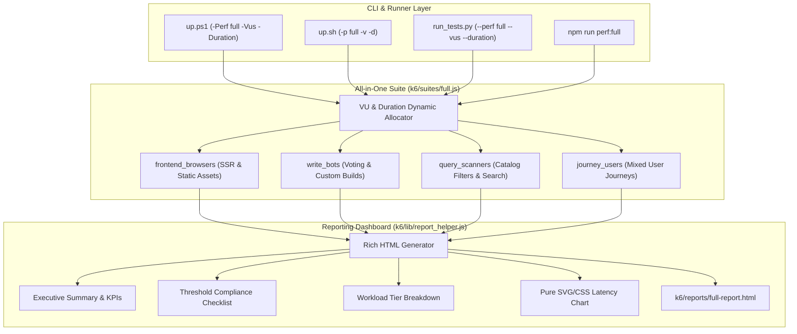

# All-in-One Comprehensive K6 Suite & Rich Reports Implementation Plan

> **For agentic workers:** REQUIRED SUB-SKILL: Use superpowers:subagent-driven-development to implement this plan task-by-task. Steps use checkbox (`- [ ]`) syntax for tracking.

**Goal:** Implement an All-in-One Comprehensive K6 Master Test Suite (`k6/suites/full.js`) with 4 concurrent workload pools (frontend, writes, queries, journeys) and configurable VUs/duration, alongside an overhauled, production-grade, user-friendly HTML performance dashboard (`k6/lib/report_helper.js`).

**Architecture:** A unified multi-scenario k6 suite distributes configurable virtual users into parallel worker pools executing simultaneously against `http://localhost`. Test summaries are parsed by an upgraded offline HTML dashboard renderer that generates visual KPI metrics, SLA threshold checklists, architectural tier breakdowns, and SVG/CSS comparative charts.

**Architecture Diagram:**



**Tech Stack:** Grafana k6 (ES6 modules), vanilla SVG/CSS (dark cyberpunk/lemon aesthetic), Python, PowerShell, Bash.

## Global Constraints

- Zero extra docker containers (keep 6 core containers only: `dbd_nginx`, `dbd_frontend`, `dbd_backend`, `dbd_db`, `dbd_umami`, `dbd_pgadmin`).
- Host execution: `k6.exe` on host targeting `http://localhost`.
- Standalone & 100% Offline: No external CDNs or remote dependencies in generated HTML reports.
- Runner Parity: Identical argument support across PowerShell, Bash, and Python.

---

### Task 1: Redesign & Overhaul Rich HTML Performance Dashboard (`k6/lib/report_helper.js`)

**Files:**
- Modify: `k6/lib/report_helper.js`
- Test: `k6/lib/test_sanity.js`

**Interfaces:**
- Consumes: k6 `data` summary object (metrics, root_group, state)
- Produces: `generateHtmlSummary(data, options)` returning self-contained, responsive HTML string

- [ ] **Step 1: Overhaul `generateHtmlSummary` in `k6/lib/report_helper.js`**
Implement the modern UI components:
1. Executive Verdict & Status Header (Suite title, Run duration, Timestamp, Target URL, large `PASS`/`FAIL` badge).
2. Key KPI Metric Cards (Total Requests, Throughput req/s, Peak VUs, Failure Rate, Data Sent/Received).
3. Response Time Percentile Distribution (Min, Median, Avg, p90, p95, p99, Max).
4. SLA Threshold Compliance Checklist table:
   - Iterates through `data.metrics` threshold rules.
   - Shows Metric name, SLA Target expression, Measured value, and status pill (`PASS`/`FAIL`).
5. Architectural Tier Breakdown table:
   - Calculates stats for tagged metrics: `{type:ssr}`, `{type:static}`, `{type:write}`, `{type:query}`, `auth_duration`.
   - Displays Request count, Average, p95, and p99.
6. Pure SVG/CSS comparative bar chart comparing p50, p95, and p99 across workloads.
7. HTTP Status Code distribution bar (`2xx`, `3xx`, `4xx`, `5xx`).

- [ ] **Step 2: Update `k6/lib/test_sanity.js`**
Update assertions to verify that `generateHtmlSummary()` produces rich HTML containing:
- Executive status badge
- SLA Threshold checklist table
- Architectural tier breakdown
- SVG chart elements

- [ ] **Step 3: Run sanity verification**
```bash
k6 run -i 1 k6/lib/test_sanity.js
```
Expected: 100% checks pass (43+ checks), zero failures.

- [ ] **Step 4: Commit changes**
```bash
git add k6/lib/report_helper.js k6/lib/test_sanity.js
git commit -m "feat(k6): overhaul report helper with rich, user-friendly HTML dashboard"
```

---

### Task 2: Implement All-in-One Comprehensive Master Test Suite (`k6/suites/full.js`)

**Files:**
- Create: `k6/suites/full.js`
- Test: `k6/lib/test_sanity.js`

**Interfaces:**
- Consumes:
  - `defaultClient`, `thinkTime` from `../lib/http_client.js`
  - `registerAndLoginUser`, `getAuthHeaders` from `../lib/auth.js`
  - `defaultTrafficMix` from `../scenarios/index.js`
  - `generateHtmlSummary` from `../lib/report_helper.js`
- Produces: Runnable suite `k6/suites/full.js` outputting `k6/reports/full-report.html`

- [ ] **Step 1: Create `k6/suites/full.js` with dynamic scenario configuration**
Read `__ENV.K6_VUS || __ENV.VUS || 40` and `__ENV.K6_DURATION || __ENV.DURATION || '1m'`.
Configure 4 scenarios in `options.scenarios`:
1. `frontend_browsers`: executor `constant-vus`, runs `browseFrontend()`
2. `write_bots`: executor `constant-vus`, runs `executeWrites()`
3. `query_scanners`: executor `constant-vus`, runs `executeQueries()`
4. `journey_users`: executor `constant-vus`, runs `defaultTrafficMix()`

Configure unified thresholds:
- `'http_req_failed': ['rate<0.01']`
- `'http_req_duration': ['p(95)<400']`
- `'http_req_duration{type:ssr}': ['p(95)<350']`
- `'http_req_duration{type:static}': ['p(95)<50']`
- `'http_req_duration{type:write}': ['p(95)<400']`
- `'http_req_duration{type:query}': ['p(95)<300']`

- [ ] **Step 2: Implement scenario worker functions**
- `browseFrontend()`: Next.js SSR pages (`/`, `/perks`, `/characters`, `/randomizer`, `/smash-or-pass`) and `/favicon.ico`.
- `executeWrites()`: Authenticated voting and custom build creation with read-after-write verification.
- `executeQueries()`: 100-perk catalog queries, prefix autocomplete, and calculation endpoints.
- `journey_users`: Calls `defaultTrafficMix(defaultClient, authToken)`.

- [ ] **Step 3: Implement `handleSummary` reporting**
Output terminal summary and write rich report to `k6/reports/full-report.html`.

- [ ] **Step 4: Verify live execution**
Run quick 1-iteration test:
```bash
k6 run -i 4 k6/suites/full.js
```
Verify all checks pass and `k6/reports/full-report.html` is generated.

- [ ] **Step 5: Commit changes**
```bash
git add k6/suites/full.js
git commit -m "feat(k6): implement all-in-one comprehensive multi-scenario test suite"
```

---

### Task 3: Tooling & Runner Integration with VUs and Duration Flags (`run_tests.py`, `up.ps1`, `up.sh`, `k6/package.json`)

**Files:**
- Modify: `run_tests.py`
- Modify: `up.ps1`
- Modify: `up.sh`
- Modify: `k6/package.json`

**Interfaces:**
- Supports CLI flags:
  - `.\up.ps1 -Perf full [-Vus 40] [-Duration 1m]`
  - `./up.sh -p full [-v 40] [-d 1m]`
  - `py run_tests.py --perf full [--vus 40] [--duration 1m]`
  - `npm run perf:full`

- [ ] **Step 1: Update `run_tests.py`**
- Add `"full"` to `--perf` choices:
  `choices=["all", "smoke", "load", "stress", "spike", "soak", "frontend", "writes", "queries", "full"]`
- Add `--vus` (int) and `--duration` (str) arguments.
- Pass `K6_VUS` and `K6_DURATION` environment variables to `k6 run`.

- [ ] **Step 2: Update `up.ps1`**
- Add `"full"` to `$validSuites`.
- Add `[int]$Vus = 0` and `[string]$Duration = ""` parameters.
- Pass `$env:K6_VUS` and `$env:K6_DURATION` when executing `k6 run`.

- [ ] **Step 3: Update `up.sh`**
- Add `"full"` to `VALID_SUITES`.
- Add `-v|--vus` and `-d|--duration` options.
- Export `K6_VUS` and `K6_DURATION` when executing `k6 run`.

- [ ] **Step 4: Update `k6/package.json`**
Add script:
`"perf:full": "cd .. && k6 run k6/suites/full.js"`

- [ ] **Step 5: Verify CLI runner integration**
Test quick execution via python runner:
```bash
py run_tests.py --perf full --vus 8 --duration 5s
```
Verify runner passes environment variables, runs clean, and displays in summary table.

- [ ] **Step 6: Commit changes**
```bash
git add run_tests.py up.ps1 up.sh k6/package.json
git commit -m "feat: integrate full suite with configurable VUs and duration into runners"
```
