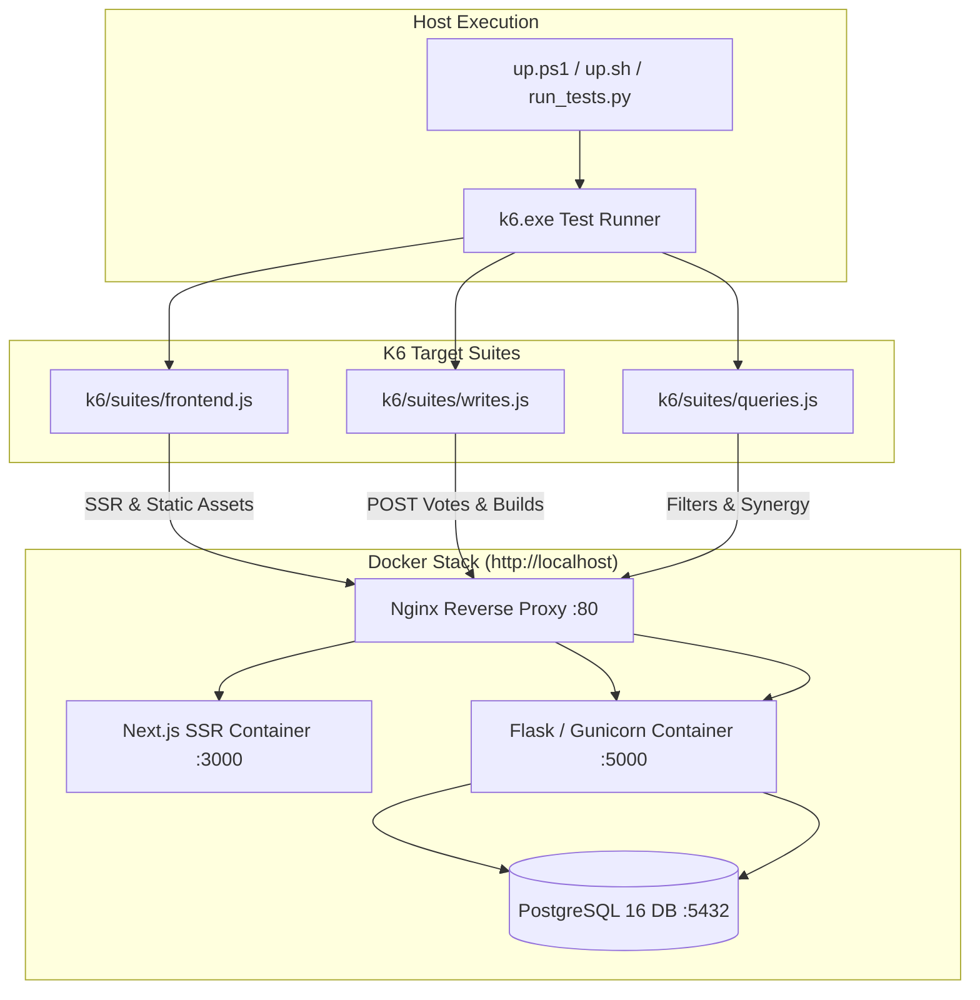

# Element-Specific K6 Performance Testing Implementation Plan

> **For agentic workers:** REQUIRED SUB-SKILL: Use superpowers:subagent-driven-development to implement this plan task-by-task. Steps use checkbox (`- [ ]`) syntax for tracking.

**Goal:** Implement dedicated, element-specific Grafana k6 performance testing suites targeting Frontend SSR, High-Concurrency Database Writes, and Heavy Query Filtering, fully integrated with `up.ps1`, `up.sh`, and `run_tests.py`.

**Architecture:** We isolate three architectural tiers into dedicated suites in `k6/suites/` using modular concurrency stages and metric thresholds. The tests run directly on the host against the running 6-container Docker stack on `http://localhost`, measuring response percentiles and transaction integrity without any extra containers.

**Architecture Diagram:**



**Tech Stack:** Grafana k6 (ES6), Next.js 14, Python Flask, PostgreSQL 16, PowerShell, Bash.

## Global Constraints
- Zero Additional Containers: Keep the 6 core containers (`dbd_db`, `dbd_backend`, `dbd_frontend`, `dbd_nginx`, `dbd_umami`, `dbd_pgadmin`).
- Host Execution: `k6.exe` executes on the host against `http://localhost`.
- Reporting: Each suite writes a standalone HTML report to `k6/reports/<suite>-report.html`.

---

### Task 1: Configuration, Thresholds & Concurrency Profiles for Target Suites

**Files:**
- Modify: `k6/config/stages.js`
- Modify: `k6/config/thresholds.js`

**Interfaces:**
- Produces:
  - `frontendStages`: 10s ramp to 15 VUs, 30s at 25 VUs, 10s ramp down
  - `frontendThresholds`: `http_req_duration{type:ssr}: ['p(95)<350']`, `http_req_duration{type:static}: ['p(95)<50']`, `http_req_failed: ['rate<0.01']`
  - `writesStages`: 10s ramp to 10 VUs, 30s at 20 VUs, 10s ramp down
  - `writesThresholds`: `http_req_duration{type:write}: ['p(95)<400']`, `http_req_failed: ['rate<0.01']`
  - `queriesStages`: 10s ramp to 15 VUs, 30s at 30 VUs, 10s ramp down
  - `queriesThresholds`: `http_req_duration{type:query}: ['p(95)<300']`, `http_req_failed: ['rate<0.005']`

- [ ] **Step 1: Update `k6/config/stages.js`**
Add `frontendStages`, `writesStages`, and `queriesStages` definitions.

- [ ] **Step 2: Update `k6/config/thresholds.js`**
Add `frontendThresholds`, `writesThresholds`, and `queriesThresholds` definitions with SLA tags.

- [ ] **Step 3: Verify configuration syntax**
Run `k6 run -i 1 k6/lib/test_sanity.js` to ensure module imports succeed without syntax error.

- [ ] **Step 4: Commit changes**
```bash
git add k6/config/stages.js k6/config/thresholds.js
git commit -m "feat(k6): add stages and thresholds for frontend, writes, and queries suites"
```

---

### Task 2: Implement Frontend SSR & Static Delivery Suite (`k6/suites/frontend.js`)

**Files:**
- Create: `k6/suites/frontend.js`

**Interfaces:**
- Consumes: `defaultClient`, `frontendStages`, `frontendThresholds`, `generateHtmlSummary`
- Produces: Executable suite `k6/suites/frontend.js` outputting `k6/reports/frontend-report.html`

- [ ] **Step 1: Create `k6/suites/frontend.js`**
Implement requests for:
- `GET /` (tags: `{ type: 'ssr', page: 'home' }`)
- `GET /perks` (tags: `{ type: 'ssr', page: 'perks' }`)
- `GET /characters` (tags: `{ type: 'ssr', page: 'characters' }`)
- `GET /generator` (tags: `{ type: 'ssr', page: 'generator' }`)
- `GET /smash-or-pass` (tags: `{ type: 'ssr', page: 'smash_or_pass' }`)
- `GET /_next/static/css/...` or static logo/favicon assets (tags: `{ type: 'static' }`)
Include short think time (100–300ms) to simulate rapid navigation.

- [ ] **Step 2: Add `handleSummary` reporting**
Generate terminal summary and write HTML report to `k6/reports/frontend-report.html`.

- [ ] **Step 3: Verify with live test**
Run `k6 run -i 2 k6/suites/frontend.js` against `http://localhost`.
Verify checks pass and `k6/reports/frontend-report.html` is generated.

- [ ] **Step 4: Commit changes**
```bash
git add k6/suites/frontend.js
git commit -m "feat(k6): implement frontend SSR and static asset delivery test suite"
```

---

### Task 3: Implement High-Concurrency Database Writes Suite (`k6/suites/writes.js`)

**Files:**
- Create: `k6/suites/writes.js`

**Interfaces:**
- Consumes: `defaultClient`, `registerAndLoginUser`, `getAuthHeaders`, `writesStages`, `writesThresholds`, `generateHtmlSummary`
- Produces: Executable suite `k6/suites/writes.js` outputting `k6/reports/writes-report.html`

- [ ] **Step 1: Create `k6/suites/writes.js`**
Implement setup/iteration flow:
- User onboarding/login on VU init to acquire JWT token.
- High-frequency write loop:
  - `POST /api/v1/smash-or-pass/vote` with randomized winner/loser (tags: `{ type: 'write', action: 'vote' }`)
  - `POST /api/v1/builds` with authenticated custom build payload (tags: `{ type: 'write', action: 'build' }`)
  - Read-after-write verification: `GET /api/v1/builds` or `GET /api/v1/smash-or-pass/rosters/canon/leaderboard` (tags: `{ type: 'read', action: 'verify' }`)

- [ ] **Step 2: Add `handleSummary` reporting**
Output terminal summary and `k6/reports/writes-report.html`.

- [ ] **Step 3: Verify with live test**
Run `k6 run -i 2 k6/suites/writes.js` against `http://localhost`.
Verify checks pass and `k6/reports/writes-report.html` is generated.

- [ ] **Step 4: Commit changes**
```bash
git add k6/suites/writes.js
git commit -m "feat(k6): implement high-concurrency database writes and transaction test suite"
```

---

### Task 4: Implement Heavy Queries & Filtering Stress Suite (`k6/suites/queries.js`)

**Files:**
- Create: `k6/suites/queries.js`

**Interfaces:**
- Consumes: `defaultClient`, `queriesStages`, `queriesThresholds`, `generateHtmlSummary`
- Produces: Executable suite `k6/suites/queries.js` outputting `k6/reports/queries-report.html`

- [ ] **Step 1: Create `k6/suites/queries.js`**
Implement heavy query permutations:
- Full catalog pagination with category & locale: `GET /api/v1/perks?category=survivor&lang=pl&limit=100` and `GET /api/v1/perks?category=killer&lang=en&limit=100` (tags: `{ type: 'query', subtype: 'perks_filter' }`)
- Broad prefix search autocompletes: `GET /api/v1/perks/suggestions?q=a` and `GET /api/v1/characters/suggestions?q=t` (tags: `{ type: 'query', subtype: 'autocomplete' }`)
- Synergy & randomizer computations: `GET /api/v1/generator/drawn?role=Survivor&perks_count=4` and `GET /api/v1/challenge-modes` (tags: `{ type: 'query', subtype: 'computation' }`)

- [ ] **Step 2: Add `handleSummary` reporting**
Output terminal summary and `k6/reports/queries-report.html`.

- [ ] **Step 3: Verify with live test**
Run `k6 run -i 2 k6/suites/queries.js` against `http://localhost`.
Verify checks pass and `k6/reports/queries-report.html` is generated.

- [ ] **Step 4: Commit changes**
```bash
git add k6/suites/queries.js
git commit -m "feat(k6): implement heavy query and filtering stress test suite"
```

---

### Task 5: Tooling & Runner Integration (`up.ps1`, `up.sh`, `run_tests.py`, `k6/package.json`)

**Files:**
- Modify: `run_tests.py`
- Modify: `up.ps1`
- Modify: `up.sh`
- Modify: `k6/package.json`

**Interfaces:**
- Supports CLI arguments:
  - `.\up.ps1 -Perf frontend|writes|queries`
  - `./up.sh -p frontend|writes|queries`
  - `py run_tests.py --perf frontend|writes|queries`
  - `npm run perf:frontend|writes|queries`

- [ ] **Step 1: Update `run_tests.py`**
Add `frontend`, `writes`, `queries` to `--perf` choices:
```python
choices=["all", "smoke", "load", "stress", "spike", "soak", "frontend", "writes", "queries"]
```

- [ ] **Step 2: Update `up.ps1` and `up.sh`**
Add `frontend`, `writes`, `queries` to valid suite lists in validation blocks.

- [ ] **Step 3: Update `k6/package.json`**
Add scripts:
```json
"perf:frontend": "cd .. && k6 run k6/suites/frontend.js",
"perf:writes": "cd .. && k6 run k6/suites/writes.js",
"perf:queries": "cd .. && k6 run k6/suites/queries.js"
```

- [ ] **Step 4: Live verification**
Run `py run_tests.py --perf frontend --iterations 1` (or 1 VU quick test).
Verify test passes and displays in summary table.

- [ ] **Step 5: Commit changes**
```bash
git add run_tests.py up.ps1 up.sh k6/package.json
git commit -m "feat: integrate frontend, writes, and queries suites into test runners"
```
