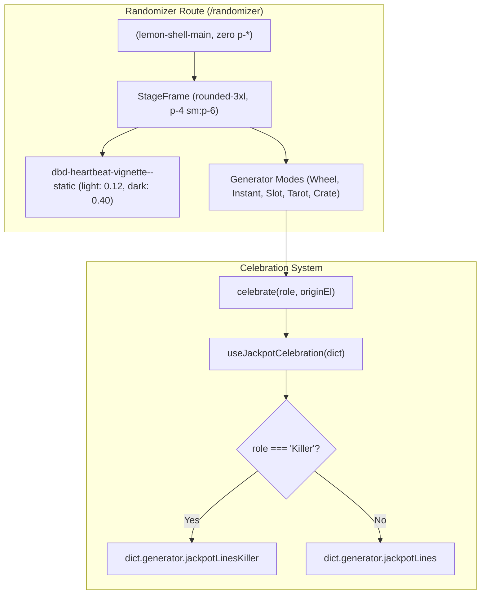

# Implementation Plan: Randomizer Glow, Paddings & Role Texts

> **For agentic workers:** REQUIRED SUB-SKILL: Use superpowers:subagent-driven-development to implement this plan task-by-task. Steps use checkbox (`- [ ]`) syntax for tracking.

**Goal:** Set the randomizer stage corner glow to static with calibrated light/dark mode opacity, remove outer main viewport padding, and provide role-suited celebration texts for Killers and Survivors without em dashes.

**Architecture:** 
- **Theming & Glow:** Refactor `StageFrame.tsx` to use `dbd-heartbeat-vignette--static` unconditionally, and tune `globals.css` with calibrated light-mode (`opacity: 0.12`) and dark-mode (`.dark { opacity: 0.4 }`) opacities.
- **Layout & Padding:** Strip `p-4 sm:p-6 lg:p-8` from `<main>` in `randomizer/page.tsx`, its Suspense fallback, and `randomizer/loading.tsx`, preserving `lemon-shell-main` for sidebar responsiveness.
- **Role Texts:** Expand generator locale files across all 5 languages (`en`, `pl`, `de`, `es`, `ja`) with `jackpotLinesKiller`, clean em dashes from survivor lines, and update `useJackpotCelebration.ts` to branch on `role`.

**Architecture Diagram:**



**Tech Stack:** Next.js App Router (React 19), Tailwind CSS v4, Node.js test runner (`tsx --test`).

## Global Constraints
- Must maintain 100% test pass on `randomizerResponsiveAndSkeletons.test.ts`.
- Must support all 5 locales: `en`, `pl`, `de`, `es`, `ja`.
- Must preserve `lemon-shell-main` on `<main>` for collapsible sidebar behavior.
- No em dashes (`—`) in generator jackpot lines.

---

### Task 1: Role-Suited Post-Draw Texts & Locales

**Files:**
- Modify: `frontend/src/locales/en/generator.ts`
- Modify: `frontend/src/locales/pl/generator.ts`
- Modify: `frontend/src/locales/de/generator.ts`
- Modify: `frontend/src/locales/es/generator.ts`
- Modify: `frontend/src/locales/ja/generator.ts`
- Modify: `frontend/src/components/generator/shared/useJackpotCelebration.ts`
- Test: `frontend/src/__tests__/unit/randomizerResponsiveAndSkeletons.test.ts`

**Interfaces:**
- Consumes: `RoleCategory` ('Survivor' | 'Killer') in `celebrate(role, originEl)`
- Produces: `jackpotLinesKiller: string[]` in `Dictionary['generator']`

- [ ] **Step 1: Write the failing tests for killer jackpot lines & role branch in `randomizerResponsiveAndSkeletons.test.ts`**

Update `frontend/src/__tests__/unit/randomizerResponsiveAndSkeletons.test.ts` to check that `jackpotLinesKiller` is present with >= 5 lines in every locale, and that neither `jackpotLines` nor `jackpotLinesKiller` contain em dashes (`—`).

- [ ] **Step 2: Run test to verify it fails**

Run: `npm run test:unit -- src/__tests__/unit/randomizerResponsiveAndSkeletons.test.ts`  
Expected: FAIL due to missing `jackpotLinesKiller`.

- [ ] **Step 3: Implement role texts across all 5 locales and update `useJackpotCelebration.ts`**

1. Add `jackpotLinesKiller` with themed, funny DBD killer lines to `en`, `pl`, `de`, `es`, `ja`.
2. Replace any em dashes (`—`) in `jackpotLines` with standard hyphens (`-`) or commas/periods.
3. Update `useJackpotCelebration.ts` to select `dict?.generator?.jackpotLinesKiller` when `role === 'Killer'`, with fallbacks.

- [ ] **Step 4: Run test to verify it passes**

Run: `npm run test:unit -- src/__tests__/unit/randomizerResponsiveAndSkeletons.test.ts`  
Expected: PASS.

- [ ] **Step 5: Commit changes**

```bash
git add frontend/src/locales/ frontend/src/components/generator/shared/useJackpotCelebration.ts frontend/src/__tests__/unit/randomizerResponsiveAndSkeletons.test.ts
git commit -m "feat(generator): add role-specific killer jackpot lines and sanitize em dashes"
```

---

### Task 2: Static Corner Glow & Theme-Aware Opacities

**Files:**
- Modify: `frontend/src/components/generator/shared/StageFrame.tsx`
- Modify: `frontend/src/app/globals.css`

- [ ] **Step 1: Update `StageFrame.tsx` to unconditionally use `dbd-heartbeat-vignette--static`**

Replace:
```tsx
className={cn(
  'pointer-events-none absolute inset-0',
  reduceMotion ? 'dbd-heartbeat-vignette--static' : 'dbd-heartbeat-vignette'
)}
```
With:
```tsx
className="pointer-events-none absolute inset-0 dbd-heartbeat-vignette--static"
```

- [ ] **Step 2: Calibrate `.dbd-heartbeat-vignette--static` in `globals.css`**

In `frontend/src/app/globals.css`:
```css
.dbd-heartbeat-vignette--static {
  background: radial-gradient(ellipse at center, transparent 55%, var(--accent-red) 100%);
  animation: none;
  opacity: 0.12;
}

.dark .dbd-heartbeat-vignette--static {
  opacity: 0.4;
}
```

- [ ] **Step 3: Verify build and unit test pass**

Run: `npx tsx --test src/__tests__/unit/randomizerResponsiveAndSkeletons.test.ts`  
Expected: PASS.

- [ ] **Step 4: Commit changes**

```bash
git add frontend/src/components/generator/shared/StageFrame.tsx frontend/src/app/globals.css
git commit -m "style(generator): set corner glow to static with light and dark mode opacities"
```

---

### Task 3: Viewport Padding Removal

**Files:**
- Modify: `frontend/src/app/[locale]/randomizer/page.tsx`
- Modify: `frontend/src/app/[locale]/randomizer/loading.tsx`

- [ ] **Step 1: Remove `p-4 sm:p-6 lg:p-8` from `<main>` in `page.tsx` and `loading.tsx`**

1. In `frontend/src/app/[locale]/randomizer/page.tsx`:
   - Replace `<main className="flex-1 w-full min-h-screen overflow-y-auto transition-[padding] duration-300 p-4 sm:p-6 lg:p-8 flex flex-col lemon-shell-main">` with `<main className="flex-1 w-full min-h-screen overflow-y-auto transition-[padding] duration-300 flex flex-col lemon-shell-main">`
   - In the Suspense fallback `<main>`, remove `p-4 sm:p-6 lg:p-8`.
2. In `frontend/src/app/[locale]/randomizer/loading.tsx`:
   - Remove `p-4 sm:p-6 lg:p-8` from `<main>`.

- [ ] **Step 2: Verify unit tests pass**

Run: `npx tsx --test src/__tests__/unit/randomizerResponsiveAndSkeletons.test.ts`  
Expected: PASS.

- [ ] **Step 3: Commit changes**

```bash
git add frontend/src/app/[locale]/randomizer/page.tsx frontend/src/app/[locale]/randomizer/loading.tsx
git commit -m "style(randomizer): remove outer main padding for full-bleed stage"
```

---

## Verification Plan

### Automated Tests
- `npm run test:unit -- src/__tests__/unit/randomizerResponsiveAndSkeletons.test.ts` (all suites must pass).
- Verify type checks: `npm run build` or `npx tsc --noEmit`.

### Manual Verification
- Launch dev server / verify in browser:
  1. Check randomizer page in Light mode: stage extends to edge, corners have a clean, non-muddy static glow.
  2. Check in Dark mode: stage corners have a moody red static terror radius vignette.
  3. Roll perks as Killer: observe that celebratory text mentions Killer concepts (4K, hooks, generators) and contains no em dashes.
  4. Roll perks as Survivor: observe that celebratory text mentions Survivor concepts.
