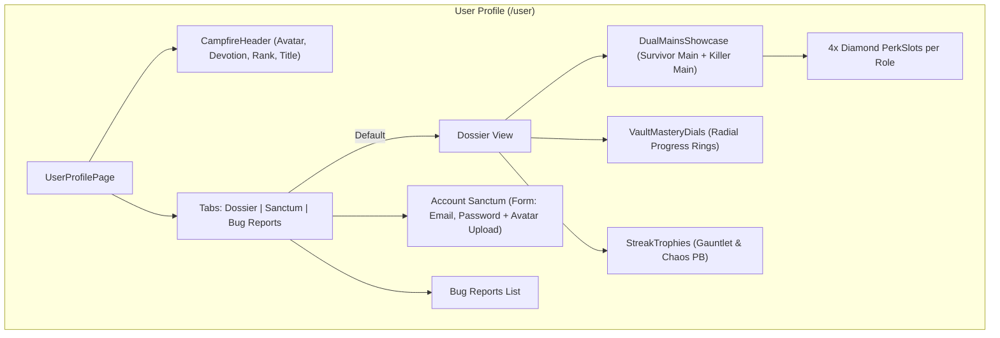

# Implementation Plan: User Profile Campfire Dossier Redesign

> **For agentic workers:** REQUIRED SUB-SKILL: Use superpowers:subagent-driven-development to implement this plan task-by-task. Steps use checkbox (`- [ ]`) syntax for tracking.

**Goal:** Transform the user profile page (`/[locale]/user`) into "The Campfire Dossier" (Proposition 1), featuring custom Survivor & Killer mains with 4-perk diamond loadouts, barbed-wire avatar styling, Devotion/Rank emblems, radial Vault mastery gauges, streak highlights, and clean Sanctum settings tabs, while strictly ignoring "Others" sidebar features and quests logs.

**Architecture:**
- **Showcase State Hook (`useUserShowcase`):** Manages player title, devotion level, rank emblem, and chosen Survivor/Killer mains with their 4 signature perks, persisted per user in `localStorage`.
- **Campfire Header (`CampfireHeader`):** Thematic player banner with barbed wire border, Entity claw accents, Devotion Level badge, Iridescent Rank I emblem, and customizable player titles.
- **Dual Mains Showcase (`DualMainsShowcase` & `MainCard`):** Survivor and Killer cards featuring character portraits, Prestige crests (P1-P100), and 4 diamond-shaped perk slots using DBD's iconic diamond geometry. Includes picker modals to swap characters and perks.
- **Vault Mastery Dials (`VaultMasteryDials`):** Radial SVG completion rings for Survivors, Killers, and Teachable Perks.
- **Tabbed Layout (`UserProfilePage`):** Three clean tabs: 🏕️ **Dossier** (Default showcase), ⚙️ **Account Sanctum** (Email, Password, Avatar management), and 🐛 **Bug Reports**.

**Architecture Diagram:**

**Tech Stack:** Next.js App Router (React 19), Tailwind CSS v4, Framer Motion, Lucide icons, SVG radial dials.

## Global Constraints
- Strictly ignore everything in the sidebar's "Others" category (guesser, draft, swf, killer-calculator, builds, custom-perks).
- Strictly ignore quests log and quest widgets.
- Support both Light and Dark mode seamlessly.
- Support localization across all 5 languages (`en`, `pl`, `de`, `es`, `ja`).
- Maintain 100% test pass on new and existing test suites.

---

### Task 1: Showcase Types, Persistence & `useUserShowcase` Hook

**Files:**
- Create: `frontend/src/types/userShowcase.ts`
- Create: `frontend/src/hooks/useUserShowcase.ts`
- Test: `frontend/src/__tests__/unit/userShowcase.test.ts`

**Interfaces:**
- Consumes: `user.id`, `allPerks`, `allCharacters`
- Produces: `UserShowcaseState`, `setSurvivorMain`, `setKillerMain`, `setPlayerTitle`, `setDevotionLevel`, `setPrestigeLevel`

- [ ] **Step 1: Write failing unit test for `useUserShowcase`**
  - Verify default initialization when `localStorage` is empty.
  - Verify updates to character name, prestige, and 4-perk loadout slots.
  - Verify persistence to `localStorage` keyed by `lemondbd_showcase_${userId}`.

- [ ] **Step 2: Run test to verify it fails**
  Run: `npm run test:unit -- src/__tests__/unit/userShowcase.test.ts`

- [ ] **Step 3: Implement `userShowcase.ts` types and `useUserShowcase.ts` hook**
  - Define `UserShowcaseState`, `MainLoadout`, `PLAYER_TITLES`, `GRADE_EMBLEMS`.
  - Implement hook with state management and `localStorage` synchronization.

- [ ] **Step 4: Run test to verify it passes**
  Run: `npm run test:unit -- src/__tests__/unit/userShowcase.test.ts`

- [ ] **Step 5: Commit**
  `git add frontend/src/types/userShowcase.ts frontend/src/hooks/useUserShowcase.ts frontend/src/__tests__/unit/userShowcase.test.ts`  
  `git commit -m "feat(user): add showcase types and useUserShowcase hook"`

---

### Task 2: Campfire Header, Radial Vault Mastery Dials & Streak Trophies

**Files:**
- Create: `frontend/src/components/user/CampfireHeader.tsx`
- Create: `frontend/src/components/user/VaultMasteryDials.tsx`
- Create: `frontend/src/components/user/StreakTrophyCard.tsx`
- Test: `frontend/src/__tests__/unit/campfireHeaderAndDials.test.ts`

- [ ] **Step 1: Write failing unit test for CampfireHeader, VaultMasteryDials, and StreakTrophyCard**
  - Assert `CampfireHeader` renders username, Devotion badge, Iridescent Rank I emblem, and player title.
  - Assert `VaultMasteryDials` renders 3 radial SVG circles with percentage stroke calculations.
  - Assert `StreakTrophyCard` renders personal best records without quest or "Others" references.

- [ ] **Step 2: Run test to verify it fails**
  Run: `npm run test:unit -- src/__tests__/unit/campfireHeaderAndDials.test.ts`

- [ ] **Step 3: Implement components**
  - `CampfireHeader`: Barbed wire avatar styling, Iridescent rank emblem SVG/badge, interactive title selector dropdown.
  - `VaultMasteryDials`: Radial progress gauges with DBD colors (Cyan for Survivor, Rose for Killer, Amber for Perks).
  - `StreakTrophyCard`: Compact badge showing Chaos & Gauntlet records from `/streaks`.

- [ ] **Step 4: Run test to verify it passes**
  Run: `npm run test:unit -- src/__tests__/unit/campfireHeaderAndDials.test.ts`

- [ ] **Step 5: Commit**
  `git add frontend/src/components/user/CampfireHeader.tsx frontend/src/components/user/VaultMasteryDials.tsx frontend/src/components/user/StreakTrophyCard.tsx frontend/src/__tests__/unit/campfireHeaderAndDials.test.ts`  
  `git commit -m "feat(user): add CampfireHeader, VaultMasteryDials, and StreakTrophyCard"`

---

### Task 3: Dual Mains Showcase & Character/Perk Picker Modals

**Files:**
- Create: `frontend/src/components/user/MainCard.tsx`
- Create: `frontend/src/components/user/DualMainsShowcase.tsx`
- Create: `frontend/src/components/user/modals/ShowcaseCharacterModal.tsx`
- Create: `frontend/src/components/user/modals/ShowcasePerkModal.tsx`
- Test: `frontend/src/__tests__/unit/dualMainsShowcase.test.ts`

- [ ] **Step 1: Write failing unit test for DualMainsShowcase and MainCard**
  - Assert rendering of 4 diamond-shaped perk slots for Survivor and 4 for Killer.
  - Assert character name, prestige badge (P1-P100), and edit buttons.

- [ ] **Step 2: Run test to verify it fails**
  Run: `npm run test:unit -- src/__tests__/unit/dualMainsShowcase.test.ts`

- [ ] **Step 3: Implement MainCard, DualMainsShowcase, and Pickers**
  - `MainCard`: Atmospheric card with character background, prestige crest, 4 diamond `PerkSlot` components.
  - `DualMainsShowcase`: Grid presenting Survivor Main and Killer Main side-by-side.
  - Modals: Searchable character picker and 4-slot perk selector modal.

- [ ] **Step 4: Run test to verify it passes**
  Run: `npm run test:unit -- src/__tests__/unit/dualMainsShowcase.test.ts`

- [ ] **Step 5: Commit**
  `git add frontend/src/components/user/MainCard.tsx frontend/src/components/user/DualMainsShowcase.tsx frontend/src/components/user/modals/ frontend/src/__tests__/unit/dualMainsShowcase.test.ts`  
  `git commit -m "feat(user): add DualMainsShowcase and character/perk picker modals"`

---

### Task 4: Integrate into `UserProfilePage` with Thematic Tabs & Locales

**Files:**
- Modify: `frontend/src/app/[locale]/user/page.tsx`
- Modify: `frontend/src/locales/en/user.ts` (and `pl`, `de`, `es`, `ja`)
- Test: `frontend/src/__tests__/unit/userProfilePageIntegration.test.ts`

- [ ] **Step 1: Write failing integration test for `UserProfilePage`**
  - Assert default view renders the "Campfire Dossier" (Showcase + Dials + Streaks).
  - Assert Sanctum tab contains `UserProfileForm` (email, password) and avatar upload.
  - Assert Bug reports tab contains `UserBugReportsList`.
  - Assert no sidebar "Others" or quest log elements are present.

- [ ] **Step 2: Run test to verify it fails**
  Run: `npm run test:unit -- src/__tests__/unit/userProfilePageIntegration.test.ts`

- [ ] **Step 3: Implement page integration and translations**
  - Wire `CampfireHeader`, `DualMainsShowcase`, `VaultMasteryDials`, and `StreakTrophyCard` into the Dossier tab.
  - Move account form and avatar controls into the Sanctum tab.
  - Add translation keys across `en`, `pl`, `de`, `es`, `ja`.

- [ ] **Step 4: Run test to verify it passes**
  Run: `npm run test:unit -- src/__tests__/unit/userProfilePageIntegration.test.ts`

- [ ] **Step 5: Commit**
  `git add frontend/src/app/[locale]/user/page.tsx frontend/src/locales/ frontend/src/__tests__/unit/userProfilePageIntegration.test.ts`  
  `git commit -m "feat(user): integrate Campfire Dossier into UserProfilePage with tabs"`

---

## Verification Plan

### Automated Tests
- `npm run test:unit -- src/__tests__/unit/userShowcase.test.ts`
- `npm run test:unit -- src/__tests__/unit/campfireHeaderAndDials.test.ts`
- `npm run test:unit -- src/__tests__/unit/dualMainsShowcase.test.ts`
- `npm run test:unit -- src/__tests__/unit/userProfilePageIntegration.test.ts`
- `npx tsc --noEmit` (clean type checks across the entire repo).

### Manual Verification
- Navigate to `/[locale]/user`:
  1. Verify Campfire Dossier displays avatar with barbed-wire/claw frame, Devotion Level 14, Rank I Iridescent emblem, and player title.
  2. Verify Survivor Main and Killer Main cards show character portrait, Prestige crest, and 4 diamond perk slots.
  3. Tap edit on Main card to swap character or assign perks; verify changes save and persist on refresh.
  4. Verify Vault Mastery radial gauges display accurate completion percentages for Survivors, Killers, and Perks.
  5. Switch to "Account Sanctum" tab: verify clean email/password form and avatar upload/reset.
  6. Switch to "Bug Reports" tab: verify bug reports list remains functional.
  7. Confirm no quest logs or "Others" sidebar features are visible.
  8. Test in both Light Mode and Dark Mode for contrast and visual fidelity.
