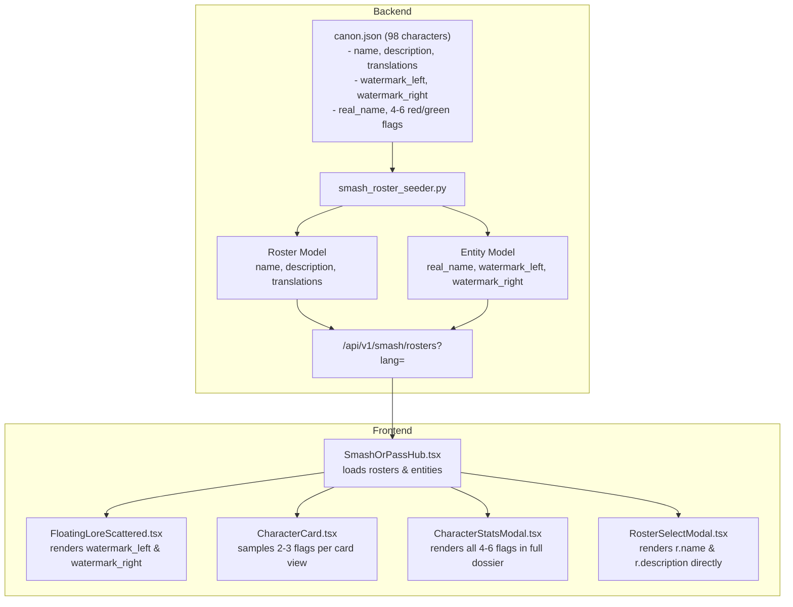

# Smash or Pass Canon Roster Overhaul & Watermark System Implementation Plan

> **For agentic workers:** REQUIRED SUB-SKILL: Use superpowers:subagent-driven-development to implement this plan task-by-task. Steps use checkbox (`- [ ]`) syntax for tracking.

**Goal:** Overhaul Dead by Daylight Smash or Pass `canon.json` (98 characters) with authentic DBD lore, explicit dual-identity background watermarks, dynamic 2–3 flag sampling from 4–6 item pools, and direct backend roster localization while completely eliminating legacy `name_i18n_key` and `description_i18n_key`.

**Architecture:**
1. **Backend Database & Schema**: Remove `name_i18n_key` and `description_i18n_key` from the `Roster` model; add `name`, `description`, and `translations`. Add `real_name`, `watermark_left`, and `watermark_right` to the `Entity` model. Serve localized `name`/`description` directly from the `/api/v1/smash/rosters` endpoint.
2. **Data Enrichment**: Rewrite `backend/app/seeds/data/smash_or_pass/rosters/canon.json` so all 98 characters have explicit watermark typography (`LEON S.` / `KENNEDY`, `THE ONRYŌ` / `SADAKO`), standardized Killer titles, zero generic meme templates, 4–6 unique red and green flags, and rich Polish translations.
3. **Frontend Presentation**: `FloatingLoreScattered.tsx` consumes explicit watermark strings with responsive font clamping; `CharacterCard.tsx` dynamically samples 2–3 red/green flags per swipe; `CharacterStatsModal.tsx` displays the complete dossier; `RosterSelectModal.tsx` renders backend names directly.

**Architecture Diagram:**


**Tech Stack:**
- Python 3.11+, FastAPI, SQLAlchemy, Pydantic, pytest
- Next.js 15, React 19, TypeScript, Tailwind CSS, Playwright

## Global Constraints
- `name_i18n_key` and `description_i18n_key` must be completely deleted from models, schemas, seeders, JSONs, frontend types, and tests.
- All 98 characters in `canon.json` must have explicit `watermark_left` and `watermark_right`.
- All characters in `canon.json` must have $\ge 4$ `red_flags` and $\ge 4$ `green_flags`.
- Zero templated meme strings (`"Meme: {Name} in the trials..."`).
- Full test pass on `pytest backend/tests/unit` and `npm run test:unit`.

---

### Task 1: Backend Model, Schema & Serialization Updates

**Files:**
- Modify: `backend/app/models/smash_or_pass.py:73-220`
- Modify: `backend/app/schemas/smash_or_pass.py:15-80`
- Modify: `backend/app/services/db/raw_schema.py:225-255`
- Modify: `backend/app/services/db/serializers.py:210-230`
- Modify: `backend/app/services/db/export_import.py:970-1000`
- Test: `backend/tests/unit/test_smash_models.py`

**Interfaces:**
- Produces:
  - `Roster.name: str`, `Roster.description: str`, `Roster.translations: dict | None`
  - `Entity.real_name: str | None`, `Entity.watermark_left: str | None`, `Entity.watermark_right: str | None`
  - `RosterOut.name`, `RosterOut.description`, `RosterOut.translations`
  - `EntityOut.real_name`, `EntityOut.watermark_left`, `EntityOut.watermark_right`

- [ ] **Step 1: Write failing test in `test_smash_models.py`**
  Add tests verifying that `Roster` instantiates with `name`, `description`, `translations` (and rejects/has no `name_i18n_key`), and that `Entity` supports `real_name`, `watermark_left`, `watermark_right`.

- [ ] **Step 2: Run test to verify it fails**
  Run: `pytest backend/tests/unit/test_smash_models.py -v`
  Expected: FAIL due to missing `name` or presence of `name_i18n_key`.

- [ ] **Step 3: Update `backend/app/models/smash_or_pass.py`**
  - In `Roster`: Replace `name_i18n_key` and `description_i18n_key` with:
    ```python
    name: Mapped[str] = mapped_column(String(128), nullable=False)
    description: Mapped[str] = mapped_column(Text, default="", nullable=False)
    translations: Mapped[dict[str, Any] | None] = _json_column(default=dict, nullable=True)
    ```
    Add `localized(lang: str | None = None)` method to `Roster`.
    Update `to_dict(lang: str | None = None)`.
  - In `Entity`: Add:
    ```python
    real_name: Mapped[str | None] = mapped_column(String(128), nullable=True)
    watermark_left: Mapped[str | None] = mapped_column(String(64), nullable=True)
    watermark_right: Mapped[str | None] = mapped_column(String(64), nullable=True)
    ```
    Update `to_dict()` and `metadata_dict()`.

- [ ] **Step 4: Update `backend/app/schemas/smash_or_pass.py`**
  - Update `RosterBase`, `RosterCreate`, `RosterUpdate`, `RosterOut` to include `name`, `description`, `translations` and remove `name_i18n_key`, `description_i18n_key`.
  - Update `EntityBase`, `EntityOut` to include `real_name`, `watermark_left`, `watermark_right`.

- [ ] **Step 5: Update `raw_schema.py`, `serializers.py`, `export_import.py`**
  - Reflect column changes in SQLite raw schema and import/export serializers.

- [ ] **Step 6: Run test to verify it passes**
  Run: `pytest backend/tests/unit/test_smash_models.py -v`
  Expected: PASS

- [ ] **Step 7: Commit**
  ```bash
  git add backend/app/models/smash_or_pass.py backend/app/schemas/smash_or_pass.py backend/app/services/db/ backend/tests/unit/test_smash_models.py
  git commit -m "feat(backend): update Roster and Entity models to direct localization and watermark columns"
  ```

---

### Task 2: Backend Seeder, API Endpoints, Roster JSONs & Test Suite Alignment

**Files:**
- Modify: `backend/app/seeds/smash_roster_seeder.py:140-220`
- Modify: `backend/app/api/v1/endpoints/smash_or_pass.py:30-80`
- Modify: `backend/app/seeds/data/smash_or_pass/rosters/*.json` (all 6 roster json headers)
- Modify: `backend/tests/unit/test_smash_api.py`
- Modify: `backend/tests/unit/test_smash_seeder_service.py`
- Modify: `backend/tests/unit/test_smash_or_pass_nsfw_gating.py`
- Modify: `backend/tests/unit/test_smash_or_pass_vote_state_edges.py`
- Modify: `backend/tests/unit/api/test_db_export_import.py`
- Modify: `backend/tests/live/test_live_challenge_and_entities.py`

**Interfaces:**
- Produces:
  - Seeder correctly parses `name`, `description`, `translations`, `real_name`, `watermark_left`, `watermark_right`.
  - Endpoint `GET /api/v1/smash/rosters?lang=` returns localized `name` and `description`.

- [ ] **Step 1: Write test for localized roster endpoint in `test_smash_api.py`**
  Assert that `GET /api/v1/smash/rosters?lang=pl` returns `"name": "Dead by Daylight: Kanon Mgły"`.

- [ ] **Step 2: Run test to verify it fails**
  Run: `pytest backend/tests/unit/test_smash_api.py -k test_get_rosters -v`

- [ ] **Step 3: Update `smash_roster_seeder.py`**
  - Read `name`, `description`, `translations` for `Roster`.
  - Read `real_name`, `watermark_left`, `watermark_right` for `Entity`.
  - Remove all references to `name_i18n_key` and `description_i18n_key`.

- [ ] **Step 4: Update all 6 roster JSON headers**
  - In `canon.json`, `legendary_cosplay.json`, `hooked_on_you.json`, `cyberpunk_2077.json`, `gothic_eldritch.json`, `anime_manga.json`:
    Replace `name_i18n_key` and `description_i18n_key` with `name`, `description`, and `translations`.

- [ ] **Step 5: Update `backend/app/api/v1/endpoints/smash_or_pass.py`**
  - In `get_rosters`, accept `lang: str = "en"`.
  - Return `r.localized(lang)` for each roster.

- [ ] **Step 6: Update all unit tests referencing `name_i18n_key`**
  - Replace `name_i18n_key` checks with `name` and `description` checks across test files.

- [ ] **Step 7: Run backend test suite**
  Run: `pytest backend/tests/unit -v`
  Expected: PASS

- [ ] **Step 8: Commit**
  ```bash
  git add backend/app/seeds/ backend/app/api/v1/endpoints/smash_or_pass.py backend/tests/
  git commit -m "feat(backend): align roster seeding, API endpoints, and tests to direct localization"
  ```

---

### Task 3: Full Overhaul of `canon.json` (All 98 Characters)

**Files:**
- Modify: `backend/app/seeds/data/smash_or_pass/rosters/canon.json`
- Test: `backend/tests/unit/test_smash_or_pass_data_integrity.py`

**Interfaces:**
- Produces:
  - 98 fully enriched characters in `canon.json`.
  - Explicit `watermark_left`, `watermark_right`, `real_name`.
  - Standardized `"The [Title]"` Killer names.
  - 4 to 6 unique `red_flags` and 4 to 6 unique `green_flags` per character.
  - Zero templated meme strings.
  - Full Polish (`translations.pl`) localization.

- [ ] **Step 1: Write comprehensive data integrity tests in `test_smash_or_pass_data_integrity.py`**
  Check that every entity in `canon.json`:
  - Has non-empty `name`, `role`, `real_name`, `watermark_left`, `watermark_right`.
  - Has `len(red_flags) >= 4` and `len(green_flags) >= 4`.
  - Does NOT contain the string `"always bringing chaos and unhinged energy"`.
  - Has `translations.pl` with `len(red_flags) >= 4` and `len(green_flags) >= 4`.

- [ ] **Step 2: Run test to verify it fails on current canon.json**
  Run: `pytest backend/tests/unit/test_smash_or_pass_data_integrity.py -v`
  Expected: FAIL

- [ ] **Step 3: Overhaul all 98 characters in `backend/app/seeds/data/smash_or_pass/rosters/canon.json`**
  - Standardize all 44 Killers to `"The [Title]"` with canonical `real_name` and explicit watermarks:
    - `The Onryō`: `Sadako Yamamura` | Left: `"THE ONRYŌ"`, Right: `"SADAKO"`
    - `The Shape`: `Michael Myers` | Left: `"THE SHAPE"`, Right: `"MICHAEL MYERS"`
    - `The Mastermind`: `Albert Wesker` | Left: `"THE MASTERMIND"`, Right: `"ALBERT WESKER"`
    - `The Executioner`: `Pyramid Head` | Left: `"THE EXECUTIONER"`, Right: `"PYRAMID HEAD"`
    - `The Good Guy`: `Chucky (Charles Lee Ray)` | Left: `"THE GOOD GUY"`, Right: `"CHUCKY"`
    - `The Cenobite`: `Pinhead` | Left: `"THE CENOBITE"`, Right: `"PINHEAD"`
    - `The Lich`: `Vecna` | Left: `"THE LICH"`, Right: `"VECNA"`
    - `The Dark Lord`: `Dracula` | Left: `"THE DARK LORD"`, Right: `"DRACULA"`
    - `The Cannibal`: `Leatherface` | Left: `"THE CANNIBAL"`, Right: `"LEATHERFACE"`
    - `The Nightmare`: `Freddy Krueger` | Left: `"THE NIGHTMARE"`, Right: `"FREDDY KRUEGER"`
    - `The Slasher`: `Jason Voorhees` | Left: `"THE SLASHER"`, Right: `"JASON VOORHEES"`
    - `The First`: `Henry Creel (001)` | Left: `"THE FIRST"`, Right: `"HENRY CREEL"`
    - `The Ghoul`: `Ken Kaneki` | Left: `"THE GHOUL"`, Right: `"KEN KANEKI"`
    - `The Krasue`: `Burong Sukapat` | Left: `"THE KRASUE"`, Right: `"BURONG"`
    - `The Animatronic`: `William Afton` | Left: `"THE ANIMATRONIC"`, Right: `"SPRINGTRAP"`
  - Standardize all 54 Survivors with explicit watermarks:
    - `Leon S. Kennedy`: Left: `"LEON S."`, Right: `"KENNEDY"`
    - `Bill Overbeck`: Left: `"BILL"`, Right: `"OVERBECK"`
    - `Detective Tapp`: Left: `"DETECTIVE"`, Right: `"TAPP"`
    - `Eleven`: Left: `"SURVIVOR"`, Right: `"ELEVEN"`
    - `Michonne Grimes`: Left: `"MICHONNE"`, Right: `"GRIMES"`
    - `Aestri Yazar`: Left: `"AESTRI"`, Right: `"YAZAR"`
    - All remaining survivors with exact first/last name watermarks.
  - Replace all generic memes, bios, quotes, turn-ons, and dealbreakers with authentic Dead by Daylight trial lore.
  - Expand `red_flags` and `green_flags` to 4–6 items each.
  - Provide full Polish translations (`translations.pl`).

- [ ] **Step 4: Run test to verify it passes**
  Run: `pytest backend/tests/unit/test_smash_or_pass_data_integrity.py -v`
  Expected: PASS

- [ ] **Step 5: Run seeder test to verify database population**
  Run: `pytest backend/tests/unit/test_smash_seeder_service.py -v`
  Expected: PASS

- [ ] **Step 6: Commit**
  ```bash
  git add backend/app/seeds/data/smash_or_pass/rosters/canon.json backend/tests/unit/test_smash_or_pass_data_integrity.py
  git commit -m "feat(data): overhaul all 98 canon characters with DBD lore, explicit watermarks, and 4-6 flags"
  ```

---

### Task 4: Frontend Types, Dual-Identity Watermarks & Dynamic Sampling

**Files:**
- Modify: `frontend/src/types/smashOrPass.ts:25-110`
- Modify: `frontend/src/components/smash-or-pass/FloatingLoreScattered.tsx:125-170`
- Modify: `frontend/src/components/smash-or-pass/CharacterCard.tsx:520-560`
- Modify: `frontend/src/components/smash-or-pass/CharacterStatsModal.tsx:250-285`
- Modify: `frontend/src/components/smash-or-pass/RosterSelectModal.tsx:220-240, 545-560`
- Modify: `frontend/src/components/smash-or-pass/SmashOrPassHub.tsx:210-225`
- Modify: `frontend/src/__tests__/unit/smashOrPass.test.ts`

**Interfaces:**
- Produces:
  - `EntityItem.watermark_left`, `EntityItem.watermark_right`, `EntityItem.real_name`
  - `RosterItem.name`, `RosterItem.description` (no `name_i18n_key` or `description_i18n_key`)
  - `FloatingLoreScattered.tsx` rendering explicit watermarks with responsive font clamping
  - `CharacterCard.tsx` sampling 2–3 red flags and 2–3 green flags stably per card view
  - `CharacterStatsModal.tsx` displaying all flags

- [ ] **Step 1: Write failing frontend unit tests in `frontend/src/__tests__/unit/smashOrPass.test.ts`**
  - Verify that `RosterItem` uses `name` and `description`.
  - Verify that `EntityItem` supports `watermark_left`, `watermark_right`, `real_name`.

- [ ] **Step 2: Run frontend unit tests to verify failure**
  Run: `npm run test:unit` in `frontend/`

- [ ] **Step 3: Update `frontend/src/types/smashOrPass.ts`**
  - Remove `name_i18n_key` and `description_i18n_key` from `RosterItem`; add `name: string;` and `description: string;`.
  - Add `real_name?: string;`, `watermark_left?: string;`, `watermark_right?: string;` to `EntityItem`.

- [ ] **Step 4: Update `FloatingLoreScattered.tsx`**
  - Use `character.watermark_left` and `character.watermark_right` directly.
  - Implement font size clamping helper (reducing font size for strings longer than 10 characters to prevent overflow).
  - Ensure neither side is ever empty.

- [ ] **Step 5: Update `CharacterCard.tsx`**
  - Add `useMemo` sampling 2–3 green flags and 2–3 red flags keyed on `character.slug`.
  - Render the sampled flags on the back of the card.

- [ ] **Step 6: Update `CharacterStatsModal.tsx`**
  - Display all 4–6 green flags and all 4–6 red flags in the full Dossier.

- [ ] **Step 7: Update `RosterSelectModal.tsx` & `SmashOrPassHub.tsx`**
  - Use `r.name` and `r.description` directly without i18n key lookup.

- [ ] **Step 8: Update mock objects in `frontend/src/__tests__/unit/smashOrPass.test.ts`**

- [ ] **Step 9: Run frontend unit tests to verify pass**
  Run: `npm run test:unit` in `frontend/`
  Expected: PASS

- [ ] **Step 10: Commit**
  ```bash
  git add frontend/src/types/smashOrPass.ts frontend/src/components/smash-or-pass/ frontend/src/__tests__/unit/
  git commit -m "feat(frontend): implement dual-identity watermarks, dynamic flag sampling, and direct roster names"
  ```

---

### Task 5: End-to-End Verification & Grinder Testing

**Files:**
- Create: `frontend/scripts/verify-smash-canon-overhaul.ts`

**Actions:**
- [ ] **Step 1: Write verification script `frontend/scripts/verify-smash-canon-overhaul.ts`**
  - Use Playwright to launch both Desktop (1280x800) and Mobile (390x844).
  - Navigate to `/pl/smash-or-pass`.
  - Verify watermark typography:
    - Check The Onryō: Left watermark is `"THE ONRYŌ"`, Right watermark is `"SADAKO"` (no parentheses, no text overflow).
    - Check Leon S. Kennedy: Left watermark is `"LEON S."`, Right watermark is `"KENNEDY"`.
    - Check single-word characters (e.g. Eleven): Left watermark is `"SURVIVOR"` (or `"OCALAŁY"`), Right watermark is `"ELEVEN"`.
  - Verify card back:
    - Flip card: exactly 2 to 3 red flags and 2 to 3 green flags are displayed.
    - Flip card back and forth: flags remain stable for the current character.
  - Verify stats modal:
    - Click Info: all 4–6 red flags and green flags are displayed.
  - Verify roster modal:
    - Open roster selector: roster title `"Dead by Daylight: Kanon Mgły"` is rendered cleanly from backend.

- [ ] **Step 2: Run verification script**
  Run: `npx tsx frontend/scripts/verify-smash-canon-overhaul.ts`
  Expected: All checks PASS on Desktop and Mobile.

- [ ] **Step 3: Run full backend and frontend regression test suites**
  Run: `pytest backend/tests/unit` and `npm run test:unit`
  Expected: All tests PASS.

- [ ] **Step 4: Commit**
  ```bash
  git add frontend/scripts/verify-smash-canon-overhaul.ts
  git commit -m "test: add Playwright verification for Smash or Pass canon overhaul and watermarks"
  ```
