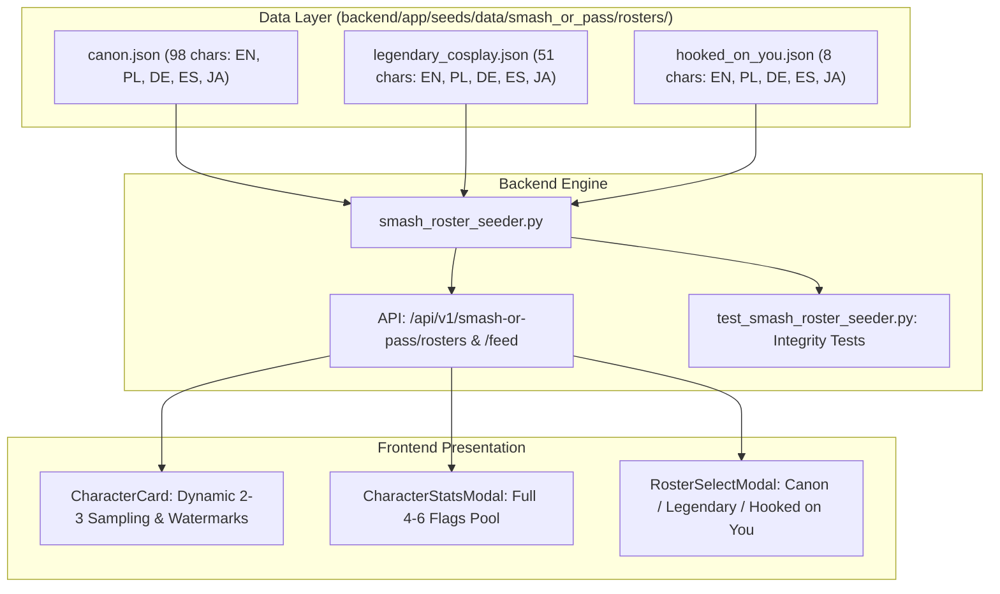

# Smash or Pass Multilingual & Extended Rosters Implementation Plan

> **For agentic workers:** REQUIRED SUB-SKILL: Use superpowers:subagent-driven-development to implement this plan task-by-task. Steps use checkbox (`- [ ]`) syntax for tracking.

**Goal:** Overhaul German (`de`), Spanish (`es`), and Japanese (`ja`) translations for all 98 canon characters in `canon.json`, and overhaul all 51 characters in `legendary_cosplay.json` and 8 characters in `hooked_on_you.json` with explicit dual-identity watermarks, 4–6 unique DBD lore flags, clean names, and full 5-language translations.

**Architecture:**
Standardize every character across all rosters to supply explicit `watermark_left` and `watermark_right`, 4–6 unique `green_flags` and `red_flags`, and complete `translations` for `pl`, `de`, `es`, and `ja` with 4–6 non-duplicate flags. Expand backend integrity testing in `test_smash_roster_seeder.py` to assert data validity for all 157 characters across all 5 languages, and verify end-to-end multi-roster switching and localization in Playwright.

**Architecture Diagram:**



**Tech Stack:**
- Backend: Python 3.14, SQLAlchemy 2.0, Pydantic, pytest
- Data: JSON seed files in `backend/app/seeds/data/smash_or_pass/rosters/`
- Frontend: Next.js 16 (App Router), React 19, TypeScript 5, Tailwind CSS, Playwright

## Global Constraints
- `watermark_left` and `watermark_right` must be explicit strings (1–2 words), non-null, and completely free of parentheses or brackets `()[]`.
- `green_flags` and `red_flags` must each have between 4 and 6 items per character in English and in all translations (`pl`, `de`, `es`, `ja`).
- No duplicate flag strings within any character's flag list.
- All 51 characters in `legendary_characters` and all 8 characters in `hooked_on_you` must have authentic lore, memes, quotes, and full 5-language translations.
- All 98 characters in `canon.json` must have their legacy `de`, `es`, and `ja` generic placeholders replaced with authentic translations matching English and Polish.

---

### Task 1: Hooked on You Overhaul (`hooked_on_you.json` - 8 Characters)

**Files:**
- Modify: `backend/app/seeds/data/smash_or_pass/rosters/hooked_on_you.json`
- Test: `backend/tests/unit/test_smash_roster_seeder.py`

**Interfaces:**
- Produces: 8 Hooked on You characters with clean names (no parentheses), explicit `watermark_left`/`watermark_right`, 4–6 unique flags, and full `pl`, `de`, `es`, `ja` translations.

- [ ] **Step 1: Write failing test in `test_smash_roster_seeder.py`**
  Add `TestHookedOnYouRosterIntegrity` asserting that all 8 characters in `hooked_on_you.json` have:
  - Clean name (no `(` or `)`).
  - Explicit non-empty `watermark_left` and `watermark_right` without `(` or `)`.
  - 4 to 6 `green_flags` and 4 to 6 `red_flags` in English.
  - Complete translations for `pl`, `de`, `es`, `ja`, each containing 4 to 6 unique `green_flags` and `red_flags` without duplicates.

- [ ] **Step 2: Run test to verify it fails**
  Run: `$env:PYTHONPATH="backend"; py -3.14 -m pytest backend/tests/unit/test_smash_roster_seeder.py -k "TestHookedOnYouRosterIntegrity" -v`
  Expected: FAIL (missing watermarks, name has `(Island)`, only 2-3 flags).

- [ ] **Step 3: Update `hooked_on_you.json`**
  Update all 8 characters:
  1. `the_trapper_hoy`: Name `"The Trapper"`, watermarks `"THE TRAPPER"` / `"ISLAND"`. 4–6 dating sim flags (e.g. "Carries you when your feet hurt", "Pouty when he loses beach volleyball").
  2. `the_huntress_hoy`: Name `"The Huntress"`, watermarks `"THE HUNTRESS"` / `"ISLAND"`. 4–6 dating sim flags (e.g. "Carves custom wooden totems for you", "Forces you to eat raw bear meat").
  3. `the_spirit_hoy`: Name `"The Spirit"`, watermarks `"THE SPIRIT"` / `"ISLAND"`. 4–6 dating sim flags (e.g. "Goth beach aesthetic perfection", "Disappears into the spirit world mid-argument").
  4. `the_wraith_hoy`: Name `"The Wraith"`, watermarks `"THE WRAITH"` / `"ISLAND"`. 4–6 dating sim flags (e.g. "Bells herald romantic island sunset strolls", "Extremely awkward beach conversation").
  5. `claudette_morel_hoy`: Name `"Claudette Morel"`, watermarks `"CLAUDETTE"` / `"MOREL"`. 4–6 flags.
  6. `dwight_fairfield_hoy`: Name `"Dwight Fairfield"`, watermarks `"DWIGHT"` / `"FAIRFIELD"`. 4–6 flags.
  7. `the_ocean`: Name `"The Ocean"`, watermarks `"THE"` / `"OCEAN"`. 4–6 flags.
  8. `the_narrator`: Name `"The Narrator"`, watermarks `"THE"` / `"NARRATOR"`. 4–6 flags.
  Populate full translations in `pl`, `de`, `es`, `ja` with 4–6 unique localized flags for all 8 characters.

- [ ] **Step 4: Run test to verify it passes**
  Run: `$env:PYTHONPATH="backend"; py -3.14 -m pytest backend/tests/unit/test_smash_roster_seeder.py -k "TestHookedOnYouRosterIntegrity" -v`
  Expected: PASS.

- [ ] **Step 5: Commit**
  ```bash
  git add backend/app/seeds/data/smash_or_pass/rosters/hooked_on_you.json backend/tests/unit/test_smash_roster_seeder.py
  git commit -m "feat(data): overhaul hooked_on_you roster with clean names, dual watermarks, and 4-6 flags across 5 languages"
  ```

---

### Task 2: Legendary Characters Overhaul (`legendary_cosplay.json` - 51 Characters)

**Files:**
- Modify: `backend/app/seeds/data/smash_or_pass/rosters/legendary_cosplay.json`
- Test: `backend/tests/unit/test_smash_roster_seeder.py`

**Interfaces:**
- Produces: 51 Legendary/Cosplay characters with explicit `watermark_left`/`watermark_right`, 4–6 unique flags, and full `pl`, `de`, `es`, `ja` translations.

- [ ] **Step 1: Write failing test in `test_smash_roster_seeder.py`**
  Add `TestLegendaryRosterIntegrity` asserting that all 51 characters in `legendary_cosplay.json` have:
  - Clean name (zero parentheses).
  - Explicit non-empty `watermark_left` and `watermark_right` without `(` or `)`.
  - 4 to 6 `green_flags` and 4 to 6 `red_flags` in English.
  - Complete translations for `pl`, `de`, `es`, `ja`, each containing 4 to 6 unique `green_flags` and `red_flags` without duplicates.

- [ ] **Step 2: Run test to verify it fails**
  Run: `$env:PYTHONPATH="backend"; py -3.14 -m pytest backend/tests/unit/test_smash_roster_seeder.py -k "TestLegendaryRosterIntegrity" -v`
  Expected: FAIL (missing watermarks, only 2-3 flags, duplicate flags in DE/ES/JA).

- [ ] **Step 3: Update `legendary_cosplay.json`**
  Update all 51 characters with authentic lore, memes, and explicit watermarks:
  - *Silent Hill*: James Sunderland (`JAMES`/`SUNDERLAND`), Cybil Bennett (`CYBIL`/`BENNETT`), Lisa Garland (`LISA`/`GARLAND`), Alessa Gillespie (`ALESSA`/`GILLESPIE`).
  - *Resident Evil*: Chris Redfield (`CHRIS`/`REDFIELD`), Claire Redfield (`CLAIRE`/`REDFIELD`), Sheva Alomar (`SHEVA`/`ALOMAR`), Carlos Oliveira (`CARLOS`/`OLIVEIRA`), William Birkin (`WILLIAM`/`BIRKIN`), HUNK (`AGENT`/`HUNK`).
  - *Stranger Things*: Jonathan Byers (`JONATHAN`/`BYERS`).
  - *Child's Play*: Tiffany Valentine (`TIFFANY`/`VALENTINE`).
  - *Crypt TV & Folklore*: The Look-See (`THE`/`LOOK-SEE`), The Malthinker (`THE`/`MALTHINKER`), The Birch (`THE`/`BIRCH`), The Ferryman (`CHARON`/`FERRYMAN`), The Minotaur (`THE`/`MINOTAUR`), Baba Yaga (`BABA`/`YAGA`), Krampus (`THE`/`KRAMPUS`).
  - *Collabs & Operators*: Kenny Ackerman (`KENNY`/`ACKERMAN`), Tubarão (`OPERATOR`/`TUBARÃO`), and all remaining characters.
  Provide 4–6 unique, authentic flags in English and across all 4 translation blocks (`pl`, `de`, `es`, `ja`).

- [ ] **Step 4: Run test to verify it passes**
  Run: `$env:PYTHONPATH="backend"; py -3.14 -m pytest backend/tests/unit/test_smash_roster_seeder.py -k "TestLegendaryRosterIntegrity" -v`
  Expected: PASS.

- [ ] **Step 5: Commit**
  ```bash
  git add backend/app/seeds/data/smash_or_pass/rosters/legendary_cosplay.json backend/tests/unit/test_smash_roster_seeder.py
  git commit -m "feat(data): overhaul legendary_cosplay roster with dual watermarks, lore flags, and 5-language translations"
  ```

---

### Task 3: Canon Multilingual Overhaul (`canon.json` - 98 Characters: DE, ES, JA)

**Files:**
- Modify: `backend/app/seeds/data/smash_or_pass/rosters/canon.json`
- Test: `backend/tests/unit/test_smash_roster_seeder.py`

**Interfaces:**
- Produces: 98 canon characters with high-fidelity, authentic DBD translations for German (`de`), Spanish (`es`), and Japanese (`ja`), each with 4–6 unique localized flags matching English and Polish.

- [ ] **Step 1: Write failing test in `test_smash_roster_seeder.py`**
  Add `TestCanonMultilingualIntegrity` asserting that all 98 characters in `canon.json` have:
  - Valid `translations.de`, `translations.es`, and `translations.ja`.
  - Non-empty `bio`, `tagline`, `archetype`, `quote`, `meme`.
  - Exactly between 4 and 6 unique `green_flags` and 4 and 6 unique `red_flags` in `de`, `es`, and `ja`.
  - No duplicate strings within any language's flag array.

- [ ] **Step 2: Run test to verify it fails**
  Run: `$env:PYTHONPATH="backend"; py -3.14 -m pytest backend/tests/unit/test_smash_roster_seeder.py -k "TestCanonMultilingualIntegrity" -v`
  Expected: FAIL (due to duplicate strings in DE/ES/JA like `'Lealtad en momentos críticos'`).

- [ ] **Step 3: Update `translations.de`, `translations.es`, `translations.ja` in `canon.json`**
  Translate and replace the placeholder blobs for all 98 characters:
  - Use official DBD German, Spanish, and Japanese gaming terminology (Entitus/Ente/エンティティ, Generatoren/Generadores/発電機, Haken/Ganchos/フック, Fluch-Totem/Tótem de maleficio/呪術トーテム).
  - Translate the authentic lore bios, taglines, quotes, memes, turn-ons, dealbreakers, and all 4–6 unique green and red flags.

- [ ] **Step 4: Run test to verify it passes**
  Run: `$env:PYTHONPATH="backend"; py -3.14 -m pytest backend/tests/unit/test_smash_roster_seeder.py -k "TestCanonMultilingualIntegrity" -v`
  Expected: PASS.

- [ ] **Step 5: Run full backend regression suite**
  Run: `$env:PYTHONPATH="backend"; py -3.14 -m pytest backend/tests/unit -v`
  Expected: All 739+ tests PASS.

- [ ] **Step 6: Commit**
  ```bash
  git add backend/app/seeds/data/smash_or_pass/rosters/canon.json backend/tests/unit/test_smash_roster_seeder.py
  git commit -m "feat(data): overhaul canon roster translations for German, Spanish, and Japanese with authentic lore"
  ```

---

### Task 4: Playwright End-to-End Multilingual & Multi-Roster Verification

**Files:**
- Modify: `frontend/scripts/verify-smash-canon-overhaul.ts`
- Test: `frontend/scripts/verify-smash-canon-overhaul.ts`

**Interfaces:**
- Produces: Playwright automated verification covering:
  - Roster switching between `canon`, `legendary_characters`, and `hooked_on_you`.
  - Dual-identity watermarks rendering without parentheses across all three rosters.
  - Dynamic 2–3 flag sampling and stability across all three rosters.
  - Full dossier stats modal showing $\ge 4$ flags.
  - Multi-language verification across `/en`, `/pl`, `/de`, `/es`, `/ja`.

- [ ] **Step 1: Update `verify-smash-canon-overhaul.ts`**
  - Add mocks for `legendary_characters` and `hooked_on_you` feed and roster data.
  - Test switching active roster via `RosterSelectModal`.
  - Test verifying watermarks for `hooked_on_you` (e.g. `THE TRAPPER` / `ISLAND`) and `legendary_characters` (e.g. `WILLIAM` / `BIRKIN`, `CHRIS` / `REDFIELD`).
  - Test language navigation across `/de/smash-or-pass`, `/es/smash-or-pass`, and `/ja/smash-or-pass` confirming localized character bios and sampled flags render correctly.

- [ ] **Step 2: Run verification script**
  Run: `npx tsx frontend/scripts/verify-smash-canon-overhaul.ts`
  Expected: Exits code 0 with all desktop and mobile tests passing.

- [ ] **Step 3: Run frontend unit tests**
  Run: `npm run test:unit`
  Expected: All 671+ tests pass.

- [ ] **Step 4: Commit**
  ```bash
  git add frontend/scripts/verify-smash-canon-overhaul.ts
  git commit -m "test(smash): extend Playwright E2E verification across all rosters and 5 languages"
  ```
