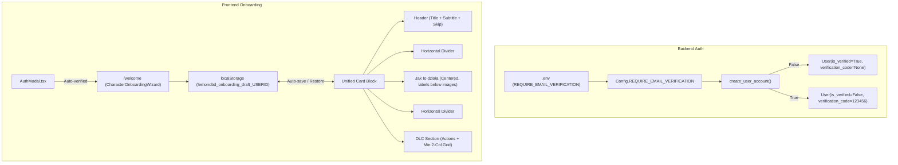

# Onboarding UI Redesign & Configurable Email Verification Implementation Plan

> **For agentic workers:** REQUIRED SUB-SKILL: Use superpowers:subagent-driven-development to implement this plan task-by-task. Steps use checkbox (`- [ ]`) syntax for tracking.

**Goal:** Redesign the `/welcome` onboarding page into a unified, responsive multi-column card layout with centered legend and localStorage draft recovery, and introduce a `REQUIRE_EMAIL_VERIFICATION` `.env` toggle to allow disabling email verification.

**Architecture:** 
1. Backend reads `REQUIRE_EMAIL_VERIFICATION` from app config; when false, `create_user_account` creates auto-verified users (`is_verified=True`) without dispatching verification emails.
2. Frontend `AuthModal` detects `res.user.is_verified` on registration and immediately logs in and routes to `/welcome` without showing verification prompts.
3. `CharacterOnboardingWizard` persists chapter and perk drafts in real-time to user-scoped `localStorage`, restoring them after catalog fetch or refresh, and cleans them up upon completion or skip.
4. Onboarding UI is consolidated into a single card with horizontal partition lines, centered legend items with captions below images, and a minimum 2-column mobile chapter grid.

**Architecture Diagram:**

**Tech Stack:** Next.js 14 / React 18, Tailwind CSS, TypeScript, Framer Motion, Python 3 / Flask, SQLAlchemy, pytest, node:test.

## Global Constraints
- `REQUIRE_EMAIL_VERIFICATION` defaults to `True` for backwards compatibility.
- Chapter grid must enforce a minimum of 2 columns on mobile (`grid-cols-2`), never 1 column.
- LocalStorage keys must be user-scoped: `lemondbd_onboarding_draft_${user?.id || 'guest'}`.
- Keep all existing accordion animations and perk popups intact.
- Pass `npm run check:i18n`, `npm run check:styles`, and `npm run test:unit`.

---

### Task 1: Backend Email Verification Toggle (.env)

**Files:**
- Create: `backend/tests/unit/test_email_verification_config.py`
- Modify: `backend/app/core/config.py`
- Modify: `backend/app/services/user/auth.py`
- Modify: `.env.example`, `.env.dev`, `.env.prod`

**Interfaces:**
- `Config.REQUIRE_EMAIL_VERIFICATION: bool`
- `create_user_account(...) -> tuple[User | None, str | None]`

- [ ] **Step 1: Write unit tests for email verification toggle**
- [ ] **Step 2: Run pytest to confirm test failure**
- [ ] **Step 3: Update `backend/app/core/config.py` with `REQUIRE_EMAIL_VERIFICATION`**
- [ ] **Step 4: Update `backend/app/services/user/auth.py` to auto-verify and skip email if disabled**
- [ ] **Step 5: Document variable in `.env.example`, `.env.dev`, `.env.prod`**
- [ ] **Step 6: Run pytest and confirm all tests pass**
- [ ] **Step 7: Commit backend changes**

---

### Task 2: Frontend AuthModal Auto-Verification & Welcome Redirection

**Files:**
- Modify: `frontend/src/components/AuthModal.tsx`
- Test: `frontend/src/__tests__/unit/authModalVerificationFlow.test.ts`

**Interfaces:**
- `AuthModal.handleSubmit: on successful registration, if res.user?.is_verified, close and route to /welcome`

- [ ] **Step 1: Write unit test checking AuthModal routing behavior when user is pre-verified**
- [ ] **Step 2: Update `frontend/src/components/AuthModal.tsx`**
- [ ] **Step 3: Run `npm run test:unit` to verify**
- [ ] **Step 4: Commit frontend AuthModal changes**

---

### Task 3: LocalStorage Draft Persistence Helper & Integration

**Files:**
- Create: `frontend/src/utils/onboardingStorage.ts`
- Create: `frontend/src/__tests__/unit/onboardingStorage.test.ts`
- Modify: `frontend/src/components/onboarding/CharacterOnboardingWizard.tsx`

**Interfaces:**
- `loadOnboardingDraft(userId: string | number): OnboardingDraft | null`
- `saveOnboardingDraft(userId: string | number, draft: OnboardingDraft): void`
- `clearOnboardingDraft(userId: string | number): void`

- [ ] **Step 1: Write unit tests for `onboardingStorage.ts`**
- [ ] **Step 2: Implement `frontend/src/utils/onboardingStorage.ts`**
- [ ] **Step 3: Run `npm run test:unit` to confirm helper tests pass**
- [ ] **Step 4: Commit storage helper**

---

### Task 4: Onboarding UI Redesign (Unified Card, Centered Legend, Min 2-Col Grid)

**Files:**
- Modify: `frontend/src/components/onboarding/CharacterOnboardingWizard.tsx`
- Create: `frontend/src/__tests__/unit/onboardingUiAndResponsiveness.test.ts`

**Interfaces:**
- Single card layout containing Header, Divider, Centered Legend (labels below images), Divider, DLC Section.
- `CHAPTER_GRID_BREAKPOINTS` with min 2 columns on mobile.
- Real-time sync with `onboardingStorage`.

- [ ] **Step 1: Write unit tests verifying new layout DOM structure, class names, and responsive breakpoints**
- [ ] **Step 2: Update `CharacterOnboardingWizard.tsx` with unified layout, centered legend, and min 2-column grid**
- [ ] **Step 3: Integrate draft load and auto-save hooks into `CharacterOnboardingWizard.tsx`**
- [ ] **Step 4: Run unit tests, i18n checks, and style checks**
- [ ] **Step 5: Commit onboarding UI redesign**
