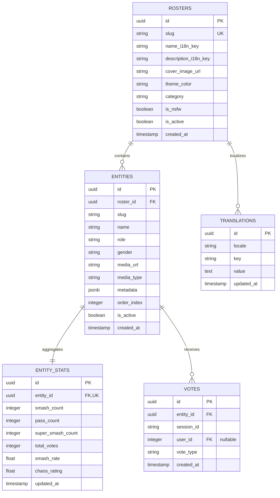

# Smash or Pass Overhaul: Complete Database-Driven Architecture & "Sexy but Twisted" Design Spec

**Date:** 2026-08-21  
**Status:** PROPOSED (Awaiting User Review)  
**Authors:** Principal Full-Stack Engineer & UX/UI Designer  

---

## 1. Executive Summary

This specification defines the complete overhaul of the **Smash or Pass** feature in LemonDBD. The system transitions from static client-side registries to a high-performance **PostgreSQL database backend** powered by **Flask REST APIs** and a **Next.js 16+ (App Router, React Server Components, Framer Motion)** frontend. 

The aesthetic vision is **"Sexy but Twisted"**: blending dark, void-like contrast with vivid neon accents, tactile keyboard/gesture feedback, glitch/chromatic aberration transitions, dynamic chaos ratings, and 100% database-driven localization (i18n).

---

## 2. PostgreSQL Schema Architecture

The PostgreSQL schema decouples all content and translations into relational, index-optimized tables.

### Table Definitions

1. **`rosters`**:
   - `id` (UUID, PK)
   - `slug` (VARCHAR(64), UNIQUE, INDEX) e.g., `canon`, `hooked_on_you`, `cyberpunk_2077`, `anime_manga`, `gothic_eldritch`, `legendary_cosplay`
   - `name_i18n_key` (VARCHAR(128))
   - `description_i18n_key` (VARCHAR(256))
   - `cover_image_url` (TEXT)
   - `theme_color` (VARCHAR(32), e.g., `#ff0055`, `#00f5d4`, `#a855f7`)
   - `category` (VARCHAR(64))
   - `is_nsfw` (BOOLEAN, default false)
   - `is_active` (BOOLEAN, default true)
   - `created_at` (TIMESTAMP)

2. **`entities`**:
   - `id` (UUID, PK)
   - `roster_id` (UUID, FK -> `rosters.id`, ON DELETE CASCADE)
   - `slug` (VARCHAR(128), INDEX)
   - `name` (VARCHAR(128))
   - `role` (VARCHAR(32), e.g. `Survivor`, `Killer`)
   - `gender` (VARCHAR(32), e.g. `female`, `male`, `monster_other`)
   - `media_url` (TEXT)
   - `media_type` (VARCHAR(16), default `image`)
   - `metadata` (JSONB) — Contains `chaos_score` (0-100), `danger_level` (`Low`, `Medium`, `High`, `Lethal`), `archetype`, `lore_quote`, `compatibility_tags`
   - `order_index` (INTEGER, default 0)
   - `is_active` (BOOLEAN, default true)
   - `created_at` (TIMESTAMP)

3. **`entity_stats`**:
   - `id` (UUID, PK)
   - `entity_id` (UUID, FK -> `entities.id`, UNIQUE, INDEX)
   - `smash_count` (INTEGER, default 0)
   - `pass_count` (INTEGER, default 0)
   - `super_smash_count` (INTEGER, default 0)
   - `total_votes` (INTEGER, default 0)
   - `smash_rate` (FLOAT, default 0.0)
   - `chaos_rating` (FLOAT, default 50.0)
   - `updated_at` (TIMESTAMP)

4. **`votes`**:
   - `id` (UUID, PK)
   - `entity_id` (UUID, FK -> `entities.id`, INDEX)
   - `session_id` (VARCHAR(128), INDEX)
   - `user_id` (INTEGER, FK -> `users.id`, nullable, INDEX)
   - `vote_type` (VARCHAR(20)) — `smash`, `pass`, `super_smash`
   - `created_at` (TIMESTAMP)

5. **`translations`**:
   - `id` (UUID, PK)
   - `locale` (VARCHAR(10), INDEX) e.g., `en`, `es`, `de`, `ja`, `pl`
   - `key` (VARCHAR(128), INDEX)
   - `value` (TEXT)
   - `updated_at` (TIMESTAMP)

---

## 3. Flask Backend API Design

The backend services will be registered under blueprint `smash_or_pass_bp` with `/api/v1/smash-or-pass` (and aliases where required).

### API Endpoints
1. `GET /api/v1/smash-or-pass/rosters`
   - **Response**: List of available rosters with cover images, stats summary, and localized labels.
2. `GET /api/v1/smash-or-pass/rosters/<slug>/feed`
   - **Query Params**: `session_id`, `role`, `gender`, `limit` (default 50)
   - **Response**: Unvoted entities for the requested roster with pre-aggregated stats and trait metadata.
3. `POST /api/v1/smash-or-pass/vote`
   - **Headers / Body**: `{ "entity_id": "<uuid>", "vote_type": "smash"|"pass"|"super_smash", "session_id": "..." }`
   - **Logic**: Atomic UPSERT on `votes` and incremental update on `entity_stats`. Rate-limited per IP/Session.
4. `GET /api/v1/smash-or-pass/rosters/<slug>/leaderboard`
   - **Query Params**: `sort_by` (`smash_rate`, `total_votes`, `smash_count`), `limit`
   - **Response**: Top ranked entities with tier badges (*God Tier*, *Fatal Attraction*, *Friendzone*, *Eldritch Void*).
5. `GET /api/v1/i18n/<locale>`
   - **Response**: Key-value dictionary of all database translations for dynamic frontend hydration.
6. `POST /api/v1/smash-or-pass/session/reset`
   - **Body**: `{ "session_id": "...", "roster_slug": "..." }`
   - **Response**: Reset confirmation and unwound session vote count.

---

## 4. Frontend Architecture (Next.js 16+ App Router)

### 1. Zero Hardcoded Strings & Dynamic Localization
- All UI strings derive from `dict.smashOrPass` or dynamic backend translations fetched via `/api/v1/i18n/<locale>`.
- Roster and entity names seamlessly support multi-language switching (`en`, `es`, `de`, `ja`, `pl`) without UI flickering or fallback breakage.

### 2. Preloading Engine
- Maintains a 3-5 item image preloading queue ahead of the active card.
- Smooth caching prevents visual lag during rapid keyboard or swipe voting.

### 3. Controls & Interaction Architecture
- **Mobile Touch Gestures**: Drag threshold with spring release and rotational momentum (Framer Motion).
- **PC Tactile Controls**:
  - `←` Left Arrow: Pass
  - `→` Right Arrow: Smash
  - `↑` Up Arrow: Open Dossier & Stats Modal
  - `↓` Down Arrow: Super Smash / Chaos Burst
  - `R` Key: Reset Deck
- **On-Screen Illuminated Keycaps**: Interactive visual indicators that glow and depress in real-time with physical keyboard triggers.

---

## 5. "Sexy but Twisted" Visual Design System

### Palette
- **Deep Void Background**: `#09090b` / `#05070a`
- **Neon Crimson (Smash / Desire)**: `#ff0055`
- **Deep Velvet Purple (Mystery / Fog)**: `#2e0854` / `#4a0e4e`
- **Cyber Mint (Chaos / Stats)**: `#00f5d4`
- **Eldritch Gold (Super Smash / God Tier)**: `#ffd166`

### Micro-Interactions & Shaders
- **Smash Action**: Radial particle shockwave, chromatic aberration pulse, heart-skull emitter, crimson border surge.
- **Pass Action**: Cold CRT scanline glitch, desaturation dissolve, shredder particle disintegration into the void.
- **Chaos / Compatibility Score**: Real-time calculated compatibility percentage based on voting preferences with playful/surreal persona feedback.

---

## 6. Pre-Seeded Roster Catalogs

1. **Dead by Daylight: Fog Canon (98 Characters)**: Complete canonical Killers & Survivors.
2. **Hooked on You: Island Romance**: Tropical dating-sim variants.
3. **Legendary Skins & Collabs**: HUNK, Birkin, James Sunderland, Maria, Baba Yaga, Naughty Bear, Chatterer, Minotaur.
4. **Cyberpunk Fog 2077**: Cyber-augmented Trickster, Neon Sable, Netrunner Nea, Chrome Wesker.
5. **Fog Anime / Manga Aesthetic**: Stylized anime renditions of iconic DBD killers and survivors.
6. **Gothic & Victorian Eldritch**: Victorian Dracula, Bloodborne Huntress, Dark Fantasy Mikaela.

---

## 7. Verification & Testing Strategy

- **Database Migrations & Seeders**: Test automated table creation and initial seeding with 0 votes.
- **API Test Suite**: Automated pytest suite verifying `/feed`, `/vote` atomic counters, `/leaderboard` ranking, and rate-limiting.
- **Frontend Interaction Testing**: Verify keyboard shortcuts, mobile drag thresholds, image preloading, and dynamic locale switching.
