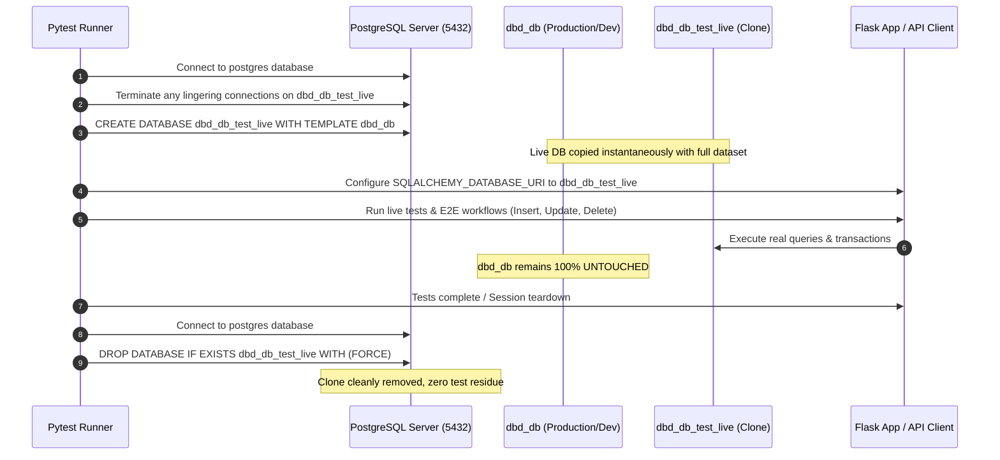

# Test Suite Overhaul & Workflow Testing Architecture Design

**Date**: 2026-08-26  
**Status**: Approved by User  
**Scope**: Backend (Flask + SQLAlchemy + PostgreSQL) & Frontend (Next.js + TypeScript)  

---

## 1. Overview & Objectives

This design outlines the complete restructuring, upgrading, and expansion of both backend and frontend test suites for LemonDBD.

### Key Goals:
1. **Categorization & Clear Separation**:
   - **Unit / Mock Tests**: Blazing fast (<1-2s total), fully isolated, zero external network or database dependencies. Use in-memory SQLite (backend) and native TSX execution (frontend).
   - **Live Tests**: Real PostgreSQL database and live Flask REST API execution. Exercises real PostgreSQL features (JSONB columns, database constraints, complex joins, Alembic migrations, foreign-key cascades).
2. **Database Safety via Template Clone & Restore**:
   - All live backend tests execute against a cloned PostgreSQL database (`dbd_db_test_live`) created via `CREATE DATABASE dbd_db_test_live WITH TEMPLATE dbd_db;`.
   - The test fixture automatically creates `dbd_db_test_live` before the live test session starts and tears it down (`DROP DATABASE dbd_db_test_live WITH (FORCE);`) when the session ends.
   - The development/production database (`dbd_db`) remains 100% untouched and pristine.
3. **End-to-End Multi-Step Workflow Tests**:
   - Comprehensive multi-stage user journeys covering Auth & Ownership Cascades, Chaos/Gauntlet/History/Page Streaks, Smash-or-Pass Leaderboards, Draft Room Synergy, and Admin Export/Import/Purge cycles.
4. **Fixing Existing Test Failures & Upgrading Quality**:
   - Fix item/addon category mismatch in scraper tests.
   - Fix custom edition roster scraping mock in image scraper tests.
   - Align user ownership test with current free-character default ownership rules.

---

## 2. Architecture & Directory Structure

### Backend (`backend/tests/`)
```
backend/tests/
├── conftest.py                           # Global pytest configuration & markers (unit vs live)
├── unit/                                 # Fast Unit / Mock Tests (SQLite in-memory)
│   ├── conftest.py                       # SQLite memory DB fixture
│   ├── test_chaos_roller.py              # Pure randomization, distribution math
│   ├── test_chaos_stats.py               # Statistics aggregation algorithms
│   ├── test_description_cleaner.py       # HTML/BBCode cleaners & tokenizer
│   ├── test_guesser.py                   # Guess scoring & clue generators
│   ├── test_history_roster.py            # Era & chapter chronologies
│   ├── test_smash_models.py              # Pydantic schemas & model validation
│   ├── test_translations_jsonb.py        # Translation dictionary helpers
│   └── scrapers/                         # Scraper parsing logic (mock HTML/JSON)
│       ├── test_character_scraper.py
│       ├── test_modular_drivers.py
│       ├── test_scraper_config.py
│       ├── test_wikigg_items_addons.py
│       ├── test_wikigg_translations.py
│       └── test_roster_image_scraper.py
└── live/                                 # Live PostgreSQL & API Integration Tests
    ├── conftest.py                       # PostgreSQL Template Clone fixture & live API client
    ├── api/                              # Route-level integration with real PostgreSQL
    │   ├── test_auth_api_live.py
    │   ├── test_characters_perks_api_live.py
    │   ├── test_user_ownership_api_live.py
    │   ├── test_admin_control_api_live.py
    │   ├── test_db_export_import_live.py
    │   ├── test_item_routes_live.py
    │   └── test_maps_routes_live.py
    ├── services/                         # Service layer against PostgreSQL & JSONB
    │   ├── test_chaos_service_live.py
    │   ├── test_gauntlet_service_live.py
    │   ├── test_history_service_live.py
    │   ├── test_page_streak_service_live.py
    │   ├── test_smash_service_live.py
    │   └── test_quest_service_live.py
    └── workflows/                        # Full E2E multi-step user workflows
        ├── test_e2e_auth_and_ownership_workflow.py
        ├── test_e2e_streak_games_workflow.py
        ├── test_e2e_smash_or_pass_workflow.py
        ├── test_e2e_draft_synergy_workflow.py
        └── test_e2e_admin_sync_export_workflow.py
```

### Frontend (`frontend/src/utils/__tests__/`)
```
frontend/src/utils/__tests__/
├── unit/                                 # Fast Unit / Mock Tests (Node / TSX)
│   ├── perkUtils.test.ts                 # Slugs, avatars, URLs, string sanitizers
│   ├── textFormatter.test.ts             # Multilingual DBD markup & token parser
│   ├── mapVoiceMatcher.test.ts           # Speech phonetics, Levenshtein, fuzzy aliases
│   ├── mapLandmarksLayouts.test.ts       # Realm coordinate layouts & landmarks
│   ├── voiceClientModel.test.ts          # Web Audio resampling (48k -> 16k Float32)
│   ├── smashOrPassUnit.test.ts           # Tier bands & 3D carousel ring normalization
│   └── perkAudio.test.ts                 # Audio synthesis fallback logic
└── live/                                 # Live API Integration & Workflow Tests (Real HTTP)
    ├── liveAuthFlow.test.ts              # Real register -> login -> JWT auth -> profile
    ├── liveStreakFlow.test.ts            # Real streak creation -> perk roll -> match record
    ├── liveSmashFlow.test.ts             # Real rosters fetch -> voting -> leaderboard verification
    ├── livePerksFlow.test.ts             # Real perk filters -> character detail -> translations
    └── liveDraftQuestsFlow.test.ts       # Real draft room lifecycle & daily quests claim
```

---

## 3. Database Snapshot & Isolation Lifecycle



---

## 4. End-to-End Workflow Test Specifications

### Workflow 1: Authentication & Ownership Cascade
1. User registration with valid credentials $\rightarrow$ returns 201 + JWT Bearer token + User profile.
2. Initial ownership check $\rightarrow$ free characters (`Dwight`, `Meg`, `Trapper`, etc.) default to `is_owned = True`; licensed/non-free default to `is_owned = False`.
3. Character lock/unlock toggle via `/api/v1/users/{id}/characters`:
   - Locking a character automatically cascades to lock all 3 of its unique teachable perks.
   - Unlocking a character automatically unlocks all 3 teachable perks.
4. Profile update $\rightarrow$ avatar selection $\rightarrow$ password reset request & verification.

### Workflow 2: Streak Game Modes (Chaos, Gauntlet, History, Page)
1. **Chaos Streak**:
   - Initialize run (Survivor / Killer).
   - Roll random perks $\rightarrow$ verify 4 perks chosen without duplication.
   - Record match result (Win $\rightarrow$ increment streak count; Loss $\rightarrow$ mark streak ended).
   - Verify streak logs, statistics, and leaderboard rankings.
2. **Gauntlet Streak**:
   - Start run for target killer.
   - Complete consecutive killer challenges across tiers.
   - Verify health/strikes decrement on defeat and victory progression on win.
3. **History Streak**:
   - Start timeline run.
   - Verify drawn perks match era chapter boundaries.
   - Record match progression.
4. **Page Streak**:
   - Generate 3-page perk layout.
   - Advance through pages, verifying perk exclusivity per page.

### Workflow 3: Smash-or-Pass Rating Engine & Leaderboards
1. Retrieve active edition rosters (Canon, HoY, Cyberpunk, Anime, Gothic).
2. Fetch personalized vote feed for session.
3. Cast series of `smash` and `pass` votes on various characters.
4. Verify dynamic recalculation of Smash Percentage, Tier categorization (S, A, B, C, D), and Leaderboard ranking.
5. Verify reset session votes endpoint.

### Workflow 4: Draft Mode & Synergy Calculation
1. Create multiplayer draft room session.
2. Join draft session $\rightarrow$ pick perks in turn-based sequence.
3. Lock build $\rightarrow$ compute synergistic interactions between picked perks.

### Workflow 5: Admin Maintenance & Export/Import
1. Admin export full database to JSON payload.
2. Purge specific test entities.
3. Admin import JSON in merge mode.
4. Verify complete recovery of entities.

---

## 5. Execution Commands & Scripts

- `npm run test`: Run frontend unit tests.
- `npm run test:live`: Run frontend live API tests.
- `npm run test:all`: Run all frontend tests.
- `py -m pytest backend/tests/unit`: Run backend unit & mock tests.
- `py -m pytest backend/tests/live`: Run backend live DB & workflow tests.
- `py run_tests.py`: Master test runner running all suites with unified summary report.
