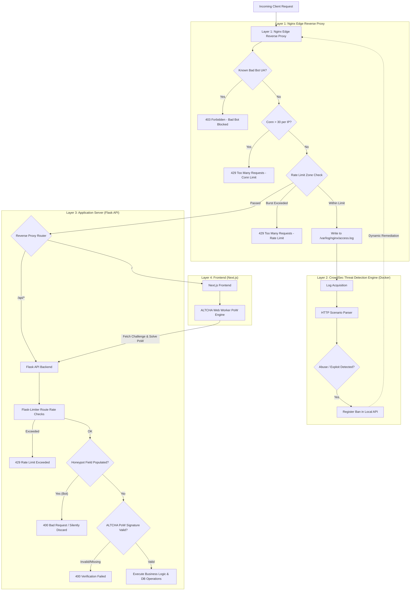

# System Design Specification: Multi-Layer Anti-Bot & DDoS Protection

**Date:** 2026-08-27  
**Project:** LemonDBD (Flask + Next.js + PostgreSQL + Umami + Nginx)  
**Branch:** `feature/anti-bot-ddos-protection`  
**Status:** Approved by User  

---

## 1. Executive Summary & Goals

This specification defines a lightweight, 100% free, fully self-hosted, multi-layered anti-bot and DDoS protection system for the LemonDBD application. 

### Goals
- **Volumetric & Connection Protection:** Defend against HTTP floods, slowloris attacks, and connection exhaustion at the Nginx edge without consuming backend worker threads or database connections.
- **Automated Threat Intelligence:** Integrate CrowdSec to analyze HTTP traffic patterns, brute-force attempts, and common exploit signatures, automatically enforcing IP bans.
- **Granular API & Endpoint Rate Limiting:** Enforce tuned per-endpoint rate limits using Flask-Limiter.
- **Zero-Friction Bot Protection:** Implement ALTCHA (an open-source, stateless Proof-of-Work mechanism) to protect sensitive form actions (login, registration, password reset, bug reports) invisibly via browser background Web Workers, with dynamic challenge triggers on suspicious activity.
- **Honeypot Trapping:** Silently neutralize automated web scrapers and spambots.
- **Zero External Paid Dependencies:** Completely self-contained within Docker Compose; no third-party subscription fees or invasive user tracking.

---

## 2. Architecture Overview



---

## 3. Detailed Component Architecture

### Layer 1: Nginx Edge Hardening & Rate Limiting

#### A. Rate Limiting Zones (Leaky-Bucket Algorithm)
Nginx allocates dedicated shared memory zones to track and throttle client requests by client IP (`$binary_remote_addr`):

1. **General API Zone (`api_limit`)**:
   - `rate=30r/s` with `burst=60 nodelay`
   - Protects standard data-fetching endpoints (`/api/v1/perks`, `/api/v1/streaks`, etc.) from aggressive polling or scraping while allowing natural burst browsing.
2. **Authentication & Sensitive Zone (`auth_limit`)**:
   - `rate=10r/m` with `burst=10 nodelay`
   - Applied to `/api/v1/auth/login`, `/api/v1/auth/register`, `/api/v1/auth/forgot-password`, `/api/v1/auth/reset-password`, and `/api/v1/bug-reports`.
3. **Static Assets Zone (`static_limit`)**:
   - `rate=120r/s` with `burst=180 nodelay`
   - Ensures high throughput for user avatars, perk icons, and static images.

#### B. Connection Limiting
- `limit_conn_zone $binary_remote_addr zone=addr_limit:10m;`
- `limit_conn addr_limit 30;` — Maximum 30 concurrent TCP connections per IP address, preventing slowloris and socket exhaustion attacks.

#### C. Buffer and Timeout Hardening
```nginx
client_body_buffer_size 128k;
client_header_buffer_size 1k;
large_client_header_buffers 4 8k;
client_max_body_size 20M;

client_body_timeout 10s;
client_header_timeout 10s;
keepalive_timeout 30s;
send_timeout 10s;
```

#### D. Bad Bot / Scraper Blocking Map
A predefined lookup map matching `$http_user_agent` blocks known malicious crawlers, exploit scanners, and blank user agents:
```nginx
map $http_user_agent $bad_bot {
    default 0;
    ~*(sqlmap|nikto|masscan|zgrab|nmap|morfeus|gobuster|dirbuster|wpscan|censys) 1;
    ~*(bytespider|gptbot|ccbot|semrushbot|ahrefsbot|petalbot|dotbot) 1;
    "" 1;
}
```

#### E. Standardized Error Handling
Nginx serves structured JSON errors for 429 and 403 responses:
```nginx
error_page 429 = @rate_limited;
location @rate_limited {
    default_type application/json;
    return 429 '{"error": "Too Many Requests", "message": "Rate limit exceeded. Please wait a moment before trying again."}';
}
```

---

## 4. Layer 2: CrowdSec Threat Engine (Docker Service)

#### A. Service Configuration in `docker-compose.yml`
```yaml
crowdsec:
  image: crowdsecurity/crowdsec:latest
  container_name: dbd_crowdsec
  restart: unless-stopped
  environment:
    COLLECTIONS: "crowdsecurity/nginx crowdsecurity/http-cve crowdsecurity/base-http-scenarios"
    GID: "1000"
  volumes:
    - ./docker/crowdsec/acquis.yaml:/etc/crowdsec/acquis.yaml:ro
    - ./docker/crowdsec/data:/var/lib/crowdsec/data
    - nginx_logs:/var/log/nginx:ro
  networks:
    - dbd_network
```

#### B. Log Acquisition (`acquis.yaml`)
```yaml
filenames:
  - /var/log/nginx/access.log
  - /var/log/nginx/error.log
labels:
  type: nginx
```

---

## 5. Layer 3: Application Server Security (Flask API)

#### A. Flask-Limiter Integration
A dedicated rate-limiter extension `app/core/limiter.py` configured with memory storage and keyed on client IP (`get_remote_address`):

- **Login & Register:** `@limiter.limit("10 per minute")`
- **Password Reset / Forgot Password:** `@limiter.limit("5 per minute")`
- **Bug Reports:** `@limiter.limit("15 per minute")`
- **Dynamic Challenges:** `@limiter.limit("60 per minute")`

#### B. Honeypot Anti-Bot Mechanism
- Sensitive forms include an invisible trap field: `website_url_verification`.
- The field is positioned off-screen / hidden from visual view and screen readers (`tabIndex={-1}`, `aria-hidden="true"`, `style={{ display: "none" }}`).
- If the backend receives any value inside this field, the request is identified as an automated form submitter and immediately rejected with a `400 Bad Request` or mock success response to waste bot resources without updating the database.

---

## 6. Layer 4: ALTCHA Proof-of-Work Challenge Engine

#### A. Architecture & Cryptographic Flow
1. **Challenge Generation (`GET /api/v1/auth/altcha-challenge`)**:
   - The server creates a payload with:
     - `algorithm`: SHA-256
     - `challenge`: Random hexadecimal string (64-char)
     - `salt`: Random salt
     - `maxnumber`: Upper bound difficulty (50,000–100,000 for ~50ms computation)
     - `expires`: Unix timestamp (valid for 5 minutes)
   - Server computes HMAC-SHA256 signature using `SECRET_KEY` and appends it to the challenge.
2. **Client Computation (Next.js Frontend)**:
   - When the user focuses or begins interacting with the form, a Web Worker iterates `number` from 0 to `maxnumber` finding `SHA256(salt + number) == challenge`.
   - Browser finds the solution in ~30–80ms without any UI freeze or user disruption.
3. **Stateless Verification (`app/services/altcha_service.py`)**:
   - When the form is submitted, the payload includes the solution `number`, `challenge`, and `signature`.
   - Backend verifies:
     1. Signature matches HMAC-SHA256(`SECRET_KEY`, payload fields).
     2. Timestamp is not expired (`expires > current_time`).
     3. `SHA256(salt + solution_number) == challenge`.
   - Verification takes < 0.2ms and requires zero database queries.

#### B. Dynamic Challenge Trigger
- For normal users: Invisible, automatic background proof-of-work.
- For high-frequency clients or flagged IPs: Displays an interactive verification badge indicating security verification is in progress.

---

## 7. Proposed File Changes

| Component | File Path | Action | Description |
| :--- | :--- | :--- | :--- |
| **Nginx** | `nginx/default.conf` | `MODIFY` | Add rate limiting zones, connection limits, buffer timeouts, bad bot mapping, and JSON error pages. |
| **Nginx** | `nginx/Dockerfile` | `MODIFY` | Ensure log directory volume `/var/log/nginx` is properly exposed and configured. |
| **Docker** | `docker-compose.yml` | `MODIFY` | Add `crowdsec` container, shared `nginx_logs` volume, and restart policies. |
| **Docker** | `docker/crowdsec/acquis.yaml` | `NEW` | CrowdSec log acquisition configuration. |
| **Backend** | `backend/requirements.txt` | `MODIFY` | Add `Flask-Limiter>=3.10.0`. |
| **Backend** | `backend/app/core/limiter.py` | `NEW` | Flask-Limiter configuration and custom error handler. |
| **Backend** | `backend/app/services/altcha_service.py` | `NEW` | Stateless ALTCHA challenge generation and SHA-256/HMAC verification service. |
| **Backend** | `backend/app/routes/auth.py` | `MODIFY` | Add rate limits, honeypot validation, and ALTCHA challenge endpoints/verification. |
| **Backend** | `backend/app/routes/bug_reports.py` | `MODIFY` | Add rate limits, honeypot validation, and ALTCHA verification. |
| **Frontend** | `frontend/src/hooks/useAltcha.ts` | `NEW` | React hook managing background Web Worker PoW computation and challenge fetching. |
| **Frontend** | `frontend/src/components/common/AltchaWidget.tsx` | `NEW` | Reusable UI component with honeypot field and dynamic status indicator. |
| **Frontend** | `frontend/src/components/modals/AuthModal.tsx` | `MODIFY` | Integrate ALTCHA and honeypot into login, register, and reset tabs. |
| **Frontend** | `frontend/src/components/modals/BugReportModal.tsx` | `MODIFY` | Integrate ALTCHA and honeypot into bug report submission. |

---

## 8. Verification & Testing Plan

### Automated Unit & Integration Tests
1. **ALTCHA Service Tests (`backend/tests/unit/test_altcha_service.py`)**:
   - Verify challenge generation generates valid HMAC signatures and difficulty bounds.
   - Verify valid PoW solutions pass verification.
   - Verify expired challenges, tampered payloads, and invalid solution numbers are strictly rejected.
2. **Honeypot & Rate Limit Tests (`backend/tests/unit/test_security_guards.py`)**:
   - Verify requests with populated honeypot fields are rejected.
   - Verify route rate-limiting triggers HTTP 429 when exceeding thresholds.
3. **Frontend Tests (`frontend/src/__tests__/unit/altcha.test.ts`)**:
   - Verify PoW solver algorithm solves challenge correctly and handles expired token refresh.

### Live & Integration Tests
1. **Nginx Rate Limit Load Test**:
   - Execute a batch of 50 rapid requests against `/api/v1/auth/login` to confirm Nginx throttles with JSON 429 after 10 requests.
2. **CrowdSec Log Stream Verification**:
   - Verify CrowdSec container parses Nginx access logs and registers metrics without errors.
3. **Full End-to-End Auth & Bug Report Flow**:
   - Perform registration, login, and bug report submission through the UI to ensure seamless, invisible verification for legitimate users.
