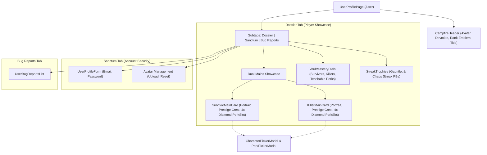

# User Profile Redesign: The Campfire Dossier

**Date:** 2026-09-04  
**Status:** PROPOSED (Awaiting User Review)  
**Scope:** `frontend` only — User Profile (`/[locale]/user`)

---

## 1. Executive Summary

Transform the user profile page from a generic administrative settings form into **"The Campfire Dossier"** (Proposition 1). This delivers a Dead by Daylight-themed player showcase centered around:
1. **Campfire Player Dossier Header:** Barbed-wire / entity claw avatar styling, Devotion Level badge, Iridescent Rank I Grade emblem, and selectable DBD Player Title (*"The Fogwalker"*, *"Apex Predator"*, *"Hex Cleanser"*, etc.).
2. **Dual Main Showcase Cards:**
   - **Survivor Main:** Portrait, character name, Prestige crest (e.g. P1–P100), and **4 diamond-shaped Dead by Daylight perk slots** displaying their signature survival loadout.
   - **Killer Main:** Killer portrait, name, Prestige crest, and **4 diamond-shaped perk slots** displaying their signature terror loadout.
   - Interactive character & perk selector modals to customize mains and loadouts seamlessly.
3. **Bloodpoint / Vault Mastery Radial Dials:** Replaces standard flat progress bars with circular radial gauges for Survivors, Killers, and Teachable Perks.
4. **Streak & Trial Highlights:** Showcase personal best records from LemonDBD's core streak modes (`/streaks`), while strictly omitting anything in the sidebar's "Others" category (guesser, draft, swf, killer-calculator, builds, custom-perks) and quests log as instructed.
5. **Clean Tabbed Architecture:**
   - 🏕️ **Dossier** (Default view: Player banner, Survivor/Killer Mains, 4-Perk Diamonds, Vault Mastery dials, Streaks).
   - ⚙️ **Account Sanctum** (Security settings: Change Email, Change Password, Avatar Upload & Reset).
   - 🐛 **Bug Reports** (User's submitted bug reports).

---

## 2. Component Architecture & Data Flow



### 2.1 Storage & Persistence
- **Custom Showcase State:** Keyed per user in `localStorage` under `lemondbd_showcase_${user.id}`:
  ```typescript
  interface UserShowcaseState {
    playerTitle: string; // e.g. "The Fogwalker"
    devotionLevel: number; // e.g. 14
    gradeRank: string; // e.g. "Iridescent I"
    survivorMain: {
      characterName: string;
      prestige: number;
      perks: (Perk | null)[]; // 4 perks
    };
    killerMain: {
      characterName: string;
      prestige: number;
      perks: (Perk | null)[]; // 4 perks
    };
  }
  ```
- Defaults populated intelligently from available character and perk datasets so the showcase looks heroic immediately upon first login.
- Interactive modals allow picking characters and perks directly with real-time preview and instant save.

### 2.2 Aesthetic Specifications
- **Framing & Accents:** Scorched iron borders (`border-slate-200 dark:border-slate-800/80`), subtle crimson fog vignette in corners, and gold/amber entity embers.
- **Perk Diamonds:** Standard Dead by Daylight 45-degree rotated diamond frames (`PerkSlot` with orange perk iconography and tooltip details).
- **Prestige Crests:** Authentic roman numeral or badge styling (`P1` to `P100`) with Entity laurels.

---

## 3. Scope Exclusions (Per User Directive)
- Strictly **no** Quests log or quest tracking widgets.
- Strictly **no** items from the sidebar "Others" section:
  - Guesser (`/characters/guesser`)
  - Draft Room (`/draft`)
  - SWF Planner (`/swf`)
  - Killer Calc (`/killer-calculator`)
  - Builds Vault (`/builds`)
  - Custom Perks (`/custom-perks`)
- Only core app features (Streaks from `/streaks`, Perks Vault, Characters, and Randomizer links) are highlighted.

---

## 4. Verification Plan
- **Unit Tests:**
  - Verify `UserProfilePage` renders the Campfire Dossier tab by default.
  - Verify Dual Mains showcase cards render 4 diamond perk slots for each role.
  - Verify Vault Mastery radial percentage gauges calculate and display correct progress.
  - Verify no references to sidebar "Others" items exist in the profile overview.
  - Verify seamless switching between Dossier, Sanctum (Settings), and Bug Reports tabs.
- **Visual Verification:**
  - Check light mode and dark mode rendering.
  - Test character selection and perk assignment in the interactive pickers.
